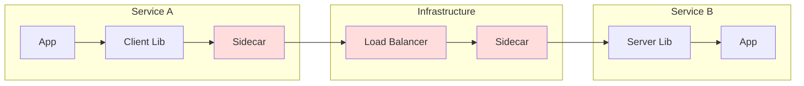
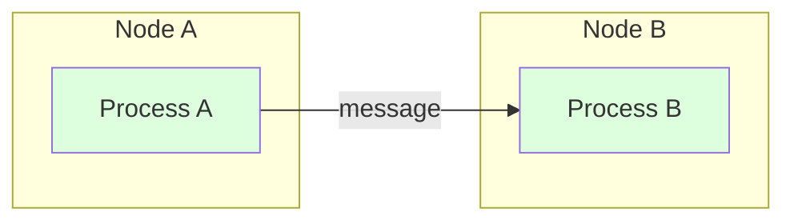
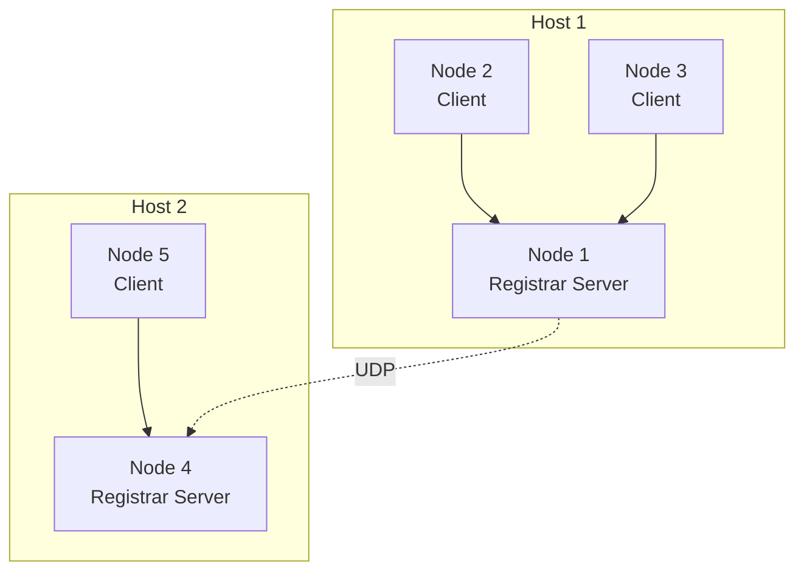
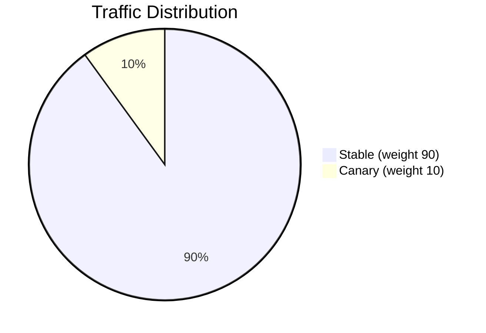
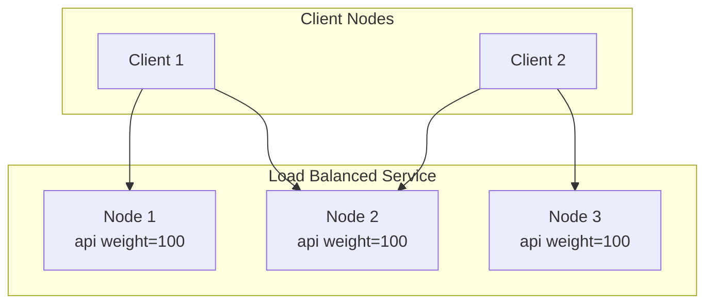
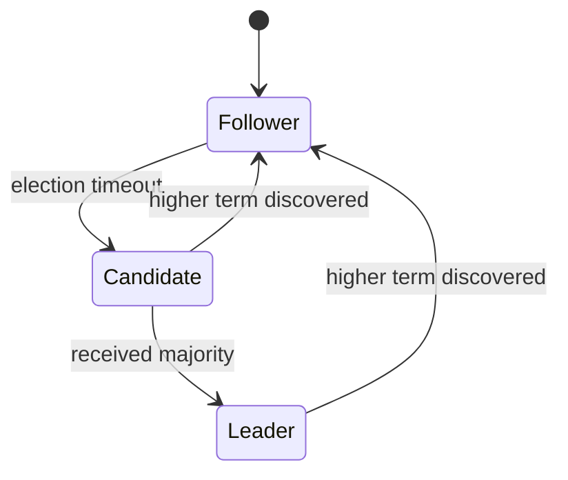
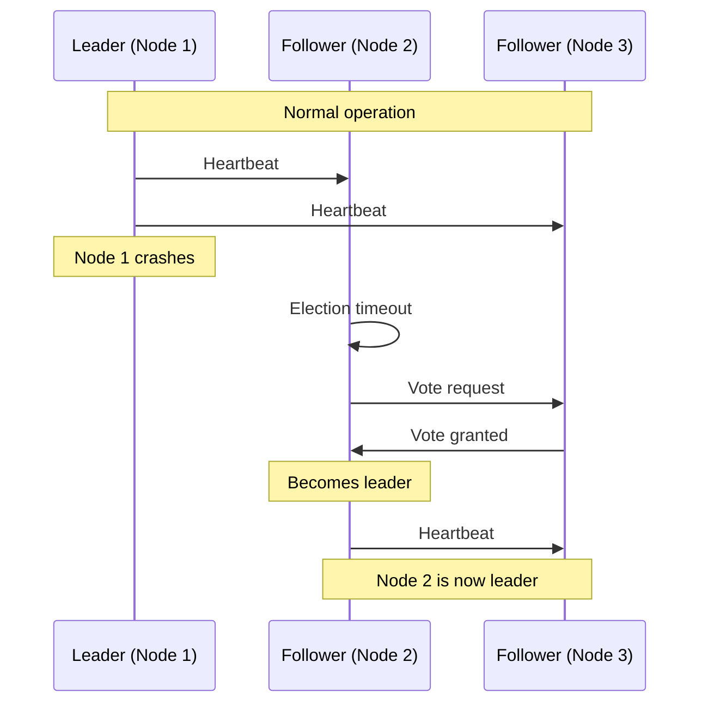
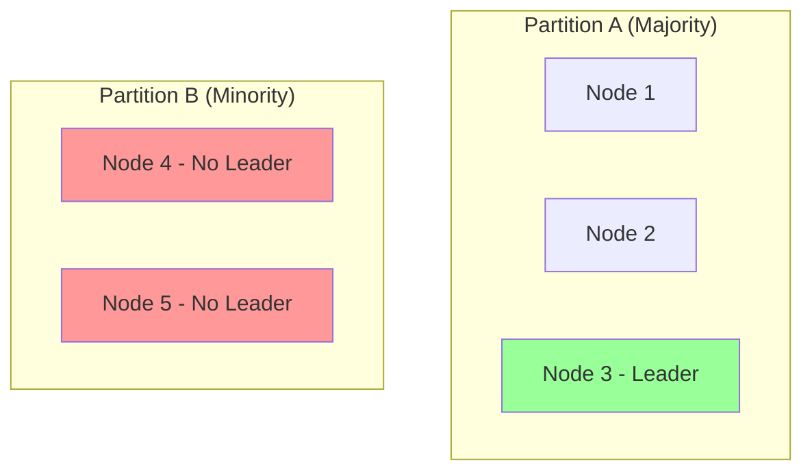
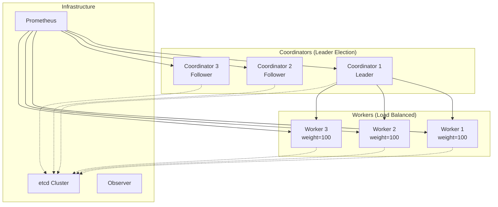

# Building a Cluster

Ergo provides a complete technology stack for building distributed systems. Service discovery, load balancing, failover, observability - all integrated and working together. No external dependencies except the registrar. No API gateways, service meshes, or orchestration layers between your services.

This chapter shows how to use Ergo technologies to build production clusters. You'll see how service discovery enables automatic load balancing, how the leader actor provides failover, how metrics and Observer give you visibility into cluster state. Each technology solves a specific problem; together they cover the full spectrum of distributed system requirements.

## The Integration Cost Problem

Traditional microservice architectures pay a heavy integration tax. Each service needs:

- HTTP/gRPC endpoints for communication
- Client libraries with retry logic and circuit breakers
- Service mesh sidecars for traffic management
- API gateways for routing and load balancing
- Health check endpoints and probes
- Metrics exporters and tracing spans
- Configuration management and secret injection

Each layer adds latency, complexity, and failure modes. A simple call between two services traverses client library, sidecar proxy, load balancer, another sidecar, server library. Each hop serializes, deserializes, and can fail independently.



Ergo eliminates these layers. Processes communicate directly through message passing. The framework handles serialization, routing, load balancing, and failure detection. No sidecars, no API gateways, no client libraries.



One network hop. One serialization. Built-in load balancing and failover. This isn't a philosophical difference - it's orders of magnitude less infrastructure to deploy, maintain, and debug.

## Service Discovery with Registrars

Service discovery is the foundation of clustering. How does node A find node B? How does a process locate the right service instance? Ergo provides three registrar options, each suited for different scales and requirements.

### Embedded Registrar

The embedded registrar requires no external infrastructure. The first node on a host becomes the registrar server; others connect as clients.

```go
// No configuration needed - embedded registrar is the default
node, _ := ergo.StartNode("service@localhost", gen.NodeOptions{})
```



Cross-host discovery uses UDP queries. When node 2 needs to reach node 4, it asks its local registrar server (node 1), which queries node 4's host via UDP.

**Use for**: Development, testing, single-host deployments, simple multi-host setups without firewalls blocking UDP.

**Limitations**: No application discovery, no configuration management, no event notifications.

### etcd Registrar

etcd provides centralized discovery with application routing, configuration management, and event notifications. Nodes register with etcd and maintain leases for automatic cleanup.

```go
import "ergo.services/registrar/etcd"

options := gen.NodeOptions{
    Network: gen.NetworkOptions{
        Registrar: etcd.Create(etcd.Options{
            Endpoints: []string{"etcd1:2379", "etcd2:2379", "etcd3:2379"},
            Cluster:   "production",
        }),
    },
}
node, _ := ergo.StartNode("service@host", options)
```

etcd registrar capabilities:

| Feature | Description |
|---------|-------------|
| Node discovery | Find all nodes in the cluster |
| Application discovery | Find which nodes run specific applications |
| Weighted routing | Load balance based on application weights |
| Configuration | Hierarchical config with type conversion |
| Events | Real-time notifications of cluster changes |

**Use for**: Teams already running etcd, clusters up to 50-70 nodes, deployments needing application discovery.

### Saturn Registrar

Saturn is purpose-built for Ergo. Instead of polling (like etcd), it maintains persistent connections and pushes updates immediately. Topology changes propagate in milliseconds.

```go
import "ergo.services/registrar/saturn"

options := gen.NodeOptions{
    Network: gen.NetworkOptions{
        Registrar: saturn.Create("saturn.example.com", "your-token", saturn.Options{
            Cluster: "production",
        }),
    },
}
node, _ := ergo.StartNode("service@host", options)
```

Saturn vs etcd:

| Aspect | etcd | Saturn |
|--------|------|--------|
| Update propagation | Polling (seconds) | Push (milliseconds) |
| Connection model | HTTP requests | Persistent TCP |
| Scalability | 50-70 nodes | Thousands of nodes |
| Event latency | Next poll cycle | Immediate |
| Infrastructure | General-purpose KV store | Purpose-built for Ergo |

**Use for**: Large clusters, real-time topology awareness, production systems where discovery latency matters.

## Application Discovery and Load Balancing

Applications are the unit of deployment in Ergo. A node can load multiple applications, start them with different modes, and register them with the registrar. Other nodes discover applications and route requests based on weights.

### Registering Applications

When you start an application, it automatically registers with the registrar (if using etcd or Saturn):

```go
// Define application spec with weight
spec := gen.ApplicationSpec{
    Name:   "api",
    Group:  []gen.ApplicationMemberSpec{{Factory: createAPIHandler}},
    Weight: 100,  // higher weight = more traffic
}

node.ApplicationLoad(app, spec)
node.ApplicationStart("api", gen.ApplicationOptions{})
```

The registrar now knows: application "api" is running on this node with weight 100.

### Discovering Applications

Other nodes can discover where applications run:

```go
registrar, _ := node.Network().Registrar()
resolver := registrar.Resolver()

routes, _ := resolver.ResolveApplication("api")
for _, route := range routes {
    fmt.Printf("api on %s (weight: %d, state: %s)\n",
        route.Node, route.Weight, route.State)
}
```

Output might show:
```
api on node1@host1 (weight: 100, state: running)
api on node2@host2 (weight: 100, state: running)
api on node3@host3 (weight: 50, state: running)
```

### Weighted Load Balancing

Weights enable traffic distribution. A node with weight 100 receives twice as much traffic as a node with weight 50. Use this for:

- **Canary deployments**: New version with weight 10, stable with weight 90
- **Capacity matching**: Powerful nodes get higher weights
- **Graceful draining**: Set weight to 0 before maintenance

```go
// Canary deployment
// Stable nodes
stableSpec := gen.ApplicationSpec{Name: "api", Weight: 90}
// Canary node
canarySpec := gen.ApplicationSpec{Name: "api", Weight: 10}
```



During canary and rolling deployments, the cluster runs mixed code versions. Messages sent from new nodes must be understood by old nodes, and vice versa. Ensure your message types support version coexistence as described in [Message Versioning](message-versioning.md).

### Routing Requests

Once you know where applications run, route requests using weighted selection:

```go
func (c *Client) selectNode(routes []gen.ApplicationRoute) gen.Atom {
    // Filter running instances
    var running []gen.ApplicationRoute
    for _, r := range routes {
        if r.State == gen.ApplicationStateRunning {
            running = append(running, r)
        }
    }

    // Weighted random selection
    totalWeight := 0
    for _, r := range running {
        totalWeight += r.Weight
    }

    pick := rand.Intn(totalWeight)
    cumulative := 0
    for _, r := range running {
        cumulative += r.Weight
        if pick < cumulative {
            return r.Node
        }
    }
    return running[0].Node
}
```

This is application-level load balancing without external infrastructure. No load balancer service, no sidecar proxies.

## Running Multiple Instances for Load Balancing

Horizontal scaling means running the same application on multiple nodes. Each instance handles a portion of traffic. Add nodes to increase capacity; remove nodes to reduce costs.

### Deployment Pattern



Each client discovers all api instances and distributes requests based on weights.

### Implementation

On each worker node:

```go
func main() {
    options := gen.NodeOptions{
        Network: gen.NetworkOptions{
            Registrar: etcd.Create(etcd.Options{
                Endpoints: []string{"etcd:2379"},
                Cluster:   "production",
            }),
        },
    }

    node, _ := ergo.StartNode("worker@"+hostname(), options)

    // Load and start the application
    node.ApplicationLoad(&WorkerApp{}, gen.ApplicationSpec{
        Name:   "worker",
        Weight: 100,
    })
    node.ApplicationStartPermanent("worker", gen.ApplicationOptions{})

    node.Wait()
}
```

On coordinator/client nodes:

```go
func (c *Coordinator) distributeWork(job Job) error {
    registrar, _ := c.Node().Network().Registrar()
    routes, _ := registrar.Resolver().ResolveApplication("worker")

    // Select node based on weights
    targetNode := c.selectNode(routes)

    // Get connection and send work
    remote, _ := c.Network().GetNode(targetNode)
    return remote.Send("worker_handler", job)
}
```

### Scaling Operations

**Scale up**: Start new node with the same application. It registers with the registrar. Other nodes discover it through events or next resolution.

**Scale down**: Set weight to 0 (drain), wait for in-flight work, stop the node. Registrar removes the registration when the lease expires.

```go
// Drain before shutdown
info, _ := node.ApplicationInfo("worker")
// Update weight through your deployment tooling
// Wait for in-flight work...
node.Stop()
```

### Reacting to Topology Changes

Subscribe to registrar events to react when instances join or leave:

```go
func (c *Coordinator) Init(args ...any) error {
    registrar, _ := c.Node().Network().Registrar()
    event, _ := registrar.Event()
    c.MonitorEvent(event)
    return nil
}

func (c *Coordinator) HandleEvent(ev gen.MessageEvent) error {
    switch msg := ev.Message.(type) {

    case etcd.EventApplicationStarted:
        if msg.Name == "worker" {
            c.Log().Info("worker started on %s (weight: %d)", msg.Node, msg.Weight)
            c.refreshWorkerList()
        }

    case etcd.EventApplicationStopped:
        if msg.Name == "worker" {
            c.Log().Info("worker stopped on %s", msg.Node)
            c.refreshWorkerList()
        }

    case etcd.EventNodeLeft:
        c.Log().Warning("node left: %s", msg.Name)
        c.handleNodeFailure(msg.Name)
    }
    return nil
}
```

No polling. No service mesh. Events arrive within milliseconds (Saturn) or at the next poll cycle (etcd).

## Running Multiple Instances for Failover

Failover means having standby instances ready to take over when the primary fails. The leader actor implements distributed leader election - exactly one instance is active (leader) while others wait (followers).

### The Leader Actor

The `leader.Actor` from `ergo.services/actor/leader` implements Raft-based leader election. Embed it in your actor to participate in elections:

```go
import "ergo.services/actor/leader"

type Scheduler struct {
    leader.Actor

    jobQueue []Job
    active   bool
}

func (s *Scheduler) Init(args ...any) (leader.Options, error) {
    return leader.Options{
        ClusterID: "scheduler-cluster",
        Bootstrap: []gen.ProcessID{
            {Name: "scheduler", Node: "node1@host1"},
            {Name: "scheduler", Node: "node2@host2"},
            {Name: "scheduler", Node: "node3@host3"},
        },
    }, nil
}

func (s *Scheduler) HandleBecomeLeader() error {
    s.Log().Info("elected as leader - starting job processing")
    s.active = true
    s.startProcessingJobs()
    return nil
}

func (s *Scheduler) HandleBecomeFollower(leaderPID gen.PID) error {
    s.Log().Info("following leader: %s", leaderPID)
    s.active = false
    s.stopProcessingJobs()
    return nil
}
```

### Election Mechanics



1. All instances start as followers
2. If no heartbeats arrive, a follower becomes candidate
3. Candidate requests votes from peers
4. Majority vote wins; candidate becomes leader
5. Leader sends periodic heartbeats
6. If leader fails, followers detect timeout and elect new leader

### Failover Scenario



Failover happens automatically. No manual intervention. The surviving nodes elect a new leader within the election timeout (150-300ms by default).

### Use Cases

**Single-writer coordination**: Only the leader writes to prevent conflicts.

```go
func (s *Scheduler) HandleMessage(from gen.PID, message any) error {
    switch msg := message.(type) {
    case SubmitJob:
        if s.IsLeader() == false {
            // Forward to leader
            s.Send(s.Leader(), msg)
            return nil
        }
        s.jobQueue = append(s.jobQueue, msg.Job)
    }
    return nil
}
```

**Task scheduling**: Only the leader runs periodic tasks.

```go
func (s *Scheduler) HandleBecomeLeader() error {
    s.SendAfter(s.PID(), RunScheduledTasks{}, 10*time.Second)
    return nil
}

func (s *Scheduler) HandleMessage(from gen.PID, message any) error {
    switch message.(type) {
    case RunScheduledTasks:
        if s.IsLeader() {
            s.executeScheduledTasks()
            s.SendAfter(s.PID(), RunScheduledTasks{}, 10*time.Second)
        }
    }
    return nil
}
```

**Distributed locks**: Leader grants exclusive access.

```go
func (s *Scheduler) HandleMessage(from gen.PID, message any) error {
    switch msg := message.(type) {
    case AcquireLock:
        if s.IsLeader() == false {
            s.Send(from, NotLeader{Leader: s.Leader()})
            return nil
        }
        if s.locks[msg.Resource] != nil {
            s.Send(from, LockDenied{})
        } else {
            s.locks[msg.Resource] = &Lock{Holder: from, Expiry: time.Now().Add(msg.TTL)}
            s.Send(from, LockGranted{})
        }
    }
    return nil
}
```

### Quorum and Split-Brain

Leader election requires a majority (quorum) to prevent split-brain:

| Cluster Size | Quorum | Tolerated Failures |
|--------------|--------|-------------------|
| 3 nodes | 2 | 1 |
| 5 nodes | 3 | 2 |
| 7 nodes | 4 | 3 |

If a network partition splits 5 nodes into groups of 3 and 2:
- The group of 3 can elect a leader (has quorum)
- The group of 2 cannot (no quorum)

This prevents both sides from having leaders and making conflicting decisions.



## Observability with Metrics

The metrics actor from `ergo.services/actor/metrics` exposes Prometheus-format metrics. Base metrics are collected automatically; you add custom metrics for application-specific telemetry.

### Basic Setup

```go
import "ergo.services/actor/metrics"

node.Spawn(metrics.Factory, gen.ProcessOptions{}, metrics.Options{
    Host: "0.0.0.0",
    Port: 9090,
    CollectInterval: 10 * time.Second,
})
```

This starts an HTTP server at `:9090/metrics` with base metrics:

| Metric | Description |
|--------|-------------|
| `ergo_node_uptime_seconds` | Node uptime |
| `ergo_processes_total` | Total process count |
| `ergo_processes_running` | Actively processing |
| `ergo_memory_used_bytes` | Memory from OS |
| `ergo_memory_alloc_bytes` | Heap allocation |
| `ergo_connected_nodes_total` | Remote connections |
| `ergo_remote_messages_in_total` | Messages received per node |
| `ergo_remote_messages_out_total` | Messages sent per node |
| `ergo_remote_bytes_in_total` | Bytes received per node |
| `ergo_remote_bytes_out_total` | Bytes sent per node |

### Custom Metrics

Extend the metrics actor for application-specific telemetry:

```go
type AppMetrics struct {
    metrics.Actor

    requestsTotal  prometheus.Counter
    requestLatency prometheus.Histogram
    activeJobs     prometheus.Gauge
}

func (m *AppMetrics) Init(args ...any) (metrics.Options, error) {
    m.requestsTotal = prometheus.NewCounter(prometheus.CounterOpts{
        Name: "app_requests_total",
        Help: "Total requests processed",
    })

    m.requestLatency = prometheus.NewHistogram(prometheus.HistogramOpts{
        Name:    "app_request_duration_seconds",
        Buckets: prometheus.DefBuckets,
    })

    m.activeJobs = prometheus.NewGauge(prometheus.GaugeOpts{
        Name: "app_active_jobs",
        Help: "Currently processing jobs",
    })

    m.Registry().MustRegister(m.requestsTotal, m.requestLatency, m.activeJobs)

    return metrics.Options{Port: 9090}, nil
}
```

Update metrics from your application:

```go
// In your request handler
func (h *Handler) HandleMessage(from gen.PID, message any) error {
    start := time.Now()

    // Process request...

    // Send metrics update
    h.Send(metricsPID, RequestCompleted{Duration: time.Since(start)})
    return nil
}

// In metrics actor
func (m *AppMetrics) HandleMessage(from gen.PID, message any) error {
    switch msg := message.(type) {
    case RequestCompleted:
        m.requestsTotal.Inc()
        m.requestLatency.Observe(msg.Duration.Seconds())
    case JobStarted:
        m.activeJobs.Inc()
    case JobCompleted:
        m.activeJobs.Dec()
    }
    return nil
}
```

### Prometheus Integration

```yaml
# prometheus.yml
scrape_configs:
  - job_name: 'ergo-cluster'
    static_configs:
      - targets:
          - 'node1:9090'
          - 'node2:9090'
          - 'node3:9090'
```

Now you have cluster-wide visibility: process counts, memory usage, network traffic, custom business metrics - all in Prometheus/Grafana.

## Inspecting with Observer

Observer is a web UI for cluster inspection. Run it as an application within your node or as a standalone tool.

### Embedding Observer

```go
import "ergo.services/application/observer"

options := gen.NodeOptions{
    Applications: []gen.ApplicationBehavior{
        observer.CreateApp(observer.Options{
            Host: "localhost",
            Port: 9911,
        }),
    },
}
node, _ := ergo.StartNode("mynode@localhost", options)
```

Open `http://localhost:9911` to see:

- **Node info**: Uptime, memory, CPU, process counts
- **Network**: Connected nodes, acceptors, traffic graphs
- **Process list**: All processes with state, mailbox depth, runtime
- **Process details**: Links, monitors, aliases, environment
- **Logs**: Real-time log stream with filtering

### Standalone Observer Tool

For inspecting remote nodes without embedding:

```bash
go install ergo.services/tools/observer@latest
observer -cookie "your-cluster-cookie"
```

Connect to any node in your cluster and inspect its state remotely.

### Process Inspection

Observer calls `HandleInspect` on processes to get internal state:

```go
func (w *Worker) HandleInspect(from gen.PID, item ...string) map[string]string {
    return map[string]string{
        "queue_depth":  fmt.Sprintf("%d", len(w.queue)),
        "processed":    fmt.Sprintf("%d", w.processedCount),
        "current_job":  w.currentJob.ID,
        "uptime":       time.Since(w.startTime).String(),
    }
}
```

This data appears in the Observer UI, updated every second.

### Debugging Production Issues

Observer helps diagnose:

- **Memory leaks**: Watch `ergo_memory_alloc_bytes`, find processes with growing mailboxes
- **Stuck processes**: Check "Top Running" sort to find processes consuming CPU
- **Message backlogs**: "Top Mailbox" shows processes falling behind
- **Network issues**: Traffic graphs show bytes/messages per remote node
- **Process relationships**: Links and monitors show supervision structure

## Remote Operations

Ergo supports starting processes and applications on remote nodes. This enables dynamic workload distribution and orchestration.

### Remote Spawn

Start a process on a remote node:

```go
// On remote node: enable spawn
network := node.Network()
network.EnableSpawn("worker", createWorker, "coordinator@host")

// On coordinator: spawn remotely
remote, _ := coordinator.Network().GetNode("worker@host")
pid, _ := remote.Spawn("worker", gen.ProcessOptions{}, WorkerConfig{BatchSize: 100})

// Send work to the remote process
coordinator.Send(pid, ProcessJob{Data: jobData})
```

The spawned process runs on the remote node but can communicate with any process in the cluster.

### Remote Application Start

Start an application on a remote node:

```go
// On remote node: load app and enable remote start
node.ApplicationLoad(&WorkerApp{}, gen.ApplicationSpec{Name: "workers"})
network.EnableApplicationStart("workers", "coordinator@host")

// On coordinator: start remotely
remote, _ := coordinator.Network().GetNode("worker@host")
remote.ApplicationStartPermanent("workers", gen.ApplicationOptions{})
```

Use this for:

- **Dynamic orchestration**: Coordinator decides which apps run where
- **Staged deployment**: Start apps in order, waiting for health checks
- **Capacity management**: Start/stop apps based on load

## Configuration Management

etcd and Saturn registrars provide cluster-wide configuration with hierarchical overrides.

### Configuration Hierarchy

```
1. Node-specific in cluster:     /cluster/{cluster}/config/{node}/{item}
2. Cluster-wide default:         /cluster/{cluster}/config/*/{item}
3. Global default:               /config/global/{item}
```

Node-specific overrides cluster-wide, which overrides global.

### Typed Configuration

Values are stored as strings with type prefixes:

```bash
# Set config via etcdctl
etcdctl put services/ergo/cluster/production/config/*/db.pool_size "int:20"
etcdctl put services/ergo/cluster/production/config/*/cache.enabled "bool:true"
etcdctl put services/ergo/cluster/production/config/node1/db.pool_size "int:50"
```

```go
// Read config in your application
registrar, _ := node.Network().Registrar()
config, _ := registrar.Config("db.pool_size", "cache.enabled")

poolSize := config["db.pool_size"].(int64)    // 50 on node1, 20 on others
cacheEnabled := config["cache.enabled"].(bool) // true
```

### Configuration Events

React to config changes in real-time:

```go
func (a *App) HandleEvent(ev gen.MessageEvent) error {
    switch msg := ev.Message.(type) {
    case etcd.EventConfigUpdate:
        a.Log().Info("config changed: %s = %v", msg.Item, msg.Value)

        switch msg.Item {
        case "log.level":
            a.updateLogLevel(msg.Value.(string))
        case "cache.size":
            a.resizeCache(msg.Value.(int64))
        }
    }
    return nil
}
```

No restart required. Configuration propagates to all nodes automatically.

## Putting It Together

Here's a complete example: a job processing cluster with load balancing, failover, metrics, and observability.

### Architecture



### Coordinator Node

```go
package main

import (
    "ergo.services/actor/leader"
    "ergo.services/actor/metrics"
    "ergo.services/application/observer"
    "ergo.services/ergo"
    "ergo.services/ergo/gen"
    "ergo.services/registrar/etcd"
)

type Coordinator struct {
    leader.Actor
    workers []gen.ApplicationRoute
}

func (c *Coordinator) Init(args ...any) (leader.Options, error) {
    // Subscribe to registrar events
    reg, _ := c.Node().Network().Registrar()
    ev, _ := reg.Event()
    c.MonitorEvent(ev)

    // Initial worker discovery
    c.refreshWorkers()

    return leader.Options{
        ClusterID: "coordinators",
        Bootstrap: []gen.ProcessID{
            {Name: "coordinator", Node: "coord1@host1"},
            {Name: "coordinator", Node: "coord2@host2"},
            {Name: "coordinator", Node: "coord3@host3"},
        },
    }, nil
}

func (c *Coordinator) HandleBecomeLeader() error {
    c.Log().Info("became leader - starting job distribution")
    c.SendAfter(c.PID(), DistributeJobs{}, time.Second)
    return nil
}

func (c *Coordinator) HandleBecomeFollower(leader gen.PID) error {
    c.Log().Info("following %s", leader)
    return nil
}

func (c *Coordinator) HandleEvent(ev gen.MessageEvent) error {
    switch ev.Message.(type) {
    case etcd.EventApplicationStarted, etcd.EventApplicationStopped:
        c.refreshWorkers()
    }
    return nil
}

func (c *Coordinator) refreshWorkers() {
    reg, _ := c.Node().Network().Registrar()
    c.workers, _ = reg.Resolver().ResolveApplication("worker")
}

func main() {
    options := gen.NodeOptions{
        Network: gen.NetworkOptions{
            Registrar: etcd.Create(etcd.Options{
                Endpoints: []string{"etcd:2379"},
                Cluster:   "production",
            }),
        },
        Applications: []gen.ApplicationBehavior{
            observer.CreateApp(observer.Options{Port: 9911}),
        },
    }

    node, _ := ergo.StartNode("coord1@host1", options)

    // Start metrics
    node.Spawn(metrics.Factory, gen.ProcessOptions{}, metrics.Options{Port: 9090})

    // Start coordinator
    node.SpawnRegister("coordinator", func() gen.ProcessBehavior {
        return &Coordinator{}
    }, gen.ProcessOptions{})

    node.Wait()
}
```

### Worker Node

```go
package main

import (
    "ergo.services/actor/metrics"
    "ergo.services/ergo"
    "ergo.services/ergo/gen"
    "ergo.services/registrar/etcd"
)

type WorkerApp struct{}

func (w *WorkerApp) Load(node gen.Node, args ...any) (gen.ApplicationSpec, error) {
    return gen.ApplicationSpec{
        Name:   "worker",
        Weight: 100,
        Group: []gen.ApplicationMemberSpec{
            {Name: "handler", Factory: createHandler},
        },
    }, nil
}

func (w *WorkerApp) Start(mode gen.ApplicationMode) {}
func (w *WorkerApp) Terminate(reason error) {}

func main() {
    options := gen.NodeOptions{
        Network: gen.NetworkOptions{
            Registrar: etcd.Create(etcd.Options{
                Endpoints: []string{"etcd:2379"},
                Cluster:   "production",
            }),
        },
    }

    node, _ := ergo.StartNode("worker1@host1", options)

    // Start metrics
    node.Spawn(metrics.Factory, gen.ProcessOptions{}, metrics.Options{Port: 9090})

    // Load and start worker application
    node.ApplicationLoad(&WorkerApp{})
    node.ApplicationStartPermanent("worker", gen.ApplicationOptions{})

    node.Wait()
}
```

### What You Get

- **Load balancing**: Jobs distribute across workers based on weights
- **Failover**: If coordinator leader fails, another takes over in <300ms
- **Discovery**: Workers auto-register; coordinators discover them via events
- **Metrics**: Prometheus scrapes all nodes for cluster-wide visibility
- **Inspection**: Observer UI shows processes, mailboxes, network traffic
- **Configuration**: Update settings via etcd; changes propagate immediately

All of this with:
- No API gateways
- No service mesh
- No load balancer services
- No orchestration layers
- No client libraries with retry logic

Just Ergo nodes communicating directly through message passing.

## Summary

Ergo provides integrated technologies for building production clusters:

| Technology | Purpose | Package |
|------------|---------|---------|
| **Registrars** | Service discovery | `ergo.services/registrar/etcd`, `registrar/saturn` |
| **Applications** | Deployment units with weights | Core framework |
| **Leader Actor** | Failover via leader election | `ergo.services/actor/leader` |
| **Metrics Actor** | Prometheus observability | `ergo.services/actor/metrics` |
| **Observer** | Web UI for inspection | `ergo.services/application/observer`, `tools/observer` |
| **Remote Spawn** | Dynamic process creation | Core framework |
| **Remote App Start** | Dynamic application deployment | Core framework |
| **Configuration** | Hierarchical config management | Registrar feature |

These components eliminate the integration layers that dominate traditional microservice architectures. Instead of building infrastructure, you build applications.

For implementation details, see:
- [Message Versioning](message-versioning.md)
- [Service Discovering](../networking/service-discovering.md)
- [Leader Actor](../extra-library/actors/leader.md)
- [Metrics Actor](../extra-library/actors/metrics.md)
- [Observer Application](../extra-library/applications/observer.md)
- [etcd Client](../extra-library/registrars/etcd-client.md)
- [Saturn Client](../extra-library/registrars/saturn-client.md)
