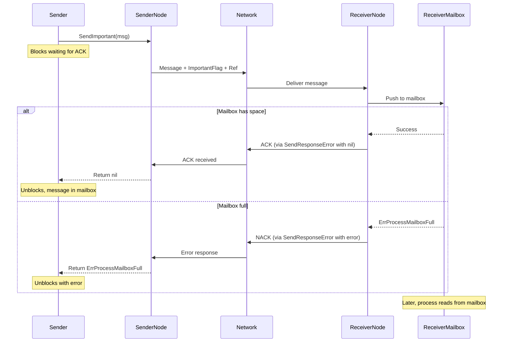
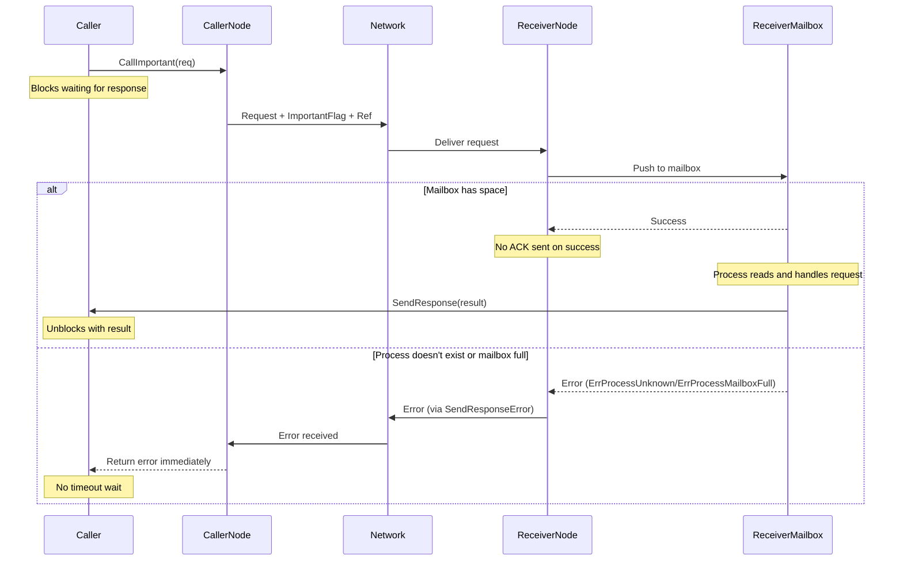
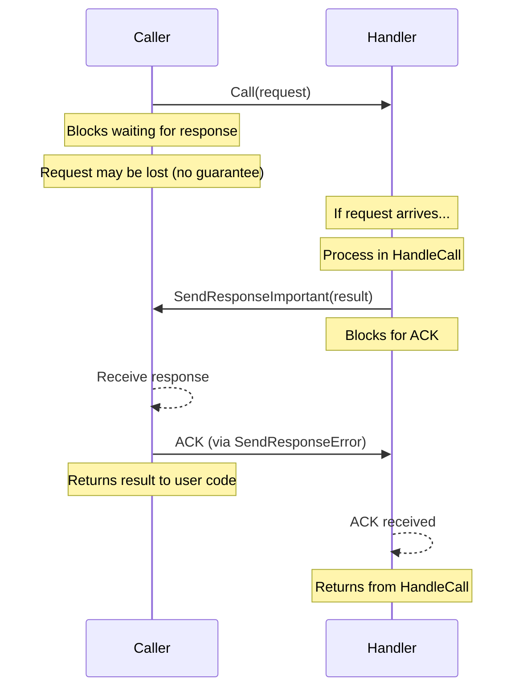
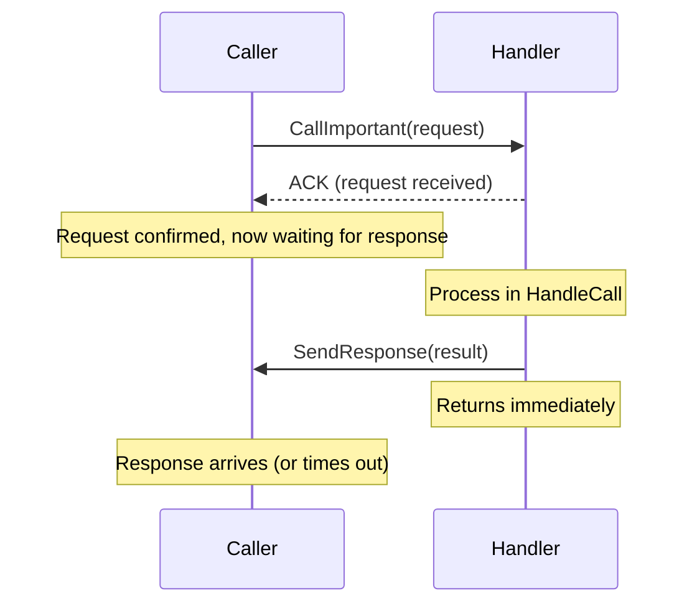
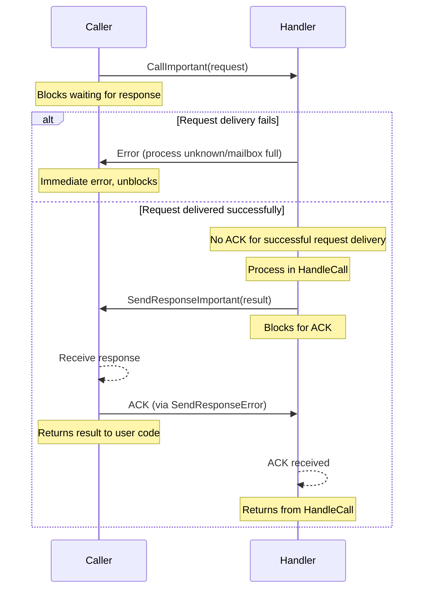

# Important Delivery

In the actor model, messages are typically fire-and-forget. You send a message, and it either arrives or it doesn't. For local communication, errors are immediate - if the process doesn't exist or the mailbox is full, `Send` returns an error. But for remote communication, `Send` succeeds as soon as the message reaches the network layer. You don't know if it arrived at the remote node, if the target process exists, or if the mailbox had space.

This works fine for many scenarios. Asynchronous messaging doesn't require confirmation. Actors process what arrives and ignore what doesn't. Systems are resilient because actors don't wait for acknowledgments - they keep working.

But some operations need certainty. A payment authorization must definitely be recorded or definitely fail - "maybe it worked" isn't acceptable. A distributed transaction coordinator needs to know that all participants received the commit message before proceeding. Critical state updates can't be silently lost.

Important Delivery provides guaranteed message delivery through acknowledgment. When you send with the important flag, the framework tracks the message, waits for confirmation from the recipient, and reports errors if delivery fails.

## The Problem: Network Opacity

Without important delivery, remote communication is opaque:

```go
// Local - errors are immediate
err := process.Send(localPID, message)
if err != nil {
    // ErrProcessUnknown or ErrProcessMailboxFull
    // You know immediately something is wrong
}

// Remote - errors are hidden
err = process.Send(remotePID, message)
if err != nil {
    // Only reports local problems (serialization, no connection)
    // Cannot report remote problems (process missing, mailbox full)
}
// Message sent to network, no idea if it arrived
```

The remote `Send` succeeds even if:
- The remote process doesn't exist
- The remote process's mailbox is full
- The remote node received the message but dropped it
- The network delivered the message but it got lost before reaching the process

You only discover problems through absence - no response arrives, timeouts fire, but you don't know why. Did the request get lost? Did the process crash? Is it just slow?

## The Solution: Confirmed Delivery

Important delivery makes remote communication transparent - errors are immediate, just like local:

```go
err := process.SendImportant(remotePID, message)
if err != nil {
    // Immediate errors:
    // - ErrProcessUnknown: process doesn't exist on remote node
    // - ErrProcessMailboxFull: process exists but mailbox is full
    // - ErrTimeout: remote node received message but no confirmation
    // - ErrNoConnection: cannot reach remote node
}
// If no error, message is definitely in the recipient's mailbox
```

The framework sends the message, waits for acknowledgment from the remote node, and reports the outcome. Either the message is in the recipient's mailbox (success) or you get an error explaining what went wrong (failure). No ambiguity.

## How to Use Important Delivery

There are two ways to enable important delivery:

**Method 1: Per-message explicit methods**

Use `SendImportant` and `CallImportant` instead of `Send` and `Call`:

```go
func (a *Actor) HandleMessage(from gen.PID, message any) error {
    switch msg := message.(type) {
    case CriticalUpdate:
        // This message must be delivered or we need to know it failed
        if err := a.SendImportant(targetPID, msg); err != nil {
            a.Log().Error("failed to send critical update: %s", err)
            return err
        }
        a.Log().Info("critical update confirmed delivered")
    }
    return nil
}
```

**Method 2: Process-level flag**

Set the important delivery flag on the process - all outgoing messages use important delivery:

```go
func (a *Actor) Init(args ...any) error {
    // Enable important delivery for all messages from this process
    a.SetImportantDelivery(true)
    return nil
}

func (a *Actor) HandleMessage(from gen.PID, message any) error {
    // Send uses important delivery automatically
    err := a.Send(targetPID, message)
    if err != nil {
        // Immediate confirmation or error
    }
    return nil
}
```

The process-level flag affects all outgoing messages: `Send`, `SendPID`, `SendProcessID`, `SendAlias`, and Call requests. You don't need to use special methods - regular `Send` and `Call` automatically include the important flag.

Use the flag when the process primarily deals with critical messages. Use explicit methods when only specific messages require guarantees.

## How Important Delivery Works

### Send with Important Delivery

Here's what happens when you send a message with important delivery:



The sender blocks until the acknowledgment arrives. The remote node attempts delivery and sends either success (ACK) or failure (error). The sender's `SendImportant` unblocks with the result.

For local sends, the behavior is identical to regular `Send` - immediate error if the process doesn't exist or mailbox is full. The important flag only affects remote sends.

### Call with Important Delivery

Call requests already have a response channel (the caller waits for `HandleCall` to return), so important delivery works differently. The ACK is only sent if there's an error - if delivery succeeds, no ACK is sent, and the caller waits for the actual response:



The key difference from regular `Call`: with `CallImportant`, if the remote process doesn't exist or its mailbox is full, you get an **immediate error** instead of waiting for timeout. If delivery succeeds, you wait for the response just like regular `Call`.

Without the important flag, `ErrProcessUnknown` looks like timeout - you can't tell if the process is slow, dead, or never existed. With important delivery, you know immediately.

## Combining Call and Response Delivery

Things get interesting when you combine important delivery on requests with important delivery on responses. There are four combinations, each with different guarantees.

### Regular Call + Regular Response

```go
// Caller
result, err := process.Call(target, request)

// Handler
func (h *Handler) HandleCall(from gen.PID, ref gen.Ref, request any) (any, error) {
    result := h.process(request)
    return result, nil  // Framework sends with SendResponse
}
```

**Guarantees:** None. Request may be lost. Response may be lost. Timeout is ambiguous.

**Use case:** Fast, non-critical operations where occasional loss is acceptable.

### Regular Call + Important Response (RR-2PC)

```go
// Caller
result, err := process.Call(target, request)

// Handler
func (h *Handler) HandleCall(from gen.PID, ref gen.Ref, request any) (any, error) {
    h.SetImportantDelivery(true)  // Or use SendResponseImportant explicitly
    result := h.process(request)
    return result, nil  // Framework sends with SendResponseImportant
}
```

**Guarantees:** Response delivery is confirmed. If the handler returns a result, the caller will receive it (or get an error if delivery fails). Request delivery is not confirmed - the handler might never receive the request.

**Protocol name:** RR-2PC (Response-Reliable Two-Phase Commit)

**Use case:** The handler's work is critical, the caller must know if it succeeded. Example: committing a transaction. If the transaction commits, the caller must know. But it's okay if the request gets lost (request is idempotent, can be retried).

**How it works:**



The handler blocks after processing until the caller acknowledges the response. If the caller crashes before sending ACK, the handler's `SendResponseImportant` returns `ErrResponseIgnored` or `ErrTimeout`.

The request has no guarantee - it might be lost, and the caller would timeout. But **if** the handler processed the request and sends a response, that response is guaranteed to be delivered.

### Important Call + Regular Response

```go
// Caller
result, err := process.CallImportant(target, request)

// Handler
func (h *Handler) HandleCall(from gen.PID, ref gen.Ref, request any) (any, error) {
    result := h.process(request)
    return result, nil  // Regular SendResponse
}
```

**Guarantees:** Request delivery is confirmed. The handler will receive the request (or caller gets an error immediately). Response delivery is not confirmed - response may be lost.

**Use case:** The handler must receive the request, but the response is less critical or can be retried. Example: triggering a background job. The job must start, but if the status response is lost, the caller can query status later.

**How it works:**



The caller gets immediate confirmation that the request arrived, then waits for the response. If the response gets lost, the caller times out - but knows the handler received and processed the request.

### Important Call + Important Response (FR-2PC)

```go
// Caller
result, err := process.CallImportant(target, request)

// Handler
func (h *Handler) HandleCall(from gen.PID, ref gen.Ref, request any) (any, error) {
    h.SetImportantDelivery(true)
    result := h.process(request)
    return result, nil  // Framework sends with SendResponseImportant
}
```

**Guarantees:** Both request and response delivery are confirmed. The handler definitely receives the request, and the caller definitely receives the response. No ambiguity at any point.

**Protocol name:** FR-2PC (Fully-Reliable Two-Phase Commit)

**Use case:** Critical operations where both request and response must be guaranteed. Example: distributed transaction commit coordination, financial operations, critical state synchronization.

**How it works:**



With FR-2PC:
- The caller gets immediate error if request can't be delivered (no ambiguous timeout)
- If request is delivered, caller waits for response
- The handler blocks after sending response until caller confirms receipt
- Both sides know definitively whether delivery succeeded

This is the most reliable pattern but also the most expensive. Use it only when guaranteed delivery is essential.

## FR-2PC as Foundation for 3PC

FR-2PC provides the messaging reliability needed to implement Three-Phase Commit (3PC) and other distributed transaction protocols at the application level.

Traditional Two-Phase Commit (2PC) has a blocking problem: if the coordinator crashes after participants vote "yes" but before sending commit/abort, participants don't know what to do. They're stuck.

Three-Phase Commit solves this by adding a pre-commit phase:
1. **Prepare:** Can you commit?
2. **Pre-commit:** Everyone said yes, get ready to commit
3. **Commit:** Now commit

If the coordinator crashes after pre-commit, participants know the outcome was "commit" and can proceed independently.

But 3PC only works if messages are reliably delivered. If a pre-commit message gets lost and a participant doesn't receive it, the protocol breaks - some participants think we're committing, others are still waiting.

FR-2PC guarantees that messages are delivered or errors are reported. This lets you implement 3PC confidently:

```go
type Coordinator struct {
    act.Actor
    participants []gen.PID
}

func (c *Coordinator) Prepare() error {
    c.SetImportantDelivery(true)  // FR-2PC for all messages
    
    // Phase 1: Prepare
    for _, p := range c.participants {
        result, err := c.CallImportant(p, PrepareRequest{})
        if err != nil {
            // Participant unreachable - abort
            return c.abort()
        }
        if result != "yes" {
            // Participant voted no - abort
            return c.abort()
        }
    }
    
    // Phase 2: Pre-commit (guaranteed delivery)
    for _, p := range c.participants {
        result, err := c.CallImportant(p, PreCommitRequest{})
        if err != nil {
            // This is a problem - participant didn't receive pre-commit
            // But FR-2PC guarantees we know immediately
            return c.handlePreCommitFailure(p, err)
        }
    }
    
    // Phase 3: Commit (guaranteed delivery)
    for _, p := range c.participants {
        _, err := c.CallImportant(p, CommitRequest{})
        if err != nil {
            // Participant didn't receive commit
            // Need recovery protocol
            return c.handleCommitFailure(p, err)
        }
    }
    
    return nil
}
```

FR-2PC ensures that:
- If `CallImportant` returns `nil`, the participant received the message
- If `CallImportant` returns an error, the participant didn't receive the message
- No ambiguous timeouts where you don't know if the message arrived

This determinism is essential for 3PC. Without it, you'd need complex timeout-based recovery that can't distinguish "participant is slow" from "participant is dead" from "message was lost."

## Performance Considerations

Important delivery adds overhead:
- **Extra round trip:** Sender waits for ACK before proceeding
- **Sender blocks:** Can't process other messages while waiting
- **Network traffic:** Additional ACK messages

For `SendImportant`, the sender blocks until ACK arrives (success or error) or timeout. For `CallImportant`, the sender gets immediate error if delivery fails, or waits for response if delivery succeeds (no extra ACK on success).

The blocking is process-local - only the sending actor waits. Other actors on the node continue normally. But the sending actor's mailbox isn't processed during the wait.

Use important delivery selectively:
- **Use for:** Critical state updates, transaction coordination, payment processing, data synchronization
- **Don't use for:** High-frequency updates, informational messages, monitoring events, retryable operations

Most actor communication doesn't need guarantees. The actor model is resilient because actors handle partial failure gracefully. Important delivery is for the cases where partial failure isn't acceptable - where certainty is worth the cost.

## Local vs Remote Behavior

Important delivery only affects remote communication. For local sends:

```go
// Local send - immediate error, important flag ignored
err := process.SendImportant(localPID, message)
if err != nil {
    // ErrProcessUnknown or ErrProcessMailboxFull
    // No ACK needed, mailbox operation is synchronous
}
```

Local mailbox operations are synchronous - pushing to the mailbox either succeeds or fails immediately. The important flag is unnecessary because there's no network uncertainty. The framework silently treats local important sends as regular sends.

This means your code works identically for local and remote processes. You can use `SendImportant` everywhere without checking if the target is local or remote - the framework optimizes local communication automatically.

## Error Types

Important delivery produces specific errors:

**ErrProcessUnknown** - The remote process doesn't exist. Without important delivery, you'd discover this through timeout. With important delivery, you know immediately.

**ErrProcessMailboxFull** - The remote process exists but its mailbox is full. Without important delivery, the message would queue in the network layer or be dropped. With important delivery, you get immediate feedback.

**ErrTimeout** - The remote node received the message but didn't send ACK within the timeout period. This is different from Call timeout - it means the node is unresponsive or overloaded.

**ErrResponseIgnored** - For important responses, the caller is no longer waiting (timed out or terminated). The response couldn't be delivered. Without important delivery, the handler wouldn't know the response was ignored.

**ErrNoConnection** - Cannot establish connection to the remote node. This error occurs for both regular and important sends, but important delivery surfaces it immediately instead of silently queueing.

These specific errors let you handle different failure modes appropriately - retry for `ErrTimeout`, provision more resources for `ErrProcessMailboxFull`, fail immediately for `ErrProcessUnknown`.

## Summary

Important delivery trades performance for certainty. Messages are guaranteed to be delivered or errors are reported immediately. Use it when:

- The operation is critical and must succeed or definitely fail
- Ambiguous timeouts are unacceptable
- You're implementing distributed protocols that require guaranteed delivery
- The cost of retrying without knowing if the first attempt succeeded is high

For most actor communication, fire-and-forget messaging is sufficient. The actor model handles uncertainty through supervision, retries, and eventual consistency. Important delivery is for the cases where uncertainty itself is the problem.

For more on handling synchronous requests, see [Sync Request Handling](handle-sync.md).
