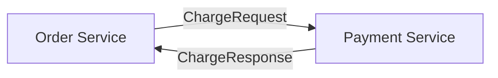
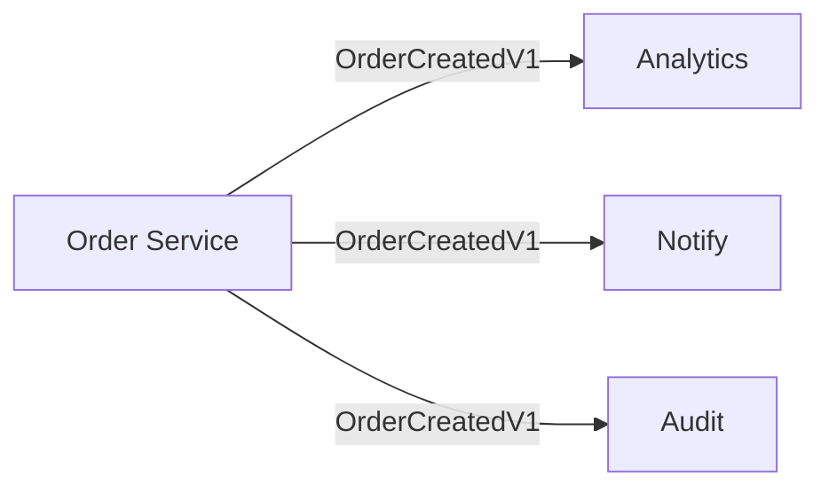
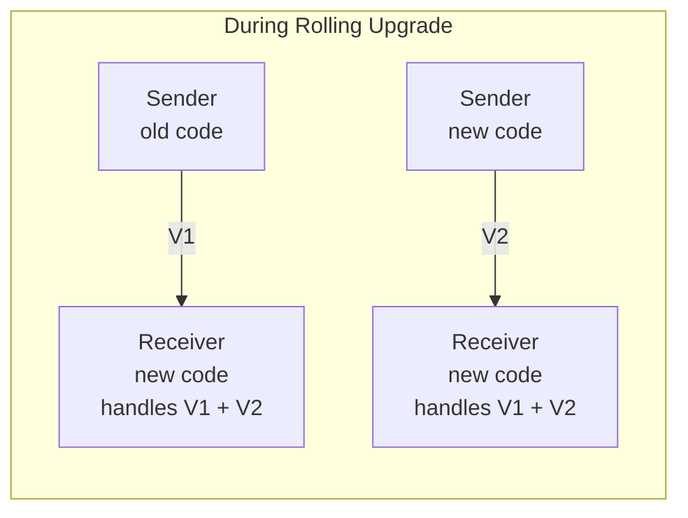

# Message Versioning

Distributed systems evolve. Services gain features, data models change, and deployments happen gradually. During a rolling upgrade, some nodes run new code while others still run the old version. A message sent from a new node must be understood by an old node, and vice versa.

EDF serializes messages by their exact Go type. Change a struct - and you have a new, incompatible type. This is intentional: explicit versioning catches breaking changes at compile time rather than hiding them until production.

This article explains how to version messages so your cluster handles upgrades gracefully.

## Explicit Versioning

Unlike Protobuf or Avro, EDF does not provide automatic backward compatibility. There are no optional fields, no field numbers, no schema evolution. A struct is its type. Change the struct - create a new type.

The approach is straightforward: create a new type for each version.

```go
// Version 1
type OrderCreatedV1 struct {
    OrderID int64
}

// Version 2 - new field
type OrderCreatedV2 struct {
    OrderID  int64
    Priority int
}
```

Both types coexist in the codebase. The receiver handles whichever version arrives:

```go
func (a *Actor) HandleMessage(from gen.PID, message any) error {
    switch m := message.(type) {
    case OrderCreatedV1:
        return a.handleOrderV1(m)
    case OrderCreatedV2:
        return a.handleOrderV2(m)
    }
    return nil
}
```

All message types must be registered with EDF before connection establishment:

```go
func init() {
    types := []any{
        OrderCreatedV1{},
        OrderCreatedV2{},
    }
    for _, t := range types {
        if err := edf.RegisterTypeOf(t); err != nil && err != gen.ErrTaken {
            panic(err)
        }
    }
}
```

For details on EDF and type registration, see [Network Transparency](../networking/network-transparency.md).

## Versioning Strategies

There are two ways to organize versioned types: version in the type name or version in the package path. Both work with EDF. Choose based on your team's preferences.

**Important:** Do not confuse package path versioning with Go modules v2+. Go modules v2+ requires changing both `go.mod` and all import paths when bumping major version (`company.com/events/v2`). This forces all consumers to update imports simultaneously, creates [diamond dependency problems](https://en.wikipedia.org/wiki/Dependency_hell#Problems), and generally causes more pain than it solves. Keep your module below v2.0.0 to avoid triggering this mechanism.

### Version in Type Name

All versions live in the same package:

```
events/
├── order_created_v1.go
├── order_created_v2.go
└── register.go
```

```go
import "company.com/events"

events.OrderCreatedV1{}
events.OrderCreatedV2{}
```

Handler uses type names directly:

```go
switch m := message.(type) {
case events.OrderCreatedV1:
    // ...
case events.OrderCreatedV2:
    // ...
}
```

Advantages:
- Single import for all versions
- All versions visible in one place - evolution is clear
- One registration file for all types
- Simpler directory structure

### Version in Package Path

Each version is a separate package:

```
messaging/
├── v1/
│   └── events/
│       └── order_created.go
└── v2/
    └── events/
        └── order_created.go
```

```go
import eventsv1 "company.com/messaging/v1/events"
import eventsv2 "company.com/messaging/v2/events"

eventsv1.OrderCreated{}
eventsv2.OrderCreated{}
```

Handler uses package aliases:

```go
switch m := message.(type) {
case eventsv1.OrderCreated:
    // ...
case eventsv2.OrderCreated:
    // ...
}
```

Advantages:
- Clean type names without version suffix
- Familiar to Protobuf users
- Clear directory separation between versions
- Removing a version means deleting a directory

#### Module Organization

For projects where message versions evolve in parallel, place `go.mod` in each domain directory:

```
messaging/
├── v1/
│   ├── events/
│   │   ├── go.mod              # module company.com/messaging/v1/events
│   │   └── order_created.go
│   └── payment/
│       ├── go.mod              # module company.com/messaging/v1/payment
│       └── charge.go
└── v2/
    ├── events/
    │   ├── go.mod              # module company.com/messaging/v2/events
    │   └── order_created.go
    └── payment/
        ├── go.mod              # module company.com/messaging/v2/payment
        └── charge.go
```

The `/v1/` and `/v2/` segments are in the middle of the module path, not at the end. Go only applies v2+ import path requirements when `/vN` is the final path element, so `company.com/messaging/v1/events` is safe.

This structure allows:
- V1 to continue receiving new message types while V2 is developed
- Each domain to have isolated dependencies
- Clean removal - deleting a directory removes the module entirely

**Tagging submodules:** Git tags for nested modules must include the path prefix. For module `company.com/messaging/v1/events` located at `v1/events/`, use tag `v1/events/v0.1.0`, not just `v0.1.0`.

### Which to Choose

This documentation uses version in type name for examples. The approach keeps related versions together and requires less import management. However, version in path is equally valid if your team prefers cleaner type names.

Whichever you choose, stay consistent across the codebase.

The versioning mechanism is clear. The next question: where should these types live, and who controls their evolution?

## Message Scopes

The answer depends on how the message is used. Not all messages are equal - some travel between two specific services, others broadcast across the entire cluster.

### Private Messages

Direct communication between specific services. Request/response patterns between known parties.



**Owner:** receiver

Payment Service defines what it accepts. Order Service adapts to Payment's contract.

### Cluster-Wide Events

Domain events published to multiple subscribers. Any service can subscribe.



**Owner:** shared repository

Events represent domain facts, not service-specific contracts. Ownership belongs to a shared module that all services import.

For event publishing patterns, see [Events](../basics/events.md).

## Ownership Rules

Scope determines ownership. Who decides when to create V2? Who approves changes?

| Scope | Owner | Module | Changes approved by |
|-------|-------|--------|---------------------|
| Private messages | Receiver | `receiver-api/` | Receiver team |
| Cluster-wide events | Shared | `events/` | All consumers |

The receiver owns private contracts because it implements the logic. Multiple senders may use the same contract, but they all adapt to what the receiver accepts. This follows the [Consumer-Driven Contracts](https://martinfowler.com/articles/consumerDrivenContracts.html) pattern. Events are shared because they represent domain facts, not service-specific APIs.

### Private Contract Ownership

Payment Service owns its API contract:

```go
// payment-api/charge_v1.go
package paymentapi

type ChargeRequestV1 struct {
    OrderID int64
    Amount  int64
}

type ChargeResponseV1 struct {
    TransactionID string
    Status        string
}
```

Order Service imports and uses it:

```go
import paymentapi "company.com/payment-api"

response, err := a.Call(paymentPID, paymentapi.ChargeRequestV1{
    OrderID: order.ID,
    Amount:  order.Total,
})
```

Payment team decides when to create V2. Order team adapts.

### Cluster Event Ownership

Events require broader coordination:

```
events/
├── OWNERS.md           # who approves changes
├── CHANGELOG.md        # version history
└── order/
    ├── created_v1.go
    └── created_v2.go
```

```markdown
# OWNERS.md

Maintainers (approve all changes):
- platform-team

Reviewers (approve breaking changes):
- order-team
- payment-team
- analytics-team
```

Breaking changes require sign-off from all consumers.

## Repository Organization

With ownership defined, the repository structure follows naturally. Private contracts live with their receivers. Cluster-wide events live in a shared module.

### Version in Type Name

```
company.com/
│
├── events/                     # cluster-wide events
│   ├── go.mod                  # module company.com/events
│   ├── order_created_v1.go
│   ├── order_created_v2.go
│   ├── payment_received_v1.go
│   └── register.go
│
├── payment-api/                # Payment Service contract
│   ├── go.mod                  # module company.com/payment-api
│   ├── charge_v1.go
│   └── refund_v1.go
│
├── order-service/
│   ├── go.mod                  # requires: events, payment-api
│   ├── internal/
│   └── cmd/
│
└── payment-service/
    ├── go.mod                  # requires: events
    ├── internal/
    └── cmd/
```

### Version in Package Path

```
company.com/
│
├── messaging/                  # cluster-wide events and contracts
│   ├── v1/
│   │   ├── events/
│   │   │   ├── go.mod          # module company.com/messaging/v1/events
│   │   │   ├── order_created.go
│   │   │   └── payment_received.go
│   │   └── payment/
│   │       ├── go.mod          # module company.com/messaging/v1/payment
│   │       └── charge.go
│   └── v2/
│       ├── events/
│       │   ├── go.mod          # module company.com/messaging/v2/events
│       │   └── order_created.go
│       └── payment/
│           ├── go.mod          # module company.com/messaging/v2/payment
│           └── charge.go
│
├── order-service/
│   ├── go.mod                  # requires: messaging/v1/events, messaging/v1/payment
│   ├── internal/
│   └── cmd/
│
└── payment-service/
    ├── go.mod                  # requires: messaging/v1/events
    ├── internal/
    └── cmd/
```

### Registration Helper

All message types must be registered with EDF before connection establishment - during handshake, nodes exchange their registered type lists which become the encoding dictionaries. Registration typically happens in `init()` functions before node startup. There are two approaches: centralized registration in the shared module or manual registration in each client.

**Centralized registration** uses `init()` to register all types when the package is imported:

```go
// events/register.go
package events

import (
    "ergo.services/ergo/gen"
    "ergo.services/ergo/net/edf"
)

func init() {
    types := []any{
        OrderCreatedV1{},
        OrderCreatedV2{},
        PaymentReceivedV1{},
    }
    for _, t := range types {
        if err := edf.RegisterTypeOf(t); err != nil && err != gen.ErrTaken {
            panic(err)
        }
    }
}
```

When clients import the package to use message types, `init()` runs automatically at program startup and registers all types:

```go
import "company.com/events"

// Using events.OrderCreatedV1 means the package is imported,
// init() has already run, types are registered
```

No risk of forgetting a type.

**Manual registration** means each client registers only the types it uses. This gives more control but introduces risk: a missing registration is only detected at runtime - `"no encoder for type"` when sending, `"unknown reg type for decoding"` when receiving. For most projects, centralized registration is simpler and safer. Choose based on your needs.

For message isolation patterns within a single codebase, see [Project Structure](../basics/project-structure.md).

## Compatibility Rules

EDF enforces strict type identity. Any struct change breaks wire compatibility.

| Change | Compatible | Action |
|--------|------------|--------|
| Add field | No | Create new version |
| Remove field | No | Create new version |
| Change field type | No | Create new version |
| Rename field | No | Create new version |
| Reorder fields | No | Create new version |

This differs from Protobuf/Avro where adding optional fields is compatible. In EDF, every change requires explicit versioning.

Yes, this means more work upfront. But consider the alternative: Protobuf lets you add an optional `Priority` field, and everything "just works" - until you spend three days debugging why orders aren't prioritized correctly. Turns out half your cluster sends the new field, half ignores it, and the receivers silently default missing values to zero. Good luck finding that in logs.

EDF makes this impossible. The receiver either handles `OrderV2` with its `Priority` field, or it doesn't - and you know this at compile time, not at 3 AM when on-call.

## Version Lifecycle

With compatibility rules clear, how do versions evolve over time?

### When to Create New Version

Any change from the compatibility table above requires a new version. Additionally, create a new version when changing field semantics (same type, different meaning).

### Deprecation

Mark deprecated versions:

```go
// Deprecated: use ChargeRequestV2. Remove after 2025-Q3.
type ChargeRequestV1 struct {
    OrderID int64
    Amount  int64
}
```

Log when receiving deprecated versions:

```go
case ChargeRequestV1:
    a.Log().Warning("deprecated ChargeRequestV1 from %s", from)
    return a.handleChargeV1(m)
```

### Removal

Remove only when:
1. All senders upgraded to V2
2. Monitoring confirms zero V1 traffic
3. Deprecation period passed

Remove in order:
1. Stop accepting (return error for V1)
2. Remove from registration
3. Delete type definition

## Rolling Upgrades

Back to the scenario from the introduction: you're deploying a new version, nodes restart one by one, and for some time the cluster runs mixed code versions. How do you handle this?

### Upgrade Strategy

1. **Deploy V2 types** to shared module
2. **Update receivers** to handle V1 and V2
3. **Rolling restart** receiver nodes
4. **Update senders** to send V2
5. **Rolling restart** sender nodes
6. **Deprecate** V1 after all nodes upgraded
7. **Remove** V1 after deprecation period

### Coexistence Period



Receivers must support both versions during the upgrade window.

For deployment patterns with weighted routing, see [Building a Cluster](building-a-cluster.md).

## Anti-Corruption Layer

Supporting multiple versions means your handler has multiple code paths. As versions accumulate, this becomes messy. The Anti-Corruption Layer pattern isolates version translation:

```go
// internal/acl/charge.go
package acl

import api "company.com/payment-api"

func ChargeV1ToV2(v1 api.ChargeRequestV1) api.ChargeRequestV2 {
    return api.ChargeRequestV2{
        OrderID:  v1.OrderID,
        Amount:   v1.Amount,
        Currency: "USD", // default for V1 clients
    }
}
```

Use in handler:

```go
func (a *Actor) HandleMessage(from gen.PID, message any) error {
    switch m := message.(type) {
    case api.ChargeRequestV1:
        v2 := acl.ChargeV1ToV2(m)
        return a.processCharge(v2)
    case api.ChargeRequestV2:
        return a.processCharge(m)
    }
    return nil
}
```

Single implementation handles V2. ACL converts V1 to V2. When V1 is removed, delete the ACL function - no changes to business logic needed.

## Contract Testing

With version handling and ACL in place, how do you verify it actually works? [Contract tests](https://martinfowler.com/articles/microservice-testing/#testing-contract-introduction) verify compatibility:

```go
func TestPaymentActorAcceptsBothVersions(t *testing.T) {
    tc := unit.NewTestCase(t, "test@localhost")
    defer tc.Stop()

    actor := tc.Spawn(createPaymentActor)

    // V1 works
    actor.Send(ChargeRequestV1{OrderID: 1, Amount: 100})
    actor.ShouldSend().Message(ChargeResponseV1{}).Once().Assert()

    // V2 works
    actor.Send(ChargeRequestV2{OrderID: 2, Amount: 200, Currency: "EUR"})
    actor.ShouldSend().Message(ChargeResponseV2{}).Once().Assert()
}
```

Test ACL conversion:

```go
func TestACLConvertsV1ToV2(t *testing.T) {
    v1 := ChargeRequestV1{OrderID: 123, Amount: 500}
    v2 := acl.ChargeV1ToV2(v1)

    assert.Equal(t, v1.OrderID, v2.OrderID)
    assert.Equal(t, v1.Amount, v2.Amount)
    assert.Equal(t, "USD", v2.Currency) // default
}
```

Run contract tests in CI before merging changes to shared modules.

For actor testing patterns, see [Unit Testing](../testing/unit.md).

## Naming Conventions

Consistent naming makes code self-documenting. When you see a type name, you should immediately know: is this async or sync? Is it a request or event? What version?

### Async Messages

Prefix with `Message`, suffix with version:

```go
type MessageOrderShippedV1 struct {
    OrderID   int64
    TrackingN string
}
```

The prefix signals fire-and-forget semantics. When reading code, `MessageXXX` means no response is expected. If someone writes `Call(pid, MessageOrderShippedV1{})`, the mismatch is immediately visible.

### Sync Messages

Use `Request`/`Response` suffix:

```go
type ChargeRequestV1 struct {
    OrderID int64
    Amount  int64
}

type ChargeResponseV1 struct {
    TransactionID string
    Status        string
}
```

Paired naming makes contracts explicit. `ChargeRequest` implies `ChargeResponse` exists. The caller knows to expect a result.

### Events

Domain events use past tense without prefix:

```go
type OrderCreatedV1 struct { ... }
type PaymentReceivedV1 struct { ... }
```

Events describe facts that already happened, not requests for action. Past tense (`Created`, `Received`) distinguishes them from commands (`Create`, `Charge`).

### Version Suffix

If using version in type name strategy, always suffix with version number:

```go
type OrderV1 struct { ... }   // correct
type Order struct { ... }     // avoid - unclear versioning
type OrderNew struct { ... }  // avoid - not a version number
```

If using version in path strategy, the package path carries the version and type names stay clean.

## Common Mistakes

These patterns emerge repeatedly in production systems. Avoid them:

**Changing existing type instead of creating new version**

```go
// Wrong - breaks existing consumers
type Order struct {
    ID       int64
    Priority int    // added field breaks wire format
}

// Correct - create new version (in type name or new package path)
type OrderV2 struct {
    ID       int64
    Priority int
}
```

**Forgetting to register new types**

```go
// Type exists but not registered - encoding fails at runtime
type OrderV3 struct { ... }

// Must register before node starts
edf.RegisterTypeOf(OrderV3{})
```

**Long coexistence periods**

Supporting V1 for months creates maintenance burden. Set clear deprecation deadlines and enforce them.

**Registering after connection established**

Types must be registered before node starts. Dynamic registration requires connection cycling.

## Summary

Message versioning in EDF is explicit by design. No hidden compatibility rules, no runtime surprises.

| Aspect | Private Messages | Cluster Events |
|--------|------------------|----------------|
| Nature | Service API contract | Domain fact |
| Owner | Receiver (implements logic) | Shared (belongs to domain) |
| Module | `receiver-api/` | `events/` |
| Changes | Receiver team decides | All consumers coordinate |

Key principles:
- Version in type name or package path, never in Go module path
- Receiver owns private contracts
- Shared repository for domain events
- Test version compatibility
- Set deprecation deadlines
- Use ACL to isolate version translation

