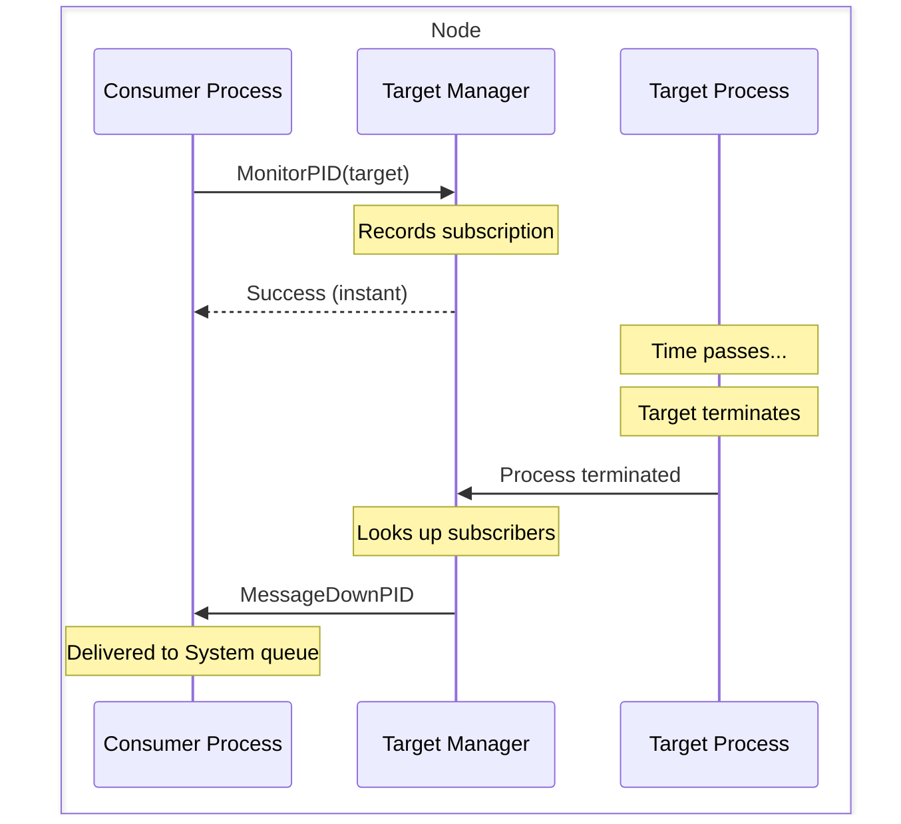
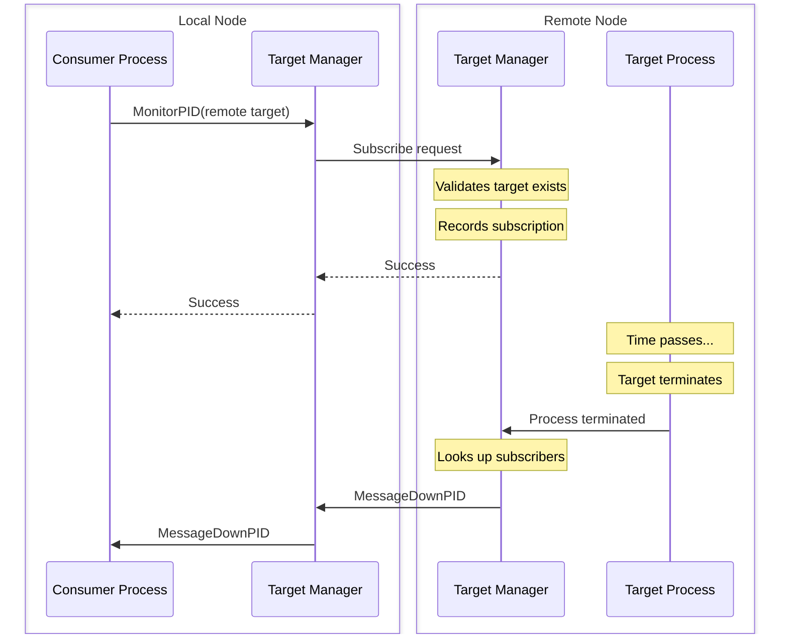
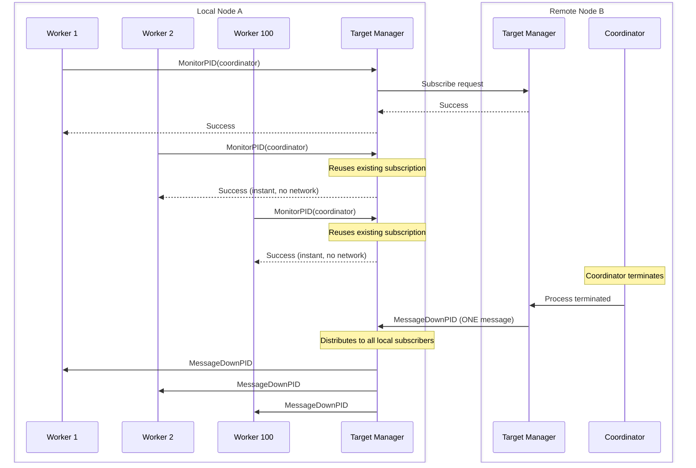
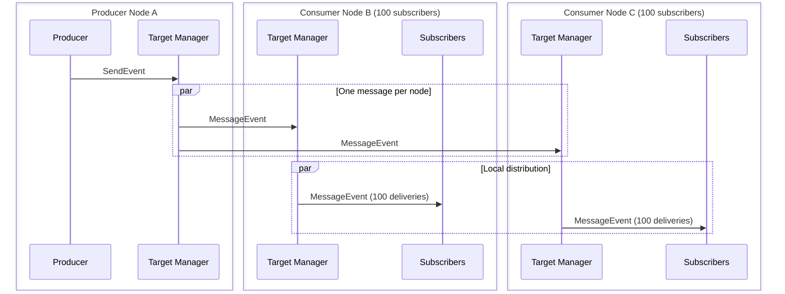
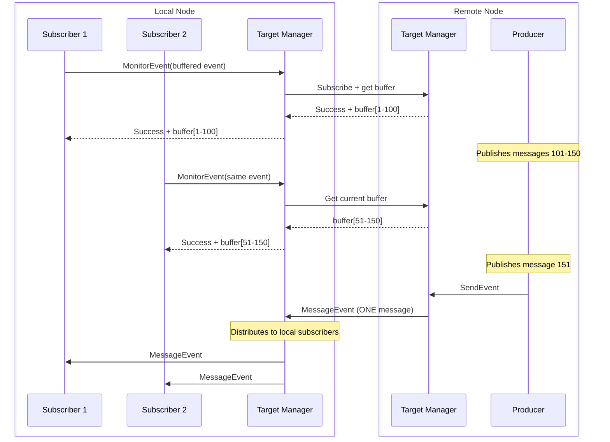

# Pub/Sub Internals

This document explains how Ergo Framework's pub/sub system works under the hood. It's written for developers who want to understand the architecture, network behavior, and performance characteristics when building distributed systems.

For basic usage, see [Links and Monitors](../basics/links-and-monitors.md) and [Events](../basics/events.md). This document assumes you're familiar with those concepts and focuses on how the system works internally.

## The Unified Architecture

Links, monitors, and events look like separate features when you use them. But underneath, they share the same mechanism. Understanding this unification explains why the system behaves consistently and why certain optimizations work.

### The Core Concept

Every interaction in the pub/sub system follows one pattern:

**A consumer subscribes to a target and receives notifications about that target.**

This applies whether you're linking to a process, monitoring a registered name, or subscribing to an event stream. The differences are in what you subscribe to and what notifications you receive.

### Three Components of Every Subscription

**1. Consumer** - The process creating the subscription. This is the process that will receive notifications when something happens to the target.

**2. Target** - What the consumer subscribes to. Targets come in several types:

| Target Type | Example | What It Represents |
|-------------|---------|-------------------|
| PID | `gen.PID{Node: "node@host", ID: 100}` | A specific process instance |
| ProcessID | `gen.ProcessID{Name: "worker", Node: "node@host"}` | A registered name |
| Alias | `gen.Alias{...}` | A process alias |
| Node | `gen.Atom("node@host")` | A network connection |
| Event | `gen.Event{Name: "prices", Node: "node@host"}` | A registered event |

**3. Subscription Type** - How the consumer wants to receive notifications:

| Type | Creates | Notification | Effect on Consumer |
|------|---------|--------------|-------------------|
| Link | Exit signal | `MessageExit*` → Urgent queue | Terminates by default |
| Monitor | Down message | `MessageDown*` → System queue | Continues running |

The combination of target type and subscription type determines what message you receive:

```
LinkPID(target)      → MessageExitPID when target terminates
MonitorPID(target)   → MessageDownPID when target terminates

LinkEvent(event)     → MessageExitEvent when event ends
MonitorEvent(event)  → MessageDownEvent when event ends
```

### Implicit vs Explicit Events

The targets divide into two categories based on what notifications they generate:

**Implicit Events** - Processes, names, aliases, and nodes generate termination notifications automatically. The target doesn't do anything special - when it terminates (or disconnects, for nodes), the framework generates notifications for all subscribers.

```go
// Subscribe to process - implicit event
process.MonitorPID(targetPID)

// When targetPID terminates, you receive MessageDownPID
// The target process didn't send anything - framework generated it
```

**Explicit Events** - Registered events generate both published messages AND termination notifications. A producer process explicitly registers an event and publishes messages to it. When the producer terminates or unregisters the event, subscribers also receive termination notification.

```go
// Producer registers event - explicit event source
token, _ := producer.RegisterEvent("prices", gen.EventOptions{})

// Producer publishes messages
producer.SendEvent("prices", token, PriceUpdate{...})

// Subscriber receives:
// - MessageEvent for each published message
// - MessageDownEvent when producer terminates or unregisters
```

The key difference: implicit events give you one notification (termination). Explicit events give you N published messages plus termination notification.

### Why Unification Matters

This unified architecture has practical benefits:

**Consistent behavior** - The same subscription and notification mechanics work for all target types. Once you understand how monitors work for processes, you understand how they work for events.

**Shared optimizations** - Network optimizations (covered later) apply to all subscription types. Whether you're monitoring 100 remote processes or subscribing 100 consumers to a remote event, the same sharing mechanism kicks in.

**Predictable cleanup** - Termination cleanup works identically for all subscriptions. When a process terminates, all its subscriptions are cleaned up using the same code path.

## How Local Subscriptions Work

When you subscribe to a target on the same node, the operation is simple and fast.

### What You Experience

```go
// Subscribe to local process
err := process.MonitorPID(localTarget)
// Returns immediately - no waiting
```

The call returns instantly. There's no network communication, no blocking. The node records your subscription in memory.

### What Happens Internally



The Target Manager maintains subscription records. When a process terminates, Target Manager looks up all subscribers and delivers notifications to their mailboxes. For links, notifications go to the Urgent queue. For monitors, they go to the System queue.

### Guarantees

**Instant subscription** - No waiting, no blocking. The subscription is recorded synchronously.

**Guaranteed notification** - If the target terminates after you subscribe, you will receive notification. The notification mechanism is part of the termination process itself.

**Asynchronous delivery** - Notifications arrive in your mailbox like any other message. You process them in your `HandleMessage` callback.

**Automatic cleanup** - When the target terminates and you receive notification, the subscription is removed automatically. You don't need to unsubscribe.

## How Remote Subscriptions Work

Remote subscriptions involve network communication but provide the same guarantees as local subscriptions.

### What You Experience

```go
// Subscribe to remote process
err := process.MonitorPID(remotePID)
// Blocks briefly during network round-trip
// May return error if target doesn't exist or network fails
```

The call blocks while the subscription request travels to the remote node and the response returns. This typically takes milliseconds on a local network.

### What Happens Internally



The subscription request travels to the remote node's Target Manager. It validates that the target exists (returning an error if not), records the subscription, and sends confirmation. Once established, termination notifications travel back over the network.

### Subscription Validation

Both local and remote subscriptions validate that the target exists:

```go
// If target doesn't exist, you get an error
err := process.MonitorPID(nonExistentPID)
// err == gen.ErrProcessUnknown

// If target exists but already terminated
err := process.MonitorPID(terminatedPID)
// err == gen.ErrProcessTerminated
```

For events, the target node validates the event is registered:

```go
// If event isn't registered, you get an error
_, err := process.MonitorEvent(gen.Event{Name: "unknown", Node: "node@host"})
// err == gen.ErrEventUnknown
```

### Guaranteed Notification Delivery

Remote subscriptions guarantee you receive exactly one termination notification. This guarantee holds even when networks fail. Two paths can deliver your notification:

**Path 1: Normal Delivery**

The target terminates normally. The remote node sends the notification over the network. You receive it with the actual termination reason:

```go
func (w *Worker) HandleMessage(from gen.PID, message any) error {
    switch msg := message.(type) {
    case gen.MessageDownPID:
        // Normal termination reasons:
        // - gen.TerminateReasonNormal (clean shutdown)
        // - gen.TerminateReasonShutdown (requested shutdown)
        // - gen.TerminateReasonPanic (crash)
        // - gen.TerminateReasonKill (forced kill)
        // - Custom error (process returned error)
        log.Printf("Target terminated: %v", msg.Reason)
    }
    return nil
}
```

**Path 2: Connection Failure**

The network connection fails before the notification arrives (or before the target even terminates). Your local node detects the disconnection and generates notifications for all subscriptions to targets on the failed node:

```go
func (w *Worker) HandleMessage(from gen.PID, message any) error {
    switch msg := message.(type) {
    case gen.MessageDownPID:
        if msg.Reason == gen.ErrNoConnection {
            // Connection failed
            // Target might still be running on an isolated node
            // Or it might have terminated - we can't know
            log.Printf("Lost connection to target's node")
        }
    }
    return nil
}
```

**Why This Works**

You're guaranteed notification through one of two mechanisms:

1. Remote node delivers it (normal case)
2. Local node generates it when detecting connection failure (failover)

The `Reason` field tells you which path occurred. Your code typically handles both the same way - the target is no longer accessible regardless of why.

```go
case gen.MessageDownPID:
    // Whether normal termination or connection failure,
    // the target is gone from our perspective
    w.handleTargetGone(msg.PID, msg.Reason)
```

This failover mechanism compensates for network unreliability. You write code assuming notifications always arrive, because they do.

## Network Optimization: Shared Subscriptions

This section describes the optimization that makes distributed pub/sub practical at scale. Without it, many common patterns would be impractical.

### The Problem

Consider a realistic scenario:

```go
// On node A, 100 worker processes all monitor the same coordinator on node B
coordinatorPID := gen.PID{Node: "nodeB@host", ID: 500}

for i := 0; i < 100; i++ {
    workers[i].MonitorPID(coordinatorPID)
}
```

**Naive implementation:** Each `MonitorPID` call creates a separate network subscription. Result:
- 100 network round-trips to create subscriptions
- 100 subscription records on the remote node
- 100 network messages when the coordinator terminates

This doesn't scale. With 1000 workers, you'd have 1000 network messages just to deliver one termination notification.

### What Actually Happens

The framework automatically detects when multiple local processes subscribe to the same remote target and shares the network subscription.



**What you observe:**

```go
// First worker subscribes
err := worker1.MonitorPID(coordinatorPID)
// Takes a few milliseconds - network round-trip

// Second worker subscribes to SAME target
err := worker2.MonitorPID(coordinatorPID)
// Returns instantly - no network communication

// 98 more workers subscribe
// All return instantly
```

The first subscription to a remote target requires network communication. Every subsequent subscription from the same node to the same target returns instantly - it shares the existing network subscription.

### How Notification Delivery Works

When the remote target terminates:

1. Remote node sends ONE notification message to your node
2. Your node receives it and looks up all local subscribers to that target
3. Your node delivers individual notifications to each subscriber's mailbox

```go
// All 100 workers receive notification
// But only ONE network message was sent
// Your node distributed it locally

func (w *Worker) HandleMessage(from gen.PID, message any) error {
    case gen.MessageDownPID:
        // You can't tell if you're the only subscriber
        // or one of 1000 subscribers
        // The timing and behavior are identical
}
```

### Performance Characteristics

| Operation | Without Sharing | With Sharing |
|-----------|----------------|--------------|
| First subscription | 1 network round-trip | 1 network round-trip |
| N additional subscriptions | N network round-trips | 0 (instant) |
| Notification delivery | N network messages | 1 network message |
| Unsubscribe (not last) | 1 network round-trip | 0 (instant) |
| Unsubscribe (last) | 1 network round-trip | 1 network round-trip |

**Network cost comparison for 100 subscribers:**

| Phase | Without Sharing | With Sharing |
|-------|----------------|--------------|
| Subscribe all | 100 round-trips | 1 round-trip |
| Notification | 100 messages | 1 message |
| Unsubscribe all | 100 round-trips | 1 round-trip |
| **Total** | **300 network operations** | **3 network operations** |

### Impact on Event Publishing

The same optimization applies to event publishing. When you publish an event with subscribers on multiple nodes:

```go
// Producer on node A publishes
process.SendEvent("market.prices", token, PriceUpdate{Symbol: "BTC", Price: 42000})
```

The framework groups subscribers by node and sends ONE message per node:



**What the producer sees:**

```go
// Publish returns immediately
process.SendEvent("market.prices", token, update)
// You don't wait for delivery
// You don't know how many subscribers there are
// You don't know which nodes they're on
```

**What subscribers see:**

```go
func (c *Consumer) HandleEvent(message gen.MessageEvent) error {
    // Event arrives in your mailbox
    // Same timing whether you're the only subscriber or one of thousands
    // Same timing whether producer is local or remote
    return nil
}
```

### Real-World Scale Example

Consider a market data feed with 1 million subscribers distributed across 10 nodes:

```
Configuration:
- 1 producer on node A
- 10 consumer nodes (B through K)
- 100,000 subscribers per consumer node
- 1,000,000 total subscribers
```

When the producer publishes one price update:

| Approach | Network Messages |
|----------|-----------------|
| Without optimization | 1,000,000 |
| With optimization | 10 |

The optimization transforms O(N) network cost (where N = total subscribers) into O(M) cost (where M = number of nodes). For distributed systems with many subscribers per node, this is the difference between practical and impossible.

**Actual benchmark results** (from the [distributed-pub-sub-1M](https://github.com/ergo-services/benchmarks/) benchmark):

```
Total subscribers:       1000000
Consumer nodes:          10
Subscribers per node:    100000

Time to publish:         64.125µs
Time to deliver all:     342.414375ms
Network messages sent:   10 (1 per consumer node)
Delivery rate:           2920438 msg/sec
```

### Why This Matters for System Design

This optimization enables patterns that would be impractical otherwise:

**Worker pools monitoring coordinators:**

```go
// 50 workers on each of 10 nodes monitor a shared coordinator
// Network cost: 10 subscriptions, not 500
for i := 0; i < 50; i++ {
    worker := SpawnWorker()
    worker.MonitorPID(coordinatorPID)
}
```

**Distributed caching with invalidation:**

```go
// Cache instances on every node subscribe to invalidation events
// When data changes, ONE message per node delivers invalidation
// Each node updates all its local cache instances
```

**Hierarchical supervision across nodes:**

```go
// Multiple supervisors can monitor the same critical process
// Notification cost stays constant regardless of supervisor count
```

**High-frequency event streaming:**

```go
// Price feed publishes thousands of updates per second
// Cost per update: one message per subscriber NODE
// Not one message per subscriber PROCESS
```

### When Sharing Doesn't Apply

The optimization applies when multiple processes on the SAME node subscribe to the SAME remote target.

**These share:**
```go
// Same node, same remote target
processA.MonitorPID(remoteTarget)  // Network round-trip
processB.MonitorPID(remoteTarget)  // Instant (shared)
processC.MonitorPID(remoteTarget)  // Instant (shared)
```

**These don't share:**
```go
// Different remote targets
processA.MonitorPID(remoteTarget1)  // Network round-trip
processB.MonitorPID(remoteTarget2)  // Network round-trip (different target)

// Different nodes subscribing to same target
// (Each node has its own subscription to the target)
nodeX_process.MonitorPID(remoteTarget)  // Network round-trip
nodeY_process.MonitorPID(remoteTarget)  // Network round-trip (from different node)
```

## Buffered Events: Partial Optimization

Buffered events receive partial optimization. The subscription is shared, but each subscriber must retrieve buffer contents individually.

### Why Buffers Complicate Sharing

Event buffers store recent messages for new subscribers:

```go
// Producer creates event with 100-message buffer
token, _ := process.RegisterEvent("prices", gen.EventOptions{
    Buffer: 100,
})

// Producer publishes messages over time
process.SendEvent("prices", token, msg1)  // Stored in buffer
process.SendEvent("prices", token, msg2)  // Stored in buffer
// ... more messages ...
```

When a subscriber joins, they receive the buffered messages:

```go
// Subscriber joins and receives buffer
buffered, _ := process.MonitorEvent(event)
for _, msg := range buffered {
    // These are recent messages published before subscription
}
```

The problem: different subscribers joining at different times need different buffer contents.

```go
// Process 1 subscribes at 10:00:00
buffered1, _ := process1.MonitorEvent(event)
// Receives messages 1-100

// Producer publishes messages 101-150

// Process 2 subscribes at 10:00:30
buffered2, _ := process2.MonitorEvent(event)
// Must receive messages 51-150 (different from process 1!)
```

If subscriptions were fully shared, all subscribers would receive the same buffer - incorrect for late subscribers.

### What Actually Happens



**First subscriber:** Network round-trip to create subscription AND retrieve buffer.

**Subsequent subscribers:** Network round-trip to retrieve current buffer (subscription already exists).

**Published messages:** Still optimized - one network message per node, distributed locally.

### Performance Comparison

| Aspect | Unbuffered Event | Buffered Event |
|--------|-----------------|----------------|
| First subscription | 1 network round-trip | 1 network round-trip |
| Additional subscriptions | Instant (shared) | Network round-trip (buffer retrieval) |
| Published messages | 1 message per node | 1 message per node |
| Termination notification | 1 message per node | 1 message per node |

### When to Use Buffers

**Use buffers when:**

- New subscribers need recent history (last N configuration updates)
- Subscribers might miss messages during brief disconnections
- State can be reconstructed from recent messages
- Subscriber count is moderate

**Avoid buffers when:**

- Real-time streaming where history isn't useful
- High subscriber count across many nodes (each pays network cost)
- Messages are only meaningful at publish time
- Memory constraints (buffers consume memory on producer node)

**Practical guidance:**

```go
// Good: Configuration updates, moderate subscribers
token, _ := process.RegisterEvent("config.updates", gen.EventOptions{
    Buffer: 10,  // Last 10 config changes
})

// Good: State snapshots for late joiners
token, _ := process.RegisterEvent("game.state", gen.EventOptions{
    Buffer: 1,  // Just the latest state
})

// Better without buffer: High-frequency price feed
token, _ := process.RegisterEvent("prices.realtime", gen.EventOptions{
    Buffer: 0,  // Full sharing optimization
})

// Better without buffer: High subscriber count
token, _ := process.RegisterEvent("system.metrics", gen.EventOptions{
    Buffer: 0,  // Thousands of subscribers, skip buffer overhead
})
```

## Producer Notifications

Producers can receive notifications when subscriber interest changes. This enables demand-driven data production.

### Enabling Notifications

```go
token, _ := process.RegisterEvent("expensive.data", gen.EventOptions{
    Notify: true,
})
```

### What You Receive

```go
func (p *Producer) HandleMessage(from gen.PID, message any) error {
    switch msg := message.(type) {
    case gen.MessageEventStart:
        // First subscriber appeared
        // Subscriber count: 0 → 1
        p.Log().Info("First subscriber for event: %s", msg.Name)

    case gen.MessageEventStop:
        // Last subscriber left
        // Subscriber count: 1 → 0
        p.Log().Info("No more subscribers for event: %s", msg.Name)
    }
    return nil
}
```

### When Notifications Arrive

| Transition | Notification |
|------------|--------------|
| 0 → 1 (first subscriber) | `MessageEventStart` |
| 1 → 0 (last subscriber leaves) | `MessageEventStop` |
| 1 → 2, 2 → 3, etc. | None |
| 3 → 2, 2 → 1, etc. | None |

You only receive notifications when crossing the zero threshold. The notifications answer: "is anyone listening?" - not "how many are listening?"

### Practical Use Case: On-Demand Data Production

```go
type PriceFeeder struct {
    act.Actor

    token   gen.Ref
    polling bool
}

func (p *PriceFeeder) Init(args ...any) error {
    // Register event with notifications enabled
    token, err := p.RegisterEvent("prices", gen.EventOptions{
        Notify: true,
    })
    if err != nil {
        return err
    }
    p.token = token
    // Don't start polling yet - wait for subscribers
    return nil
}

func (p *PriceFeeder) HandleMessage(from gen.PID, message any) error {
    switch message.(type) {
    case gen.MessageEventStart:
        // Someone wants prices - start polling external API
        p.Log().Info("Starting price polling - subscribers appeared")
        p.polling = true
        p.schedulePoll()

    case gen.MessageEventStop:
        // Nobody wants prices - stop wasting resources
        p.Log().Info("Stopping price polling - no subscribers")
        p.polling = false

    case pollTick:
        if p.polling {
            price := p.fetchPriceFromAPI()
            p.SendEvent("prices", p.token, price)
            p.schedulePoll()
        }
    }
    return nil
}

func (p *PriceFeeder) schedulePoll() {
    p.SendAfter(p.PID(), pollTick{}, time.Second)
}
```

The producer idles when nobody's listening, avoiding unnecessary API calls and resource usage. When subscribers appear, it starts producing. When all subscribers leave, it stops.

### Network Transparency

Notifications work across nodes. Remote subscribers count toward "someone is listening":

```go
// Producer on node A
token, _ := process.RegisterEvent("data", gen.EventOptions{Notify: true})

// Subscriber on node B subscribes
// Producer receives MessageEventStart

// Subscriber on node B unsubscribes (and was the only subscriber)
// Producer receives MessageEventStop
```

The producer doesn't know or care whether subscribers are local or remote. The notification mechanism handles it transparently.

### Multiple Events

Each event tracks subscribers independently:

```go
token1, _ := process.RegisterEvent("prices.stocks", gen.EventOptions{Notify: true})
token2, _ := process.RegisterEvent("prices.crypto", gen.EventOptions{Notify: true})

// MessageEventStart for "prices.stocks" when first stock subscriber appears
// MessageEventStart for "prices.crypto" when first crypto subscriber appears
// These are independent - one can have subscribers while other doesn't
```

## Automatic Cleanup

Subscriptions clean up automatically when any participant terminates. This eliminates resource leaks from forgotten subscriptions.

### When Target Terminates

```go
// You subscribed to this process
process.MonitorPID(target)

// Target terminates for any reason
// - Returns error from callback
// - Panics
// - Receives kill signal
// - Node shuts down

// You receive notification
case gen.MessageDownPID:
    // Subscription is automatically removed
    // No cleanup needed on your part
```

All subscribers receive notification. The subscription ceases to exist - there's nothing to unsubscribe from.

### When Subscriber Terminates

```go
// You created several subscriptions
process.MonitorPID(target1)
process.MonitorPID(target2)
process.MonitorEvent(event)

// Your process terminates
// All subscriptions are automatically removed
// No cleanup code needed
```

Your subscriptions are removed from:
- Local subscription records
- Remote nodes (for remote subscriptions)

If you were the last local subscriber to a remote target, the network subscription is removed. Otherwise, it stays for remaining local subscribers.

### When Event Producer Terminates

```go
// Producer registered an event
token, _ := producer.RegisterEvent("prices", gen.EventOptions{Buffer: 100})

// Producer terminates (or explicitly calls UnregisterEvent)

// All subscribers receive termination notification:
// - Links receive MessageExitEvent
// - Monitors receive MessageDownEvent

// Event resources are cleaned up:
// - Buffer memory freed
// - Event name available for re-registration
```

Subscribers can't distinguish explicit `UnregisterEvent` from producer termination - both deliver termination notification with reason `gen.ErrUnregistered`.

### When Network Connection Fails

```go
// You have subscriptions to targets on node B
process.MonitorPID(pid_on_nodeB)
process.MonitorProcessID(name_on_nodeB)
process.MonitorEvent(event_on_nodeB)

// Connection to node B fails
// (Network partition, node crash, etc.)

// You receive termination for ALL subscriptions to that node:
case gen.MessageDownPID:
    if msg.Reason == gen.ErrNoConnection {
        // Network failure, not process termination
    }

case gen.MessageDownProcessID:
    if msg.Reason == gen.ErrNoConnection {
        // Network failure
    }

case gen.MessageDownEvent:
    if msg.Reason == gen.ErrNoConnection {
        // Network failure
    }
```

All subscriptions involving the failed node are cleaned up. If the node reconnects later, you need to re-subscribe - the framework doesn't automatically restore subscriptions.

### Explicit Unsubscription

You can explicitly remove subscriptions:

```go
// Remove link
process.UnlinkPID(target)
process.UnlinkEvent(event)

// Remove monitor
process.DemonitorPID(target)
process.DemonitorEvent(event)
```

Explicit unsubscription is useful when:
- You want to stop watching before termination
- You're switching to a different target
- You're implementing connection retry logic

But in most cases, you don't need explicit unsubscription. Let termination handle cleanup.

### Cleanup Order Guarantees

When a process terminates, cleanup happens in a specific order:

1. Process state changes to Terminated
2. All outgoing subscriptions (where process is consumer) are removed
3. All incoming subscriptions (where process is target) generate notifications
4. Process resources are freed

This ordering ensures:
- You don't receive notifications after your process starts terminating
- Subscribers to you receive notifications before your resources are freed
- No race conditions between notification delivery and cleanup

## Summary

| Concept | How It Works |
|---------|--------------|
| **Unified architecture** | Links, monitors, and events share the same subscription mechanism |
| **Local subscriptions** | Instant creation, guaranteed notification, asynchronous delivery |
| **Remote subscriptions** | Network round-trip, guaranteed notification via normal or failover path |
| **Shared subscriptions** | Multiple local subscribers share one network subscription to remote target |
| **Event publishing** | One network message per subscriber node, local fanout to subscribers |
| **Buffered events** | Shared delivery, but each subscriber retrieves buffer individually |
| **Producer notifications** | MessageEventStart/Stop when crossing zero subscriber threshold |
| **Automatic cleanup** | All subscriptions cleaned up on any termination |

### Key Performance Insights

**For subscriptions:**
- First subscription to remote target: network round-trip
- Additional subscriptions to same target: instant
- Unbuffered events: full sharing
- Buffered events: shared delivery, individual buffer retrieval

**For notifications:**
- One network message per subscriber node
- Local distribution to all subscribers on that node
- Cost scales with number of nodes, not number of subscribers

**For cleanup:**
- Automatic on any termination
- No resource leaks possible
- No manual unsubscription required
