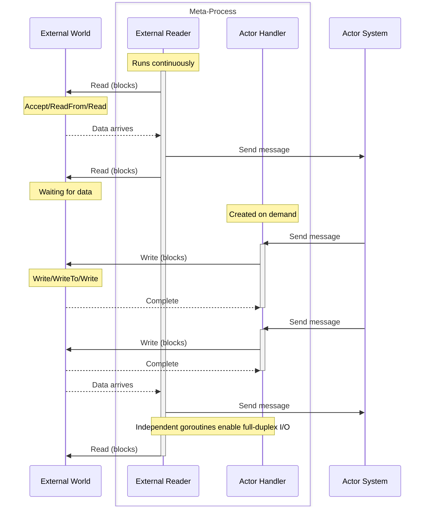

# Meta-Process

A meta-process solves a specific problem: how to integrate blocking I/O with the actor model without breaking its guarantees. It runs two goroutines - one executes your blocking I/O code, the other handles actor messages. This separation preserves sequential message processing while allowing continuous external I/O operations.

Meta-processes are owned by their parent process. When the parent terminates, all its meta-processes terminate with it. This dependency is by design - meta-processes extend the parent's capabilities rather than existing as independent entities in the supervision tree.

## The Problem

Actors work sequentially. One message arrives, gets processed, completes. Next message. This simplicity eliminates race conditions and makes reasoning straightforward.

Blocking I/O breaks this model. Call `net.Listener.Accept()` in a message handler and the actor freezes. The goroutine blocks waiting for connections. Other messages pile up unprocessed. The actor becomes unresponsive.

The obvious fix fails. Spawn a goroutine for `Accept()` and now two goroutines access the actor's state concurrently. You need locks. The sequential guarantee vanishes. The actor model collapses into traditional concurrent programming with all its complexity.

Meta-processes preserve both. One goroutine blocks on I/O. Another goroutine processes messages sequentially. Neither interferes with the other.

## Two Goroutines, Two Purposes

When a meta-process starts, the framework launches two goroutines:

**External Reader**: Runs your `Start()` method from beginning to end. This goroutine is meant for blocking operations - `Accept()` loops, `ReadFrom()` calls, reading from pipes. When external events occur, this goroutine sends messages into the actor system using `Send()`. It never processes incoming messages.

**Actor Handler**: Created on-demand when messages arrive in the mailbox. Processes messages sequentially by calling your `HandleMessage()` and `HandleCall()` methods. When the mailbox empties, this goroutine terminates. Next time messages arrive, a new actor handler spawns. This goroutine never does I/O directly - it handles requests from actors.

The External Reader runs continuously from spawn until termination. The Actor Handler comes and goes based on message traffic.

## Why Regular Processes Cannot Do This

| Aspect | Process | Meta-Process |
|--------|---------|-------------|
| Goroutines | One per process | Two per meta-process |
| Message queues | 4 queues (urgent, system, main, log) | 2 queues (system, main) |
| Identifier type | `gen.PID` | `gen.Alias` |
| States | Init → Sleep → Running → Terminated | Sleep → Running → Terminated |
| Spawn children | Processes and meta-processes | Meta-processes only |
| Synchronous calls | Can make calls with `Call()` | Cannot make calls |
| Links and monitors | Can create and receive | Can only receive |

Processes have one goroutine that must handle everything. If it blocks on I/O, message processing stops. If it spawns additional goroutines for I/O, the actor model breaks.

Meta-processes separate concerns. The External Reader handles I/O. The Actor Handler handles messages. Both run independently.

### Restrictions Explained

Meta-processes cannot make synchronous calls. Which goroutine should block waiting for the response? The External Reader is blocked on external I/O. The Actor Handler might not be running. Neither can reliably wait for responses.

Meta-processes cannot create links or monitors. When a linked process terminates, it sends an exit signal as a message. The Actor Handler processes messages, but only when running. Signals could be delayed or lost if the Actor Handler is not active. Incoming links and monitors work because other processes send signals that queue in the mailbox. Creating outgoing links requires guarantees that meta-processes cannot provide.

These are not arbitrary limitations. They follow from having two goroutines with distinct responsibilities.

## Behavior Implementation

```go
type MetaBehavior interface {
    Init(process MetaProcess) error
    Start() error
    HandleMessage(from PID, message any) error
    HandleCall(from PID, ref Ref, request any) (any, error)
    Terminate(reason error)
    HandleInspect(from PID, item ...string) map[string]string
}
```

`Init()` runs once during creation. Initialize state, store the `MetaProcess` reference, prepare resources. Return an error to prevent spawning.

`Start()` runs in the External Reader. This is where your blocking I/O lives. Loop forever accepting connections. Block reading datagrams. Read from pipes. When `Start()` returns, the meta-process terminates.

`HandleMessage()` processes regular messages sent by actors. Runs in the Actor Handler. Return `nil` to continue, return an error to terminate.

`HandleCall()` processes synchronous requests from actors. Return `(result, nil)` to send the result back. Return `(nil, error)` to send an error. The framework handles the response automatically.

`Terminate()` runs during shutdown regardless of how termination occurred. Close resources, flush buffers, clean up. Do not block or panic here.

`HandleInspect()` returns diagnostic information as string key-value pairs. Used by monitoring tools. Inspect requests are sent to the system queue (high priority) and processed before regular messages. You can inspect meta processes from within a process context using `process.InspectMeta(alias)` or directly from the node using `node.InspectMeta(alias)`. Both methods only work for local meta processes (same node).

## Three States

**Sleep**: External Reader is running (usually blocked on I/O), Actor Handler does not exist. Mailbox may contain messages waiting to be processed. This is the resting state when no actors are communicating with the meta-process.

**Running**: Both goroutines active. External Reader continues I/O operations. Actor Handler processes messages from the mailbox. Both work simultaneously without blocking each other.

**Terminated**: Both goroutines stopped. `Start()` returned and Actor Handler completed its final message.

Transitions are automatic. Message arrives → Actor Handler spawns → Sleep becomes Running. Mailbox empties → Actor Handler exits → Running becomes Sleep. `Start()` returns → Terminated regardless of current state.

## Data Flow



The External Reader blocks reading while the Actor Handler simultaneously blocks writing. Two blocking operations, two goroutines, neither prevents the other.

## Creating Meta-Processes

Define your behavior:

```go
type UDPServer struct {
    gen.MetaProcess
    socket net.PacketConn
    target gen.PID
}

func (u *UDPServer) Init(process gen.MetaProcess) error {
    u.MetaProcess = process
    u.target = process.Parent()
    return nil
}

func (u *UDPServer) Start() error {
    // External Reader - continuous read loop
    for {
        buf := make([]byte, 65536)
        n, addr, err := u.socket.ReadFrom(buf)
        if err != nil {
            return err
        }
        u.Send(u.target, Datagram{Data: buf[:n], From: addr})
    }
}

func (u *UDPServer) HandleMessage(from gen.PID, message any) error {
    // Actor Handler - write on demand
    switch msg := message.(type) {
    case SendDatagram:
        u.socket.WriteTo(msg.Data, msg.To)
    }
    return nil
}

func (u *UDPServer) HandleCall(from gen.PID, ref gen.Ref, request any) (any, error) {
    return nil, nil
}

func (u *UDPServer) Terminate(reason error) {
    u.socket.Close()
}

func (u *UDPServer) HandleInspect(from gen.PID, item ...string) map[string]string {
    return map[string]string{"local_addr": u.socket.LocalAddr().String()}
}
```

Spawn from a process:

```go
type Server struct {
    act.Actor
}

func (s *Server) Init(args ...any) error {
    socket, err := net.ListenPacket("udp", ":8080")
    if err != nil {
        return err
    }

    udpServer := &UDPServer{socket: socket}
    alias, err := s.SpawnMeta(udpServer, gen.MetaOptions{})
    if err != nil {
        socket.Close()
        return err
    }

    s.Log().Info("UDP server listening on :8080 as %s", alias)
    return nil
}
```

The meta-process lives as long as its parent lives. When `Server` terminates, the UDP server terminates automatically.

## State-Based Operations

Different operations are available in different states:

**All states** (Sleep, Running, Terminated):
- `Send()`, `SendWithPriority()` - External Reader sends in Sleep, Actor Handler sends in Running
- `ID()`, `Parent()` - Identity never changes
- `Env()`, `EnvList()`, `EnvDefault()` - Configuration access
- `Log()` - Logging always available
- `SendPriority()`, `Compression()` - Read settings

**Running only**:
- `SendResponse()`, `SendResponseError()` - Only Actor Handler has the `gen.Ref` from `HandleCall()`
- `SetSendPriority()`, `SetCompression()` - Actor Handler controls these

**Sleep and Running** (not Terminated):
- `Spawn()` - Both goroutines can spawn child meta-processes

The External Reader operates in Sleep state and has minimal capabilities - just sending messages and spawning children. The Actor Handler operates in Running state and has full capabilities for processing requests.

## Shared State

Both goroutines access the same struct fields. Use atomic operations for shared counters and flags:

```go
type TCPConnection struct {
    gen.MetaProcess
    conn     net.Conn
    bytesIn  uint64  // accessed by both goroutines
    bytesOut uint64  // accessed by both goroutines
}

func (t *TCPConnection) Start() error {
    // External Reader
    buf := make([]byte, 4096)
    for {
        n, err := t.conn.Read(buf)
        if err != nil {
            return err
        }
        atomic.AddUint64(&t.bytesIn, uint64(n))
        t.Send(t.Parent(), Data{Bytes: buf[:n]})
    }
}

func (t *TCPConnection) HandleMessage(from gen.PID, message any) error {
    // Actor Handler
    if msg, ok := message.(Data); ok {
        n, err := t.conn.Write(msg.Bytes)
        atomic.AddUint64(&t.bytesOut, uint64(n))
        return err
    }
    return nil
}

func (t *TCPConnection) HandleInspect(from gen.PID, item ...string) map[string]string {
    // Actor Handler
    in := atomic.LoadUint64(&t.bytesIn)
    out := atomic.LoadUint64(&t.bytesOut)
    return map[string]string{
        "bytes_in":  fmt.Sprintf("%d", in),
        "bytes_out": fmt.Sprintf("%d", out),
    }
}
```

Avoid complex synchronization. If you need mutexes, the design probably belongs in a regular process with meta-processes handling only I/O.

## Common Patterns

**External events to actors**: External Reader reads events, sends them to actors for processing.

```go
func (r *FileReader) Start() error {
    file, _ := os.Open(r.filename)
    defer file.Close()

    scanner := bufio.NewScanner(file)
    for scanner.Scan() {
        r.Send(r.processor, Line{Text: scanner.Text()})
    }
    return scanner.Err()
}
```

**Actor-controlled I/O**: Actors send commands, Actor Handler executes them against external resources.

```go
func (e *CommandExecutor) HandleMessage(from gen.PID, message any) error {
    switch msg := message.(type) {
    case RunCommand:
        output, err := exec.Command(msg.Cmd, msg.Args...).Output()
        e.Send(from, CommandResult{Output: output, Error: err})
    }
    return nil
}
```

**Full-duplex communication**: External Reader reads, Actor Handler writes, both operate on the same connection.

```go
func (t *TCPConnection) Start() error {
    // Continuous reading
    for {
        n, err := t.conn.Read(buf)
        if err != nil {
            return err
        }
        t.Send(t.target, Received{Data: buf[:n]})
    }
}

func (t *TCPConnection) HandleMessage(from gen.PID, message any) error {
    // On-demand writing
    if msg, ok := message.(Send); ok {
        _, err := t.conn.Write(msg.Data)
        return err
    }
    return nil
}
```

**Server accepting connections**: External Reader accepts connections, spawns child meta-processes for each.

```go
func (t *TCPServer) Start() error {
    for {
        conn, err := t.listener.Accept()
        if err != nil {
            return err
        }

        handler := &TCPConnection{conn: conn}
        if _, err := t.Spawn(handler, gen.MetaOptions{}); err != nil {
            conn.Close()
            t.Log().Error("failed to spawn connection handler: %s", err)
        }
    }
}
```

## When to Use Meta-Processes

Use meta-processes when:
- Operating on blocking I/O (TCP accept, UDP read, pipe read, file read)
- Bridging external event sources with actors (monitoring filesystems, listening to OS signals)
- Wrapping synchronous APIs that cannot be made asynchronous
- Implementing network servers where accept loop must run continuously

Do not use meta-processes when:
- Implementing business logic
- Managing application state
- Coordinating between actors
- Processing messages that do not involve blocking I/O

Meta-processes sit at the boundary between the external world and the actor system. They translate blocking operations into asynchronous messages and execute actor commands using blocking APIs. Regular processes implement everything else.

For complete examples, see [TCP](../meta-processes/tcp.md), [UDP](../meta-processes/udp.md), [Web](../meta-processes/web.md), and [Port](../meta-processes/port.md).
