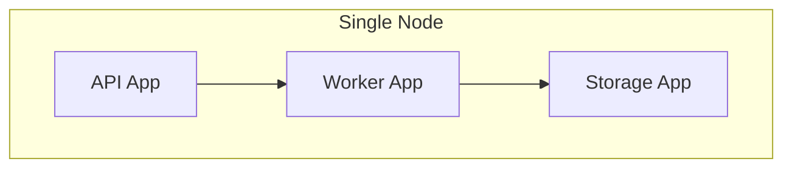
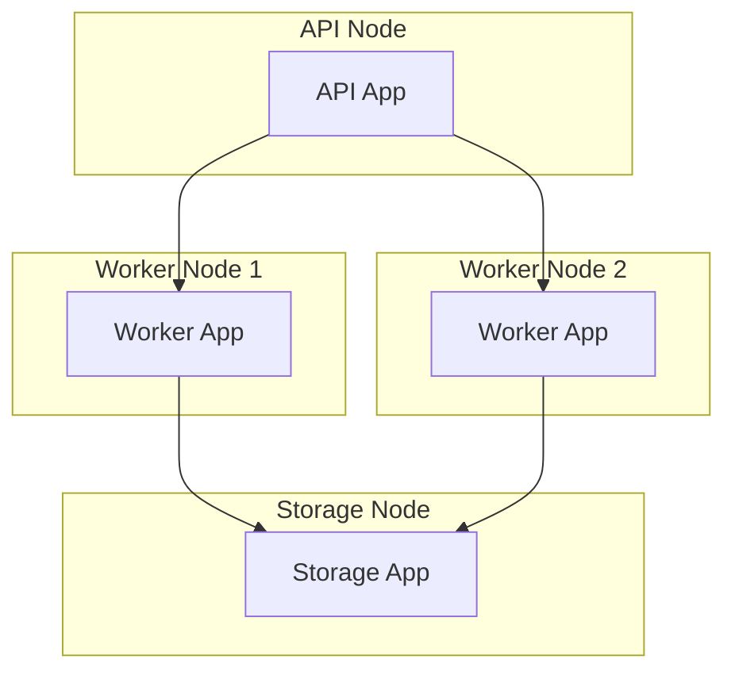
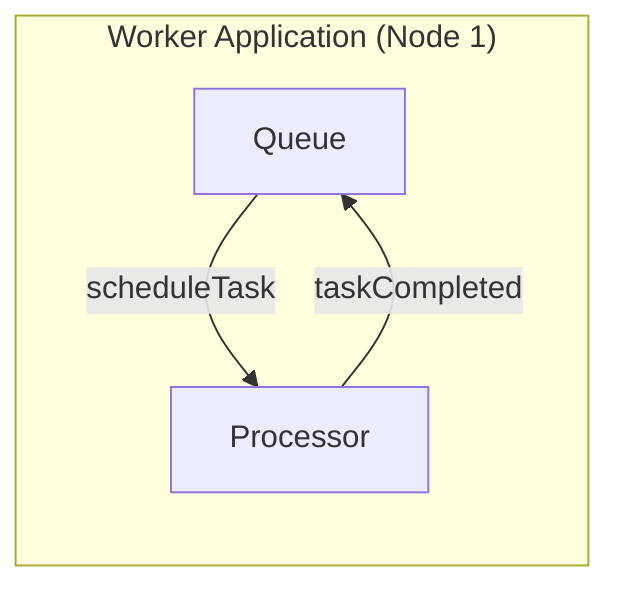
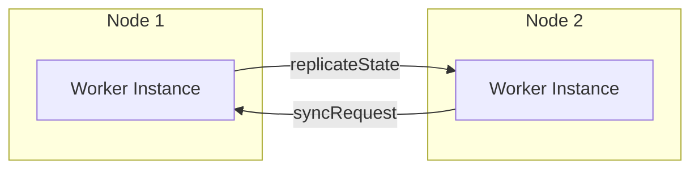
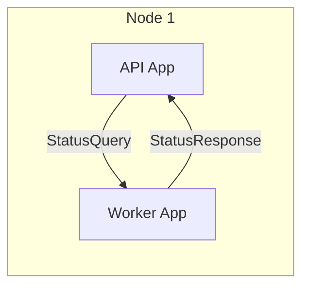
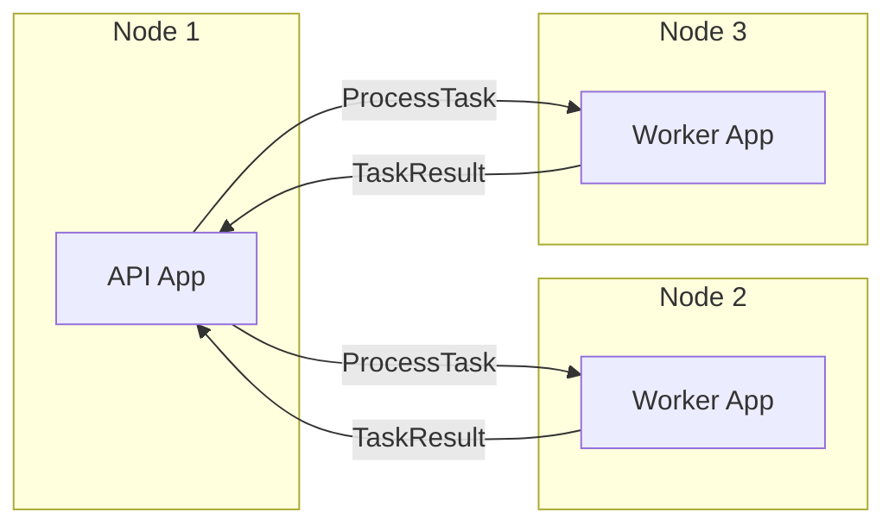
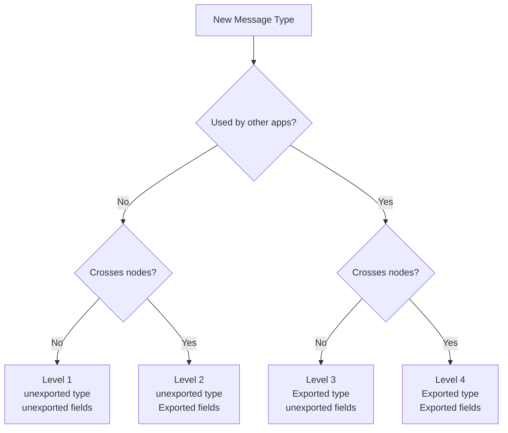
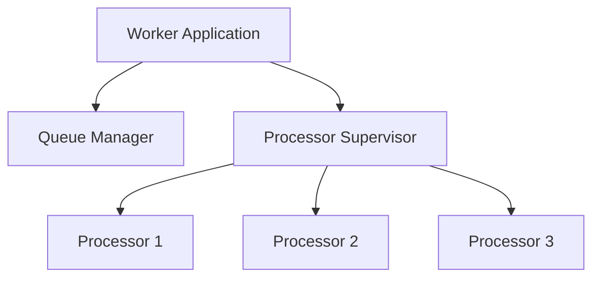
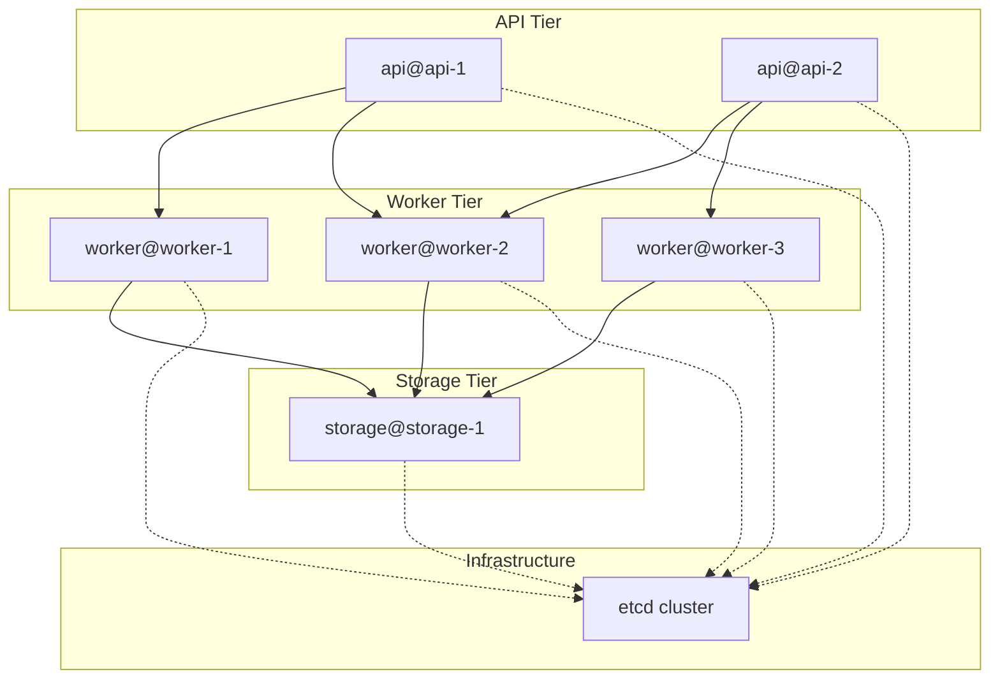
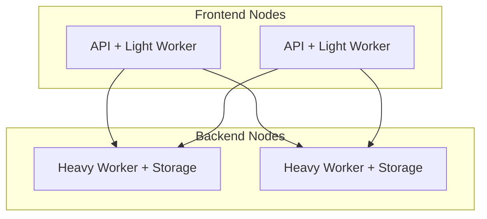

# Project Structure

The same codebase can run as a monolith on your laptop or as distributed services across a data center. This flexibility comes from one principle: applications are the unit of composition. How you organize your project determines whether you can use this flexibility or fight against it.

This chapter covers project organization, message isolation patterns, deployment strategies, and evolution paths. The goal is a structure that supports both development simplicity and production scalability without code changes.

## The Flexibility Promise

Ergo's network transparency means a process doesn't know if it's talking to a neighbor in the same node or a remote process across the network. The same `Send()` call works either way. But this only helps if your code is organized to take advantage of it.

Consider two deployment scenarios:

**Development**: All applications in one process for fast iteration.



**Production**: Applications distributed across nodes for scalability.



The application code is identical in both cases. Only the entry point changes - which applications start on which nodes.

This works because:
- Applications are self-contained functional units
- Messages define contracts between applications
- The framework handles routing transparently

Your project structure must preserve these properties. Mix them up, and you lose deployment flexibility.

## Directory Layout

A well-structured project separates entry points from applications from shared code:

```
project/
├── cmd/                        # Entry points
│   ├── monolith/main.go       # All apps together
│   ├── api/main.go            # API node
│   ├── worker/main.go         # Worker node
│   └── storage/main.go        # Storage node
│
├── apps/                       # Application packages
│   ├── api/
│   │   ├── app.go             # Application definition
│   │   ├── handler.go         # Request handling actor
│   │   ├── router.go          # Routing logic
│   │   ├── messages.go        # Internal messages
│   │   └── supervisor.go      # Supervision tree
│   ├── worker/
│   │   ├── app.go
│   │   ├── processor.go
│   │   ├── queue.go
│   │   ├── messages.go
│   │   └── types.go
│   └── storage/
│       ├── app.go
│       ├── reader.go
│       ├── writer.go
│       ├── messages.go
│       └── types.go
│
├── types/                      # Service-level contracts
│   ├── events.go              # Cross-application events
│   └── commands.go            # Cross-application commands
│
├── lib/                        # Shared non-actor code
│   ├── config/                # Configuration utilities
│   └── models/                # Domain models
│
└── go.mod
```

### Entry Points (`cmd/`)

Each directory in `cmd/` produces a different binary with a different deployment topology.

**Monolith** - everything together:

```go
// cmd/monolith/main.go
package main

import (
    "myproject/apps/api"
    "myproject/apps/worker"
    "myproject/apps/storage"

    "ergo.services/ergo"
    "ergo.services/ergo/gen"
)

func main() {
    node, _ := ergo.StartNode("app@localhost", gen.NodeOptions{
        Applications: []gen.ApplicationBehavior{
            api.CreateApp(api.Options{Port: 8080}),
            worker.CreateApp(worker.Options{Concurrency: 10}),
            storage.CreateApp(storage.Options{DSN: "postgres://..."}),
        },
    })
    node.Wait()
}
```

**Distributed** - each application on its own node:

```go
// cmd/api/main.go
package main

import (
    "myproject/apps/api"

    "ergo.services/ergo"
    "ergo.services/ergo/gen"
    "ergo.services/registrar/etcd"
)

func main() {
    node, _ := ergo.StartNode("api@api-server-1", gen.NodeOptions{
        Applications: []gen.ApplicationBehavior{
            api.CreateApp(api.Options{Port: 8080}),
        },
        Network: gen.NetworkOptions{
            Registrar: etcd.Create(etcd.Options{
                Endpoints: []string{"etcd:2379"},
                Cluster:   "production",
            }),
        },
    })
    node.Wait()
}
```

```go
// cmd/worker/main.go
package main

import (
    "myproject/apps/worker"

    "ergo.services/ergo"
    "ergo.services/ergo/gen"
    "ergo.services/registrar/etcd"
)

func main() {
    node, _ := ergo.StartNode("worker@worker-1", gen.NodeOptions{
        Applications: []gen.ApplicationBehavior{
            worker.CreateApp(worker.Options{Concurrency: 50}),
        },
        Network: gen.NetworkOptions{
            Registrar: etcd.Create(etcd.Options{
                Endpoints: []string{"etcd:2379"},
                Cluster:   "production",
            }),
        },
    })
    node.Wait()
}
```

The application code (`apps/api`, `apps/worker`) is identical. The entry point decides what runs where.

### Applications (`apps/`)

Each subdirectory in `apps/` is a self-contained application. An application is:
- A cohesive functional unit
- Deployable independently
- Composed of actors with a supervision tree
- Communicating via messages

**Application structure:**

```
apps/worker/
├── app.go              # Application behavior implementation
├── processor.go        # Main processing actor
├── queue.go            # Queue management actor
├── supervisor.go       # Supervision strategy
├── messages.go         # Message types (see isolation levels)
└── types.go            # Domain types used in messages
```

**Application definition:**

```go
// apps/worker/app.go
package worker

import "ergo.services/ergo/gen"

type Options struct {
    Concurrency int
    QueueSize   int
}

func CreateApp(opts Options) gen.ApplicationBehavior {
    return &app{options: opts}
}

type app struct {
    options Options
}

func (a *app) Load(node gen.Node, args ...any) (gen.ApplicationSpec, error) {
    return gen.ApplicationSpec{
        Name:        "worker",
        Description: "Background task processing",
        Weight:      100,
        Group: []gen.ApplicationMemberSpec{
            {Name: "queue", Factory: a.createQueue},
            {Name: "supervisor", Factory: a.createSupervisor},
        },
        Env: gen.EnvList{
            {"CONCURRENCY", a.options.Concurrency},
            {"QUEUE_SIZE", a.options.QueueSize},
        },
    }, nil
}

func (a *app) Start(mode gen.ApplicationMode) {}
func (a *app) Terminate(reason error) {}
```

Applications should not import each other. If `apps/api` imports `apps/worker`, you've created a compile-time dependency that limits deployment flexibility.

### Service-Level Types (`types/`)

When applications need to communicate, they need shared message types. The `types/` directory holds these contracts:

```go
// types/events.go
package types

import (
    "time"
    "ergo.services/ergo/net/edf"
)

// Events published by the orders application
type OrderCreated struct {
    OrderID    string
    CustomerID string
    Total      int64
    CreatedAt  time.Time
}

type OrderCompleted struct {
    OrderID     string
    CompletedAt time.Time
}

func init() {
    // Register for network serialization
    edf.RegisterTypeOf(OrderCreated{})
    edf.RegisterTypeOf(OrderCompleted{})
}
```

Both `apps/orders` and `apps/shipping` can import `types` without importing each other. This breaks the circular dependency while maintaining strong typing.

### Shared Libraries (`lib/`)

Non-actor code that multiple applications use goes in `lib/`:

```go
// lib/config/config.go
package config

import "os"

func DatabaseURL() string {
    return os.Getenv("DATABASE_URL")
}

// lib/models/order.go
package models

type Order struct {
    ID         string
    CustomerID string
    Items      []OrderItem
    Total      int64
}
```

Libraries must be:
- **Stateless** - no global variables, no goroutines
- **Pure** - same inputs produce same outputs
- **Actor-agnostic** - no dependency on `gen.Process`

Libraries are safe to call from actor callbacks because they don't block or manage state.

## Message Isolation Levels

Messages define contracts between actors. The visibility of message types controls who can send them and where they can travel. Ergo uses Go's export rules plus EDF serialization requirements to create four isolation levels.

Understanding these levels is critical for proper encapsulation.

### Level 1: Application-Internal (Same Node)

Messages used only within a single application instance on one node.

```go
// apps/worker/messages.go
package worker

// Unexported type, unexported fields
// Cannot be referenced outside this package
// Cannot be serialized (unexported fields)
type scheduleTask struct {
    taskID   string
    priority int
    data     []byte
}

type taskCompleted struct {
    taskID string
    result []byte
}
```

**Characteristics:**
- Type is unexported (`scheduleTask`)
- Fields are unexported (`taskID`, not `TaskID`)
- Cannot be imported by other packages
- Cannot be serialized for network transmission
- Maximum encapsulation

**Use when:**
- Communication between actors in the same application
- Messages never leave the local node
- Implementation details that shouldn't be exposed



### Level 2: Application-Cluster (Same Application, Multiple Nodes)

Messages between instances of the same application across nodes.

```go
// apps/worker/messages.go
package worker

// Unexported type, EXPORTED fields
// Cannot be referenced outside this package
// CAN be serialized (exported fields)
type replicateState struct {
    Version   int64   // Exported for EDF
    TaskIDs   []string
    Positions map[string]int
}

type syncRequest struct {
    FromVersion int64
    ToVersion   int64
}
```

**Characteristics:**
- Type is unexported (`replicateState`)
- Fields are exported (`Version`, not `version`)
- Cannot be imported by other packages
- CAN be serialized (EDF requires exported fields)
- Internal to application, but network-capable

**Use when:**
- Replication between application instances
- Cluster-internal coordination
- Messages that other applications shouldn't see



### Level 3: Cross-Application (Same Node Only)

Messages between different applications on the same node.

```go
// apps/worker/messages.go
package worker

// EXPORTED type, unexported fields
// CAN be referenced by other packages
// Cannot be serialized (unexported fields)
type StatusQuery struct {
    taskID string  // unexported - prevents network use
}

type StatusResponse struct {
    taskID   string
    status   string
    progress int
}
```

**Characteristics:**
- Type is exported (`StatusQuery`)
- Fields are unexported (`taskID`, not `TaskID`)
- CAN be imported by other packages
- Cannot be serialized (unexported fields block EDF)
- Cross-application but local-only

**Use when:**
- Local service queries
- Same-node optimization paths
- Explicitly preventing network transmission



This level is intentionally restrictive. If someone tries to send `StatusQuery` to a remote node, serialization fails. The unexported fields act as a compile-time guard against accidental network use.

### Level 4: Service-Level (Everywhere)

Messages that form public contracts between applications across the cluster.

```go
// types/commands.go
package types

import "ergo.services/ergo/net/edf"

// EXPORTED type, EXPORTED fields
// CAN be referenced by any package
// CAN be serialized
type ProcessTask struct {
    TaskID   string
    Priority int
    Payload  []byte
}

type TaskResult struct {
    TaskID string
    Status string
    Output []byte
    Error  string
}

func init() {
    edf.RegisterTypeOf(ProcessTask{})
    edf.RegisterTypeOf(TaskResult{})
}
```

**Characteristics:**
- Type is exported (`ProcessTask`)
- Fields are exported (`TaskID`)
- CAN be imported by any package
- CAN be serialized
- Full network transparency

**Use when:**
- Public API between applications
- Events that multiple applications subscribe to
- Commands sent across application boundaries



### Summary Table

| Level | Scope | Type | Fields | Serializable | Import |
|-------|-------|------|--------|--------------|--------|
| 1 | Within app, same node | `unexported` | `unexported` | No | No |
| 2 | Same app, any node | `unexported` | `Exported` | Yes | No |
| 3 | Cross-app, same node | `Exported` | `unexported` | No | Yes |
| 4 | Everywhere | `Exported` | `Exported` | Yes | Yes |

### Choosing the Right Level

Start with Level 1 (maximum restriction). Only increase visibility when needed:

1. **Does another application need this message?**
   - No → Keep type unexported (Level 1 or 2)
   - Yes → Export type (Level 3 or 4)

2. **Does this message cross node boundaries?**
   - No → Keep fields unexported (Level 1 or 3)
   - Yes → Export fields (Level 2 or 4)



## Application Design Patterns

### Supervision Structure

Applications typically have a supervision tree:

```go
// apps/worker/app.go
func (a *app) Load(node gen.Node, args ...any) (gen.ApplicationSpec, error) {
    return gen.ApplicationSpec{
        Name: "worker",
        Group: []gen.ApplicationMemberSpec{
            {Name: "queue_manager", Factory: createQueueManager},
            {Name: "processor_sup", Factory: a.createProcessorSupervisor},
        },
    }, nil
}

// apps/worker/supervisor.go
func (a *app) createProcessorSupervisor() gen.ProcessBehavior {
    children := make([]act.SupervisorChildSpec, a.options.Concurrency)
    for i := 0; i < a.options.Concurrency; i++ {
        children[i] = act.SupervisorChildSpec{
            Name:   fmt.Sprintf("processor_%d", i),
            Create: createProcessor,
        }
    }

    return &act.Supervisor{
        Type:     act.SupervisorTypeOneForOne,
        Restart:  act.SupervisorRestartTemporary,
        Children: children,
    }
}
```



### Configuration via Options

Applications accept configuration through an Options struct:

```go
// apps/worker/app.go
type Options struct {
    Concurrency   int
    QueueSize     int
    RetryAttempts int
    RetryDelay    time.Duration
}

func DefaultOptions() Options {
    return Options{
        Concurrency:   10,
        QueueSize:     1000,
        RetryAttempts: 3,
        RetryDelay:    time.Second,
    }
}

func CreateApp(opts Options) gen.ApplicationBehavior {
    // Validate options
    if opts.Concurrency < 1 {
        opts.Concurrency = DefaultOptions().Concurrency
    }
    return &app{options: opts}
}
```

Entry points configure options based on deployment:

```go
// cmd/worker/main.go
func main() {
    opts := worker.Options{
        Concurrency:   getEnvInt("WORKER_CONCURRENCY", 50),
        QueueSize:     getEnvInt("WORKER_QUEUE_SIZE", 10000),
        RetryAttempts: getEnvInt("WORKER_RETRY_ATTEMPTS", 5),
    }

    node, _ := ergo.StartNode("worker@host", gen.NodeOptions{
        Applications: []gen.ApplicationBehavior{
            worker.CreateApp(opts),
        },
    })
    node.Wait()
}
```

### Inter-Application Communication

Applications discover each other through application names, not node names:

```go
// apps/api/handler.go
func (h *Handler) processRequest(req Request) error {
    // Discover worker application
    registrar, _ := h.Node().Network().Registrar()
    routes, _ := registrar.Resolver().ResolveApplication("worker")

    if len(routes) == 0 {
        return errors.New("no workers available")
    }

    // Select a worker (weighted random)
    target := h.selectRoute(routes)

    // Send message (works whether local or remote)
    remote, _ := h.Network().GetNode(target.Node)
    result, err := remote.Call("queue_manager", types.ProcessTask{
        TaskID:  req.ID,
        Payload: req.Data,
    })

    return err
}
```

When running as monolith, `routes` returns the local node. When distributed, it returns remote nodes. The code doesn't change.

### Event Publishing

Applications publish events for loose coupling:

```go
// apps/orders/manager.go
func (m *Manager) completeOrder(orderID string) error {
    // ... complete order logic ...

    // Publish event (Level 4 - service-level)
    m.SendEvent("orders", "completed", types.OrderCompleted{
        OrderID:     orderID,
        CompletedAt: time.Now(),
    })

    return nil
}

// apps/shipping/listener.go
func (l *Listener) Init(args ...any) error {
    // Subscribe to order events
    event, _ := l.RegisterEvent("orders", "completed")
    l.LinkEvent(event)
    return nil
}

func (l *Listener) HandleEvent(ev gen.MessageEvent) error {
    switch e := ev.Message.(type) {
    case types.OrderCompleted:
        l.createShipment(e.OrderID)
    }
    return nil
}
```

Events decouple applications. Orders doesn't know who listens. Shipping doesn't know where Orders runs.

## Deployment Patterns

### Pattern 1: Development Monolith

Everything in one process for fast iteration:

```go
// cmd/dev/main.go
func main() {
    node, _ := ergo.StartNode("dev@localhost", gen.NodeOptions{
        Applications: []gen.ApplicationBehavior{
            api.CreateApp(api.Options{Port: 8080}),
            worker.CreateApp(worker.Options{Concurrency: 5}),
            storage.CreateApp(storage.Options{DSN: "dev.db"}),
            observer.CreateApp(observer.Options{Port: 9911}),
        },
    })

    node.Log().Info("Development server: http://localhost:8080")
    node.Log().Info("Observer UI: http://localhost:9911")
    node.Wait()
}
```

Benefits:
- Single binary to run
- No network setup
- Easy debugging
- Fast startup

### Pattern 2: Distributed Production

Each application on dedicated nodes:



Each binary runs one application:

```go
// cmd/api/main.go
node, _ := ergo.StartNode("api@api-1", gen.NodeOptions{
    Applications: []gen.ApplicationBehavior{
        api.CreateApp(api.Options{Port: 8080}),
    },
    Network: gen.NetworkOptions{
        Registrar: etcd.Create(etcd.Options{
            Endpoints: []string{"etcd:2379"},
            Cluster:   "production",
        }),
    },
})
```

Benefits:
- Independent scaling per tier
- Fault isolation
- Resource optimization
- Zero-downtime updates

### Pattern 3: Hybrid Deployment

Group related applications for efficiency:

```go
// cmd/frontend/main.go - API + lightweight worker
node, _ := ergo.StartNode("frontend@web-1", gen.NodeOptions{
    Applications: []gen.ApplicationBehavior{
        api.CreateApp(api.Options{Port: 8080}),
        worker.CreateApp(worker.Options{Concurrency: 5}), // light tasks
    },
    Network: gen.NetworkOptions{Registrar: registrar},
})

// cmd/backend/main.go - Heavy processing + storage
node, _ := ergo.StartNode("backend@compute-1", gen.NodeOptions{
    Applications: []gen.ApplicationBehavior{
        worker.CreateApp(worker.Options{Concurrency: 100}), // heavy tasks
        storage.CreateApp(storage.Options{DSN: "prod.db"}),
    },
    Network: gen.NetworkOptions{Registrar: registrar},
})
```



Benefits:
- Reduced network hops for common paths
- Fewer nodes to manage
- Right-sized for actual traffic patterns

## Testing Strategies

### Unit Testing Actors

Test actors in isolation using the testing framework:

```go
// apps/worker/processor_test.go
package worker

import (
    "testing"
    "ergo.services/ergo/testing/unit"
)

func TestProcessorHandlesTask(t *testing.T) {
    actor := unit.NewTestActor(t, createProcessor)

    // Send internal message (Level 1)
    actor.Send(actor.PID(), scheduleTask{
        taskID:   "task-1",
        priority: 1,
        data:     []byte("test"),
    })

    // Verify response
    actor.ExpectMessage(taskCompleted{
        taskID: "task-1",
        result: []byte("processed"),
    })
}
```

### Integration Testing Applications

Test complete applications:

```go
// apps/worker/integration_test.go
package worker_test

import (
    "testing"
    "myproject/apps/worker"

    "ergo.services/ergo"
    "ergo.services/ergo/gen"
)

func TestWorkerApplication(t *testing.T) {
    node, err := ergo.StartNode("test@localhost", gen.NodeOptions{
        Applications: []gen.ApplicationBehavior{
            worker.CreateApp(worker.Options{Concurrency: 2}),
        },
    })
    if err != nil {
        t.Fatal(err)
    }
    defer node.Stop()

    // Verify application started
    info, err := node.ApplicationInfo("worker")
    if err != nil {
        t.Fatal(err)
    }
    if info.State != gen.ApplicationStateRunning {
        t.Fatalf("expected running, got %s", info.State)
    }

    // Send test message and verify behavior
    // ...
}
```

### Testing Distributed Scenarios

Test multiple nodes:

```go
func TestCrossNodeCommunication(t *testing.T) {
    // Start API node
    apiNode, _ := ergo.StartNode("api@localhost:15001", gen.NodeOptions{
        Applications: []gen.ApplicationBehavior{
            api.CreateApp(api.Options{}),
        },
    })
    defer apiNode.Stop()

    // Start worker node
    workerNode, _ := ergo.StartNode("worker@localhost:15002", gen.NodeOptions{
        Applications: []gen.ApplicationBehavior{
            worker.CreateApp(worker.Options{}),
        },
    })
    defer workerNode.Stop()

    // Connect nodes
    apiNode.Network().AddRoute("worker@localhost:15002", gen.NetworkRoute{
        Route: gen.Route{Host: "localhost", Port: 15002},
    }, 100)

    // Test cross-node message passing
    remote, _ := apiNode.Network().GetNode("worker@localhost:15002")
    result, err := remote.Call("queue_manager", types.ProcessTask{
        TaskID: "test-task",
    })

    if err != nil {
        t.Fatal(err)
    }
    // Verify result...
}
```

## Evolution and Refactoring

### Starting Simple

Begin with a monolith:

```go
// cmd/main.go - Everything together
func main() {
    node, _ := ergo.StartNode("app@localhost", gen.NodeOptions{
        Applications: []gen.ApplicationBehavior{
            combined.CreateApp(), // One big application
        },
    })
    node.Wait()
}
```

### Extracting Applications

When the monolith grows, extract bounded contexts:

**Step 1**: Identify boundaries in the combined application.

```
combined/
├── order_handler.go      → apps/orders/
├── order_processor.go    → apps/orders/
├── shipping_handler.go   → apps/shipping/
├── shipping_tracker.go   → apps/shipping/
└── ...
```

**Step 2**: Create separate application packages.

```go
// apps/orders/app.go
package orders

func CreateApp(opts Options) gen.ApplicationBehavior {
    return &app{options: opts}
}

// apps/shipping/app.go
package shipping

func CreateApp(opts Options) gen.ApplicationBehavior {
    return &app{options: opts}
}
```

**Step 3**: Update the entry point.

```go
// cmd/main.go - Multiple applications, still one node
func main() {
    node, _ := ergo.StartNode("app@localhost", gen.NodeOptions{
        Applications: []gen.ApplicationBehavior{
            orders.CreateApp(orders.Options{}),
            shipping.CreateApp(shipping.Options{}),
        },
    })
    node.Wait()
}
```

**Step 4**: When ready, create distributed entry points.

```go
// cmd/orders/main.go
func main() {
    node, _ := ergo.StartNode("orders@orders-1", gen.NodeOptions{
        Applications: []gen.ApplicationBehavior{
            orders.CreateApp(orders.Options{}),
        },
        Network: gen.NetworkOptions{Registrar: registrar},
    })
    node.Wait()
}
```

The application code never changes. Only entry points and deployment.

### Merging Applications

If you over-distributed:

```go
// Before: Two binaries
// cmd/orders/main.go → orders.CreateApp()
// cmd/shipping/main.go → shipping.CreateApp()

// After: One binary
// cmd/fulfillment/main.go
func main() {
    node, _ := ergo.StartNode("fulfillment@host", gen.NodeOptions{
        Applications: []gen.ApplicationBehavior{
            orders.CreateApp(orders.Options{}),
            shipping.CreateApp(shipping.Options{}),
        },
    })
    node.Wait()
}
```

No application code changes. Just different composition.

## Best Practices

### Application Boundaries

**Do:**
- One application per bounded context
- Applications that scale together can be one application
- Applications that deploy together can be one application

**Don't:**
- Create applications for single actors
- Split applications by technical layer (web/service/data)
- Create circular dependencies between applications

Good:
```
apps/
├── orders/      # Complete order lifecycle
├── shipping/    # Complete shipping lifecycle
└── inventory/   # Complete inventory management
```

Bad:
```
apps/
├── order_api/           # Just API handlers
├── order_service/       # Just business logic
├── order_repository/    # Just data access
└── order_events/        # Just events
```

### Message Design

**Do:**
- Start with Level 1 (most restrictive)
- Increase visibility only when needed
- Document which level each message uses
- Register Level 4 types with EDF

**Don't:**
- Default to Level 4 for everything
- Mix isolation levels arbitrarily
- Use `any` or `interface{}` for messages
- Include pointers in network messages

### Dependencies

**Do:**
- Applications import `types/` for shared contracts
- Applications import `lib/` for utilities
- Entry points import applications

**Don't:**
- Applications import other applications
- Libraries depend on applications
- Create import cycles

### Configuration

**Do:**
- Use Options structs for application config
- Validate in CreateApp or Load
- Provide sensible defaults
- Read environment in entry points

**Don't:**
- Hard-code configuration in actors
- Read `os.Getenv` directly in actors
- Store configuration in global variables

## What's Next

This article covered project organization for flexible deployment. As your system grows into a distributed cluster, two topics become essential:

- [Building a Cluster](../advanced/building-a-cluster.md) - service discovery, load balancing, failover, and observability
- [Message Versioning](../advanced/message-versioning.md) - evolving message contracts during rolling upgrades