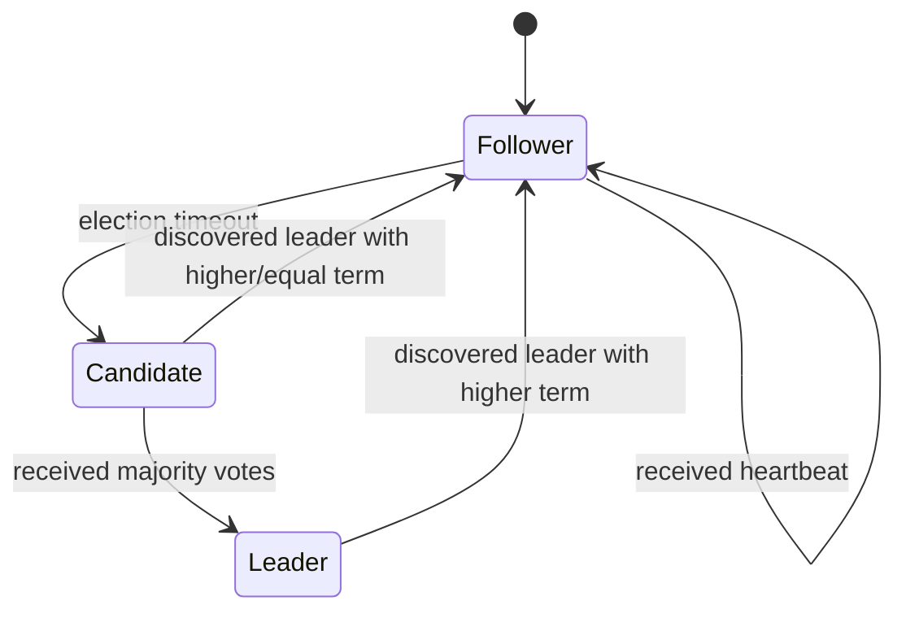
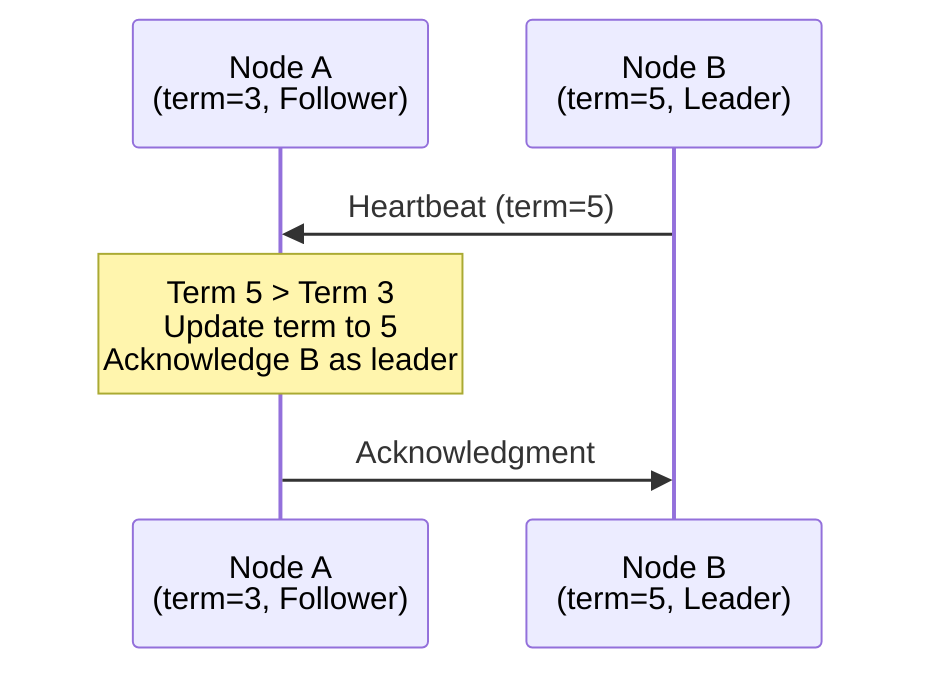
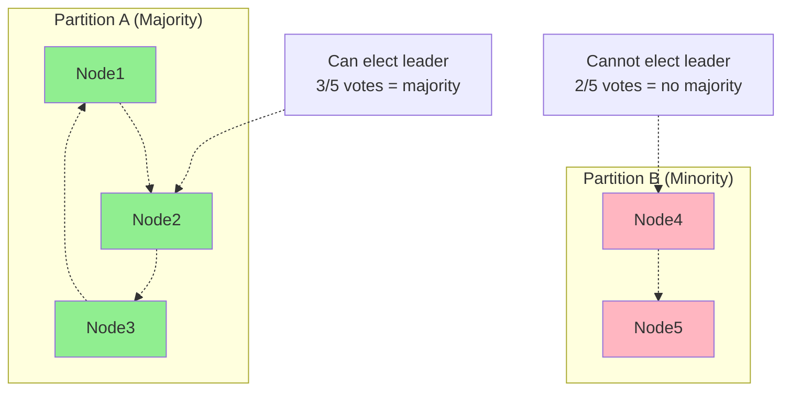
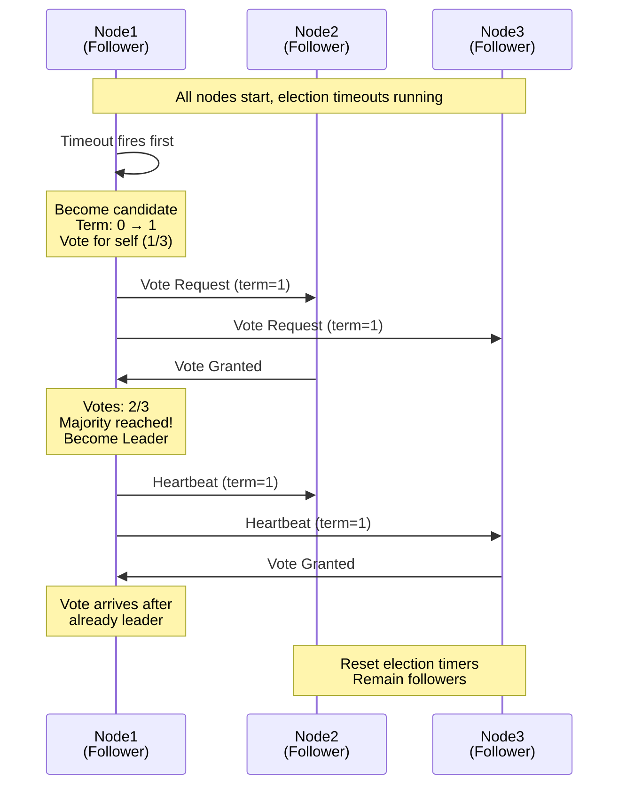
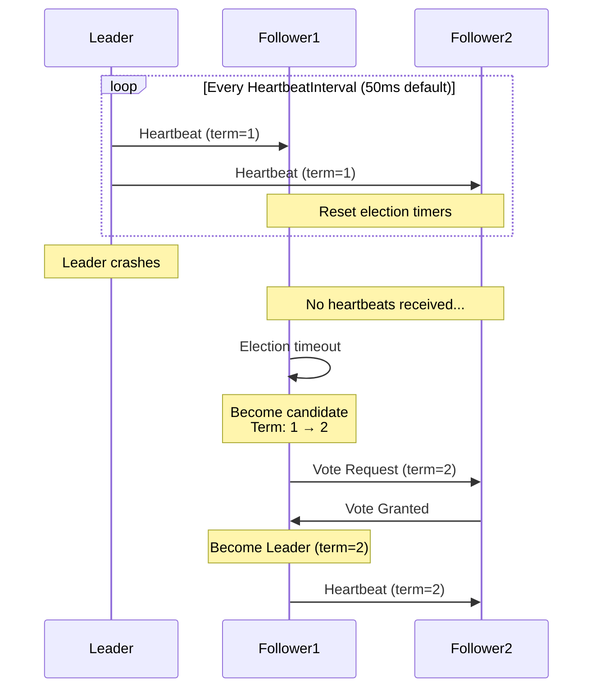
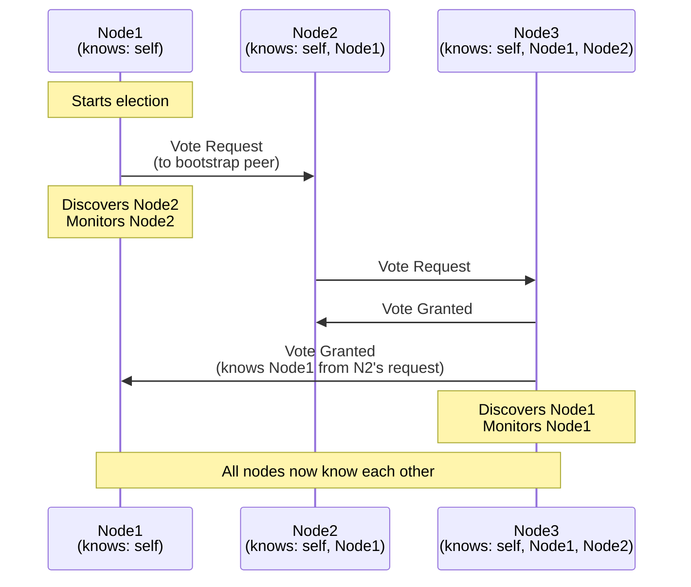
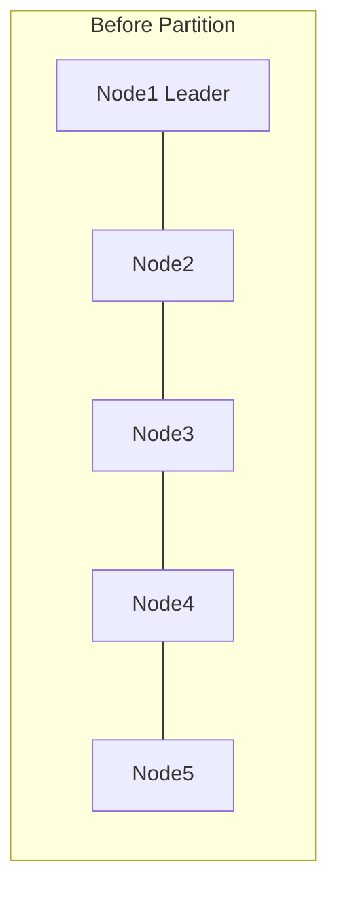
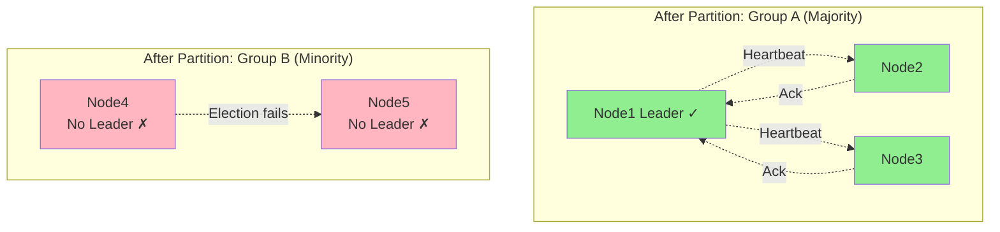
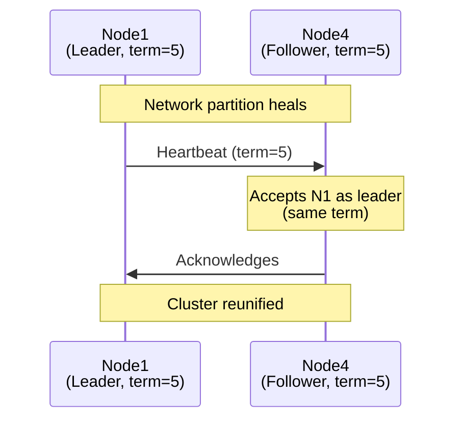

# Leader

Distributed systems often require coordination - ensuring only one node writes to prevent conflicts, scheduling tasks exactly once, or managing exclusive access to shared resources. This coordination demands selecting one node as the leader while others follow. The leader actor implements this election mechanism, handling failures, network issues, and dynamic cluster changes automatically.

When you embed `leader.Actor` in your process, it participates in distributed leader election with other instances across your Ergo cluster. The framework manages the election protocol - tracking terms, exchanging votes, broadcasting heartbeats. Your code focuses on what matters: what to do when elected leader, and how to behave as a follower.

## The Coordination Problem

Consider a typical scenario: you have a multi-replica service that needs to perform periodic cleanup. If every replica runs cleanup independently, you waste resources and might corrupt data through concurrent modifications. You need exactly one replica to run cleanup while others stand ready to take over if it fails.

Traditional solutions involve external systems - ZooKeeper, etcd, or distributed locks in databases. These work, but add operational complexity. You need to deploy and maintain additional infrastructure. Your application depends on external services being available, correctly configured, and network-accessible. Each external dependency is another potential failure point.

The leader actor embeds coordination directly into your Ergo cluster. No external dependencies. Election happens through actor message passing using the same network protocols your application already uses. If your Ergo nodes can communicate with each other, they can elect a leader.

## How Election Works

The election protocol follows Raft consensus principles, adapted for actor message passing. Understanding the mechanism requires knowing about three concepts: states, terms, and quorum.

### States and Transitions

Every process starts as a **follower**. This is the initial state - passive, waiting to hear from a leader. If no heartbeats arrive within the election timeout, the follower transitions to **candidate** and starts an election. If the candidate receives enough votes, it becomes **leader**. If it discovers another leader or loses the election, it reverts to follower.



The transitions are deliberate. Followers conserve resources by remaining passive. Only when leadership is needed (timeout occurs) does a node become active by candidacy. Leadership is earned through votes, not asserted unilaterally.

### Terms and Logical Time

Elections happen in numbered **terms**. Terms increment monotonically - term 1, term 2, term 3, and so on. Each term has at most one leader. When a candidate starts an election, it increments the term. When nodes communicate, they include their current term. If a node sees a higher term, it updates immediately and acknowledges the new term.

Terms solve a subtle problem: distinguishing stale information from current state. Without terms, a network partition could cause confusion - is this heartbeat from the current leader, or from a partitioned node that thinks it's still leader? Terms provide a logical clock that orders events without requiring synchronized system clocks.



This mechanism ensures that newer elections always supersede older ones, regardless of network delays or partitions.

### Quorum and Split-Brain Prevention

To become leader, a candidate needs votes from a **majority** of nodes. In a three-node cluster, that's two votes (including voting for itself). In a five-node cluster, three votes. The majority requirement prevents split-brain - a dangerous scenario where multiple nodes believe they're leader simultaneously.

Consider a network partition splitting five nodes into groups of 3 and 2:



Only the majority side can elect a leader. The minority side remains leaderless, preventing conflicting leadership. When the partition heals, the minority nodes recognize the higher term from the majority side's leader and follow it.

### Election Sequence

Here's what happens when a cluster starts:



Election timeouts are randomized, so typically one node times out first and wins the election before others start their own campaigns. This reduces the chance of split votes.

### Leader Maintenance

Once elected, the leader sends periodic heartbeats to all followers:



Heartbeats serve two purposes: they suppress elections on followers (by resetting their timeouts), and they act as a liveness signal. If heartbeats stop, followers know the leader has failed and trigger a new election.

### Peer Discovery

Nodes discover each other dynamically. You provide bootstrap addresses - a list of known peers to contact initially. When a node sends or receives election messages, it monitors the sender. Over time, all nodes discover all peers, even if they didn't initially know about each other.



Discovery is automatic. You can provide a bootstrap list for faster initial synchronization, or start with an empty list and add peers dynamically using the `Join()` method. Bootstrap accelerates cluster formation but isn't required - nodes discover each other through any election message exchange.

## Using the Leader Actor

To create a leader-electing process, embed `leader.Actor` in your struct and implement the `leader.ActorBehavior` interface:

```go
type Coordinator struct {
    leader.Actor
    
    tasks      []Task
    processing bool
}

func (c *Coordinator) Init(args ...any) (leader.Options, error) {
    clusterID := args[0].(string)
    bootstrap := args[1].([]gen.ProcessID)
    
    c.tasks = make([]Task, 0)
    
    return leader.Options{
        ClusterID: clusterID,
        Bootstrap: bootstrap,
    }, nil
}

func (c *Coordinator) HandleBecomeLeader() error {
    c.Log().Info("elected as leader - starting task processor")
    c.processing = true
    c.startProcessing()
    return nil
}

func (c *Coordinator) HandleBecomeFollower(leader gen.PID) error {
    if leader == (gen.PID{}) {
        c.Log().Info("no leader elected yet")
    } else {
        c.Log().Info("following leader: %s", leader)
        c.processing = false
        c.stopProcessing()
    }
    return nil
}

func (c *Coordinator) HandleMessage(from gen.PID, message any) error {
    switch msg := message.(type) {
    case AddTaskRequest:
        if !c.IsLeader() {
            // Not leader - reject or forward
            c.Send(from, NotLeaderError{Leader: c.Leader()})
            return nil
        }
        
        c.tasks = append(c.tasks, msg.Task)
        c.Send(from, TaskAccepted{})
        
    case ProcessNextTask:
        if c.IsLeader() && len(c.tasks) > 0 {
            task := c.tasks[0]
            c.tasks = c.tasks[1:]
            c.executeTask(task)
        }
    }
    return nil
}

func (c *Coordinator) Terminate(reason error) {
    c.Log().Info("coordinator stopping: %s", reason)
}
```

Spawn it like any actor, passing cluster configuration:

```go
clusterID := "task-coordinators"
bootstrap := []gen.ProcessID{
    {Name: "coordinator", Node: "node1@host"},
    {Name: "coordinator", Node: "node2@host"},
    {Name: "coordinator", Node: "node3@host"},
}

factory := func() gen.ProcessBehavior {
    return &Coordinator{}
}

pid, err := node.SpawnRegister("coordinator", factory, 
    gen.ProcessOptions{}, clusterID, bootstrap)
```

When you spawn identical processes on three nodes with the same `ClusterID` and `Bootstrap`, they form a cluster. Within milliseconds, one becomes leader and starts processing tasks. The others stand by as followers.

## The ActorBehavior Interface

The interface extends `gen.ProcessBehavior` with leader-specific callbacks:

```go
type ActorBehavior interface {
    gen.ProcessBehavior
    
    Init(args ...any) (Options, error)
    HandleMessage(from gen.PID, message any) error
    HandleCall(from gen.PID, ref gen.Ref, request any) (any, error)
    Terminate(reason error)
    HandleInspect(from gen.PID, item ...string) map[string]string
    
    // Leadership transitions
    HandleBecomeLeader() error
    HandleBecomeFollower(leader gen.PID) error
    
    // Cluster membership changes
    HandlePeerJoined(peer gen.PID) error
    HandlePeerLeft(peer gen.PID) error
    
    // Term changes (for log replication or versioning)
    HandleTermChanged(oldTerm, newTerm uint64) error
}
```

### Mandatory Callbacks

`Init` returns election configuration. The `Options` specify `ClusterID` (identifying which cluster this process belongs to), `Bootstrap` (initial peers to contact), and optional timing parameters for election and heartbeat intervals.

`HandleBecomeLeader` is called when this process becomes leader. Start exclusive work here - processing task queues, scheduling cron jobs, claiming resources. Return an error to reject leadership and trigger a new election.

`HandleBecomeFollower` is called when this process follows a leader. The `leader` parameter identifies the leader's PID. If `leader` is empty (`gen.PID{}`), it means no leader is currently elected. Stop exclusive work here. Followers should redirect requests to the leader or buffer them until leadership is established.

### Optional Callbacks

`HandlePeerJoined` notifies when a new peer joins the cluster. Use this to track cluster size for capacity planning, or to send initialization messages to newcomers.

`HandlePeerLeft` notifies when a peer crashes or disconnects. Use this to detect cluster degradation or to clean up peer-specific state.

`HandleTermChanged` notifies when the election term increases. This is useful for distributed log replication or versioned command processing - the term can serve as a logical timestamp for ordering operations.

The other callbacks (`HandleMessage`, `HandleCall`, `Terminate`, `HandleInspect`) work as they do in regular actors. `leader.Actor` provides default implementations that log warnings, so you only override what you need.

### Error Handling

If any callback returns an error, the actor terminates. This includes leadership callbacks - returning an error from `HandleBecomeLeader` causes the process to reject leadership, step down, and terminate. This is intentional: if initialization of leader responsibilities fails (can't open files, can't connect to database, etc.), it's better to terminate and let a supervisor restart with clean state than to limp along as a broken leader.

## Configuration Options

The `Options` struct controls election behavior:

```go
type Options struct {
    ClusterID string            // Required: identifies the cluster
    Bootstrap []gen.ProcessID   // Optional: initial peers to contact
    
    ElectionTimeoutMin int      // Minimum timeout (ms, default: 150)
    ElectionTimeoutMax int      // Maximum timeout (ms, default: 300)
    HeartbeatInterval  int      // Heartbeat frequency (ms, default: 50)
}
```

`ClusterID` must match across all processes in the same election cluster. Processes with different cluster IDs ignore each other, allowing multiple independent elections in the same Ergo cluster.

`Bootstrap` lists the initial peers to contact on startup. Can be empty - in this case, use the `Join()` method to add peers dynamically. When provided, each process should include itself in the list. At startup, processes send vote requests to bootstrap peers even if they haven't discovered them yet. This accelerates initial election and cluster formation.

`ElectionTimeoutMin` and `ElectionTimeoutMax` define the randomization range for election timeouts. Actual timeouts are randomly chosen from this range to reduce the chance of simultaneous elections. Defaults (150-300ms) work well for local networks.

`HeartbeatInterval` controls how often leaders send heartbeats. Must be significantly smaller than `ElectionTimeoutMin` - typically at least 3x smaller. The default (50ms) provides a 3x safety margin against the default election timeout.

### Tuning for Network Conditions

For local clusters (single datacenter, low latency):

```go
leader.Options{
    ClusterID:          "my-cluster",
    Bootstrap:          peers,
    ElectionTimeoutMin: 150,
    ElectionTimeoutMax: 300,
    HeartbeatInterval:  50,
}
```

For geographically distributed clusters (high latency, possible packet loss):

```go
leader.Options{
    ClusterID:          "my-cluster",
    Bootstrap:          peers,
    ElectionTimeoutMin: 1000,  // 1 second
    ElectionTimeoutMax: 2000,  // 2 seconds
    HeartbeatInterval:  250,   // 4x safety margin
}
```

The tradeoff: longer timeouts increase failover time but reduce false elections during network hiccups. Shorter timeouts provide fast failover but risk spurious elections if networks are slow.

## API Methods

The embedded `leader.Actor` provides methods for querying state and communicating with peers:

### State Queries

`IsLeader() bool` - Returns `true` if this process is currently the leader.

`Leader() gen.PID` - Returns the current leader's PID, or empty if no leader elected yet.

`Term() uint64` - Returns the current election term.

`ClusterID() string` - Returns the cluster identifier.

### Peer Information

`Peers() []gen.PID` - Returns a snapshot of discovered peers. The slice is a copy, so you can iterate safely.

`PeerCount() int` - Returns the number of known peers.

`HasPeer(pid gen.PID) bool` - Checks if a specific PID is a known peer.

`Bootstrap() []gen.ProcessID` - Returns the bootstrap peer list.

### Communication

`Broadcast(message any)` - Sends a message to all discovered peers. Useful for disseminating information or coordinating state across the cluster.

`BroadcastBootstrap(message any)` - Sends a message to all bootstrap peers (excluding self). Useful for announcements before peer discovery completes.

`Join(peer gen.ProcessID)` - Manually adds a peer to the cluster by sending it a vote request. Use this for dynamic cluster growth when new nodes join after initial bootstrap.

### Example: Leader-Only Processing

```go
func (c *Coordinator) HandleMessage(from gen.PID, message any) error {
    switch msg := message.(type) {
    case ProcessTask:
        if !c.IsLeader() {
            // Forward to leader
            if leader := c.Leader(); leader != (gen.PID{}) {
                c.Send(leader, msg)
            } else {
                c.Send(from, ErrorNoLeader{})
            }
            return nil
        }
        
        // We're leader - process the task
        result := c.executeTask(msg.Task)
        c.Send(from, TaskResult{Result: result})
    }
    return nil
}
```

### Example: Broadcasting State Updates

```go
func (c *Coordinator) HandleBecomeLeader() error {
    c.Log().Info("elected leader - broadcasting initial state")
    
    // Notify all peers of current state
    c.Broadcast(StateUpdate{
        Term:  c.Term(),
        State: c.getCurrentState(),
    })
    
    return nil
}

func (c *Coordinator) HandlePeerJoined(peer gen.PID) error {
    if c.IsLeader() {
        // New peer joined - send them current state
        c.Send(peer, StateUpdate{
            Term:  c.Term(),
            State: c.getCurrentState(),
        })
    }
    return nil
}
```

## Common Patterns

### Single Writer Coordination

Only the leader writes to external storage:

```go
func (c *Coordinator) HandleMessage(from gen.PID, message any) error {
    switch msg := message.(type) {
    case WriteRequest:
        if !c.IsLeader() {
            c.Send(from, ErrorNotLeader{Leader: c.Leader()})
            return nil
        }
        
        // Only leader performs writes
        err := c.database.Write(msg.Key, msg.Value)
        if err != nil {
            c.Send(from, WriteError{Err: err})
        } else {
            c.Send(from, WriteSuccess{})
        }
    }
    return nil
}
```

### Task Scheduling

Only the leader schedules periodic tasks:

```go
func (c *Coordinator) HandleBecomeLeader() error {
    c.schedulerActive = true
    c.scheduleNextTask()
    return nil
}

func (c *Coordinator) HandleBecomeFollower(leader gen.PID) error {
    c.schedulerActive = false
    return nil
}

func (c *Coordinator) scheduleNextTask() {
    if !c.schedulerActive {
        return
    }
    
    c.SendAfter(c.PID(), RunScheduledTask{}, 10*time.Second)
}

func (c *Coordinator) HandleMessage(from gen.PID, message any) error {
    switch message.(type) {
    case RunScheduledTask:
        if c.IsLeader() {
            c.executeScheduledWork()
            c.scheduleNextTask()  // Reschedule
        }
    }
    return nil
}
```

### Forwarding to Leader

Followers forward writes to the leader:

```go
func (c *Coordinator) HandleMessage(from gen.PID, message any) error {
    switch msg := message.(type) {
    case WriteCommand:
        if c.IsLeader() {
            // Process locally
            c.applyWrite(msg)
            c.Send(from, WriteSuccess{})
        } else {
            // Forward to leader
            leader := c.Leader()
            if leader == (gen.PID{}) {
                c.Send(from, ErrorNoLeader{})
            } else {
                c.Send(leader, ForwardedWrite{
                    OriginalSender: from,
                    Command:        msg,
                })
            }
        }
        
    case ForwardedWrite:
        // Leader received forwarded write
        if c.IsLeader() {
            c.applyWrite(msg.Command)
            c.Send(msg.OriginalSender, WriteSuccess{})
        }
    }
    return nil
}
```

### Dynamic Cluster Membership

You can start a node with an empty bootstrap list and add peers dynamically:

```go
// Start isolated node with no bootstrap
pid, err := node.SpawnRegister("coordinator", createCoordinator,
    gen.ProcessOptions{}, 
    "cluster-id", 
    []gen.ProcessID{})  // Empty bootstrap

// Later, add peers dynamically
coordinator.Join(gen.ProcessID{
    Name: "coordinator",
    Node: "node2@host",
})

coordinator.Join(gen.ProcessID{
    Name: "coordinator", 
    Node: "node3@host",
})
```

## Network Partitions and Split-Brain

Network partitions are inevitable in distributed systems. The election algorithm handles them safely through the quorum requirement.

### Partition Scenario

Consider a five-node cluster that splits into groups of 3 and 2:





**Group A** (majority side) - Node1 remains leader because it can send heartbeats to Node2 and Node3, which acknowledge them. The majority side continues operating normally.

**Group B** (minority side) - Node4 and Node5 don't receive heartbeats from Node1. They trigger elections, but neither can get 3 votes (only 2 nodes total in their partition). They remain leaderless and reject write requests.

This asymmetry is intentional. Only one side can have a leader, preventing split-brain writes that would corrupt data.

### Partition Healing

When the network partition heals:



The minority nodes recognize the majority leader's heartbeats and rejoin the cluster. If they had incremented their term during failed election attempts, they would detect the higher term and update accordingly.

## Integration with Applications

For real applications, the leader actor is a building block for distributed systems patterns:

### Distributed Key-Value Store

Extend the leader actor with log replication for a linearizable KV store:

```go
type KVStore struct {
    leader.Actor
    
    data      map[string]string
    log       []LogEntry
    commitIdx uint64
}

func (kv *KVStore) HandleBecomeLeader() error {
    // Leader starts replicating log to followers
    kv.startReplication()
    return nil
}

func (kv *KVStore) HandleMessage(from gen.PID, message any) error {
    switch msg := message.(type) {
    case PutRequest:
        if !kv.IsLeader() {
            return kv.forwardToLeader(from, msg)
        }
        
        // Append to log
        entry := LogEntry{
            Term:    kv.Term(),
            Command: msg,
        }
        kv.log = append(kv.log, entry)
        
        // Replicate to followers (simplified)
        kv.Broadcast(ReplicateEntry{Entry: entry})
        
    case ReplicateEntry:
        // Follower receives log entry
        kv.log = append(kv.log, msg.Entry)
    }
    return nil
}
```

### Distributed Lock Service

Implement distributed locks where the leader grants leases:

```go
type LockService struct {
    leader.Actor
    
    locks map[string]LockInfo
}

func (ls *LockService) HandleMessage(from gen.PID, message any) error {
    switch msg := message.(type) {
    case AcquireLock:
        if !ls.IsLeader() {
            ls.Send(from, ErrorNotLeader{Leader: ls.Leader()})
            return nil
        }
        
        if _, held := ls.locks[msg.Resource]; held {
            ls.Send(from, LockDenied{})
        } else {
            ls.locks[msg.Resource] = LockInfo{
                Holder: from,
                Expiry: time.Now().Add(msg.Duration),
            }
            ls.Send(from, LockGranted{})
        }
        
    case ReleaseLock:
        if ls.IsLeader() {
            delete(ls.locks, msg.Resource)
        }
    }
    return nil
}

func (ls *LockService) HandleBecomeFollower(leader gen.PID) error {
    // Leader changed - invalidate all locks
    ls.locks = make(map[string]LockInfo)
    return nil
}
```

## Limitations and Trade-offs

The leader election actor solves coordination, but it's not a complete distributed database. Understanding what it doesn't provide is as important as knowing what it does.

**No automatic log replication** - The actor handles leader election but doesn't replicate application state. If you need replicated state machines, you must implement log replication yourself on top of the election foundation.

**No persistence** - Election state exists only in memory. If all nodes restart simultaneously, the cluster performs a fresh election. For state that must survive restarts, use external storage or implement persistence in your application.

**Cluster membership is dynamic discovery, not consensus** - Nodes discover peers through message exchange, not through a formal membership protocol. This is sufficient for most use cases but isn't suitable for scenarios requiring precise, consensus-based membership changes.

**Leader election is not instantly consistent** - During network partitions or failures, there may be brief periods with no leader, or where nodes have inconsistent views of leadership. This is fundamental to distributed consensus and cannot be avoided.

The actor provides the foundation - stable leader election with safety guarantees. Building complete distributed systems (databases, coordination services) requires additional mechanisms built on this foundation.

## Observability

The leader actor integrates with Ergo's inspection system:

```go
info, err := node.Inspect(coordinatorPID)
fmt.Printf("Cluster: %s\n", info["cluster"])
fmt.Printf("Term: %s\n", info["term"])
fmt.Printf("IsLeader: %s\n", info["leader"])
fmt.Printf("Peers: %s\n", info["peers"])
```

Monitor leadership changes in your logging:

```go
func (c *Coordinator) HandleBecomeLeader() error {
    c.Log().Info("became leader at term=%d with %d peers", 
        c.Term(), c.PeerCount())
    // Record metric, emit event, update monitoring dashboard
    return nil
}

func (c *Coordinator) HandlePeerLeft(peer gen.PID) error {
    c.Log().Warning("peer left: %s (remaining: %d)", 
        peer, c.PeerCount())
    return nil
}
```

Track cluster health by monitoring peer counts and leadership stability over time.
