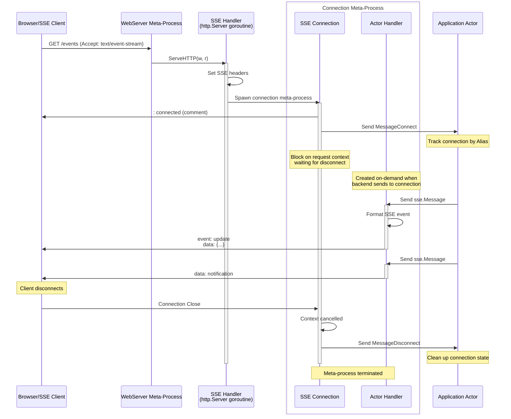

# SSE (Server-Sent Events)

SSE provides unidirectional server-to-client streaming over HTTP. Unlike WebSocket bidirectional connections, SSE is designed for scenarios where server pushes updates to clients - live feeds, notifications, real-time dashboards.

The framework provides SSE meta-process implementation that integrates SSE connections with the actor model. Each connection becomes an independent actor addressable from anywhere in the cluster.

## The Integration Problem

SSE connections need two capabilities:

**HTTP streaming**: Connection must keep HTTP response open and stream events to client. Standard HTTP handlers return immediately - SSE requires long-lived responses.

**Asynchronous writing**: Backend actors must be able to push events to the client at any time - notifications, updates, data changes from the actor system.

This is exactly what meta-processes solve. The SSE connection meta-process holds the HTTP response open. Actor Handler receives messages from backend actors and writes formatted SSE events to the response stream.

## Components

Two meta-processes work together:

**SSE Handler**: Implements `http.Handler` interface. When HTTP request arrives, sets SSE headers and spawns Connection meta-process. Returns after connection closes.

**SSE Connection**: Meta-process managing one SSE connection. Actor Handler receives messages from actors, formats them as SSE events, writes to HTTP response stream. Connection lives until client disconnects or error occurs.

For client-side connections:

**SSE Client Connection**: Meta-process connecting to external SSE endpoint. External Reader continuously reads SSE stream, parses events, sends them to application actors.

## Creating SSE Server

Use `sse.CreateHandler` to create handler meta-process:

```go
type WebService struct {
    act.Actor
    connections map[gen.Alias]bool
}

func (w *WebService) Init(args ...any) error {
    w.connections = make(map[gen.Alias]bool)

    // Create SSE handler
    sseHandler := sse.CreateHandler(sse.HandlerOptions{
        ProcessPool: []gen.Atom{"sse-handler"},
        Heartbeat:   30 * time.Second,
    })

    // Spawn handler meta-process
    _, err := w.SpawnMeta(sseHandler, gen.MetaOptions{})
    if err != nil {
        return err
    }

    // Register with HTTP mux
    mux := http.NewServeMux()
    mux.Handle("/events", sseHandler)

    // Create web server
    server, err := meta.CreateWebServer(meta.WebServerOptions{
        Host:    "localhost",
        Port:    8080,
        Handler: mux,
    })
    if err != nil {
        return err
    }

    _, err = w.SpawnMeta(server, gen.MetaOptions{})
    return err
}
```

Handler options:

**ProcessPool**: List of process names that will receive messages from SSE connections. When connection is established, handler round-robins across this pool to select which process handles this connection. If empty, connection sends to parent process.

**Heartbeat**: Interval for sending comment heartbeats to keep connection alive. Default 30 seconds. Heartbeats prevent proxies and load balancers from closing idle connections.

## Connection Lifecycle



When client connects:
1. HTTP request arrives with `Accept: text/event-stream`
2. Handler sets SSE response headers
3. Handler spawns Connection meta-process
4. Connection sends `MessageConnect` to application
5. Connection blocks waiting for client disconnect
6. Actor Handler waits for backend messages

During connection lifetime:
- Server events: Application sends message -> Actor Handler formats and writes SSE event
- Heartbeats: Periodic comment lines keep connection alive
- Connection remains open until client disconnects

When client disconnects:
1. HTTP request context is cancelled
2. Connection sends `MessageDisconnect` to application
3. Meta-process terminates
4. HTTP handler returns

## Messages

Four message types flow between connections and actors:

**sse.MessageConnect**: Sent when connection established.

```go
type MessageConnect struct {
    ID         gen.Alias      // Connection meta-process identifier
    RemoteAddr net.Addr       // Client address
    LocalAddr  net.Addr       // Server address
    Request    *http.Request  // Original HTTP request
}
```

Receive this to track new connections:

```go
func (h *Handler) HandleMessage(from gen.PID, message any) error {
    switch m := message.(type) {
    case sse.MessageConnect:
        h.connections[m.ID] = true
        h.Log().Info("Client connected: %s from %s", m.ID, m.RemoteAddr)

        // Send welcome event
        h.SendAlias(m.ID, sse.Message{
            Event: "welcome",
            Data:  []byte("Connected successfully"),
        })
    }
    return nil
}
```

**sse.MessageDisconnect**: Sent when connection closes.

```go
type MessageDisconnect struct {
    ID gen.Alias  // Connection meta-process identifier
}
```

Receive this to clean up connection state:

```go
case sse.MessageDisconnect:
    delete(h.connections, m.ID)
    h.Log().Info("Client disconnected: %s", m.ID)
```

**sse.Message**: Event to send to client (server) or received from server (client).

```go
type Message struct {
    ID    gen.Alias  // Connection identifier
    Event string     // Event type (optional)
    Data  []byte     // Event data (can be multi-line)
    MsgID string     // Event ID for reconnection (optional)
    Retry int        // Retry hint in milliseconds (optional)
}
```

Send events to client:

```go
// Simple data event
h.SendAlias(connID, sse.Message{
    Data: []byte("Hello, client!"),
})

// Named event with ID
h.SendAlias(connID, sse.Message{
    Event: "update",
    Data:  []byte(`{"temperature": 23.5}`),
    MsgID: "42",
})

// Broadcast to all connections
for connID := range h.connections {
    h.SendAlias(connID, sse.Message{
        Event: "broadcast",
        Data:  []byte("Server announcement"),
    })
}
```

Wire format for the above message:

```
event: update
id: 42
data: {"temperature": 23.5}

```

**sse.MessageLastEventID**: Sent when client reconnects with `Last-Event-ID` header.

```go
type MessageLastEventID struct {
    ID          gen.Alias  // Connection identifier
    LastEventID string     // ID from client header
}
```

Handle reconnection to resume from last event:

```go
case sse.MessageLastEventID:
    h.Log().Info("Client reconnected, last event: %s", m.LastEventID)
    // Send missed events since LastEventID
    h.sendMissedEvents(m.ID, m.LastEventID)
```

## SSE Wire Format

SSE events follow a simple text format:

```
event: <event-type>
id: <event-id>
retry: <milliseconds>
data: <line1>
data: <line2>

```

- `event:` - Event type. Client listens with `addEventListener("type", ...)`. Optional, defaults to "message".
- `id:` - Event ID. Client sends as `Last-Event-ID` header on reconnect. Optional.
- `retry:` - Suggested reconnection delay. Client uses this if connection drops. Optional.
- `data:` - Event payload. Can span multiple lines, each prefixed with `data:`. Required.
- Empty line terminates event.

The `sse.Message` struct maps directly to this format. Multi-line data is handled automatically.

## Client Connections

Create client-side SSE connections with `sse.CreateConnection`:

```go
func (c *Client) Init(args ...any) error {
    conn := sse.CreateConnection(sse.ConnectionOptions{
        URL:               url.URL{Scheme: "http", Host: "server:8080", Path: "/events"},
        Process:           "event-handler",
        Headers:           http.Header{"Authorization": []string{"Bearer token"}},
        LastEventID:       "42",
        ReconnectInterval: 5 * time.Second,
    })

    connID, err := c.SpawnMeta(conn, gen.MetaOptions{})
    if err != nil {
        return err
    }

    c.Log().Info("Connected to SSE server: %s", connID)
    return nil
}
```

Connection options:

**URL**: SSE server endpoint. Use `http://` or `https://` scheme.

**Process**: Process name that will receive events from server. If empty, sends to parent process.

**Headers**: Custom HTTP headers for the request. Useful for authentication.

**LastEventID**: Initial `Last-Event-ID` header value for resuming from specific event.

**ReconnectInterval**: Default reconnection delay. Can be overridden by server's `retry:` field. Default 3 seconds.

Client connections receive the same message types. External Reader parses SSE stream and sends `sse.Message` to application:

```go
func (h *EventHandler) HandleMessage(from gen.PID, message any) error {
    switch m := message.(type) {
    case sse.MessageConnect:
        h.Log().Info("Connected to server")

    case sse.Message:
        h.Log().Info("Event: %s, Data: %s", m.Event, string(m.Data))

    case sse.MessageDisconnect:
        h.Log().Info("Disconnected from server")
    }
    return nil
}
```

## Network Transparency

Connection meta-processes have `gen.Alias` identifiers that work across the cluster. Any actor on any node can send events to any connection:

```go
// Actor on node1 sends to connection on node2
actor.SendAlias(connectionAlias, sse.Message{
    Event: "notification",
    Data:  []byte("Update from backend service"),
})
```

Network transparency makes every SSE connection addressable like any other actor. Backend logic scattered across cluster nodes can push updates to specific clients without intermediaries.

## Process Pool Distribution

Handler accepts `ProcessPool` - list of process names to receive connection messages. Handler distributes connections across this pool using round-robin:

```go
sseHandler := sse.CreateHandler(sse.HandlerOptions{
    ProcessPool: []gen.Atom{"handler1", "handler2", "handler3"},
})
```

Connection 1 sends to "handler1", connection 2 to "handler2", connection 3 to "handler3", connection 4 to "handler1", etc. This distributes load across multiple handler processes.

Useful for scaling: spawn multiple handler processes, each managing subset of connections. Prevents single handler from becoming bottleneck.

## Differences from WebSocket

| Aspect | WebSocket | SSE |
|--------|-----------|-----|
| Direction | Bidirectional | Server to client only |
| Protocol | Upgrade to ws:// | Standard HTTP streaming |
| Client to server | WriteMessage() | Not supported (use separate HTTP requests) |
| Browser support | Requires WebSocket API | Native EventSource API |
| Reconnection | Manual implementation | Built-in with Last-Event-ID |
| Binary data | Supported | Text only (base64 encode if needed) |
| Proxy support | May require configuration | Works through standard HTTP proxies |

Choose SSE when:
- Server pushes updates to clients (notifications, live feeds, dashboards)
- Clients only need to receive, not send through same connection
- Working with proxies that may not support WebSocket
- Want automatic reconnection with event replay

Choose WebSocket when:
- True bidirectional communication needed
- Binary data transfer required
- Low latency in both directions critical
