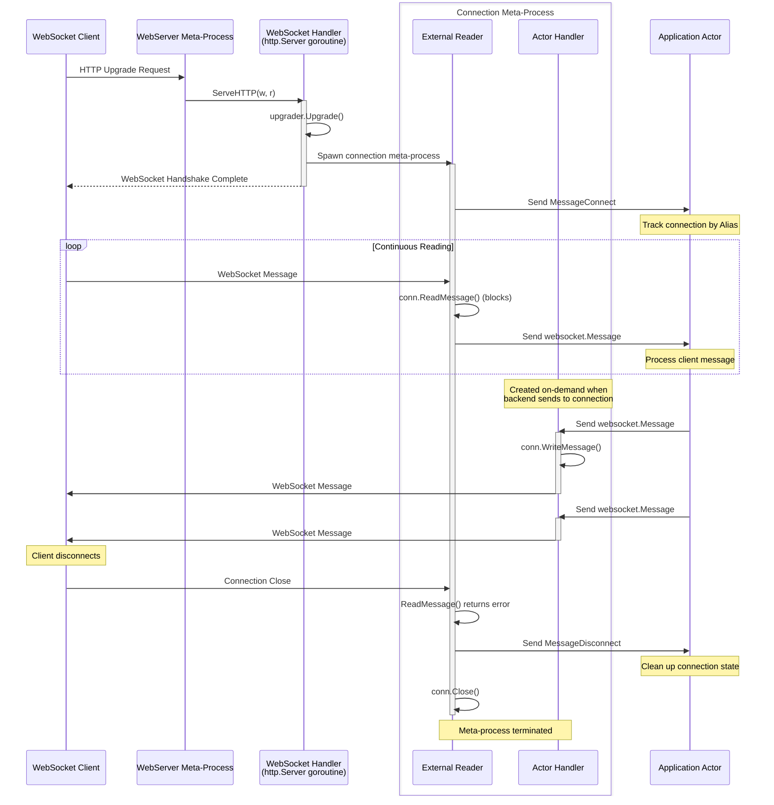

# WebSocket

WebSocket provides persistent bidirectional connections between clients and servers. Unlike HTTP request-response, a WebSocket connection remains open for extended periods, allowing both client and server to send messages at any time.

The framework provides WebSocket meta-process implementation that integrates WebSocket connections with the actor model. Each connection becomes an independent actor addressable from anywhere in the cluster.

## The Integration Problem

WebSocket connections need two capabilities simultaneously:

**Continuous reading**: Connection must block reading messages from the client. When a message arrives, forward it to application actors for processing.

**Asynchronous writing**: Backend actors must be able to push messages to the client at any time - notifications, updates, events from the actor system.

This is exactly what meta-processes solve. External Reader continuously reads from the WebSocket. Actor Handler receives messages from backend actors and writes to the WebSocket. Both operate concurrently on the same connection.

## Components

Two meta-processes work together:

**WebSocket Handler**: Implements `http.Handler` interface. When HTTP request arrives, upgrades it to WebSocket connection using gorilla/websocket library. Spawns Connection meta-process for each upgrade. Returns immediately - does not block.

**WebSocket Connection**: Meta-process managing one WebSocket connection. External Reader continuously reads messages from client, sends them to application actors. Actor Handler receives messages from actors, writes them to client. Connection lives until client disconnects or error occurs.

## Creating WebSocket Server

Use `websocket.CreateHandler` to create handler meta-process:

```go
type WebService struct {
    act.Actor
}

func (w *WebService) Init(args ...any) error {
    // Create WebSocket handler
    wsHandler := websocket.CreateHandler(websocket.HandlerOptions{
        ProcessPool:       []gen.Atom{"ws-handler"},
        HandshakeTimeout:  15 * time.Second,
        EnableCompression: true,
        CheckOrigin:       func(r *http.Request) bool { return true },
    })

    // Spawn handler meta-process
    _, err := w.SpawnMeta(wsHandler, gen.MetaOptions{})
    if err != nil {
        return err
    }

    // Register with HTTP mux
    mux := http.NewServeMux()
    mux.Handle("/ws", wsHandler)

    // Create web server
    server, err := meta.CreateWebServer(meta.WebServerOptions{
        Host:    "localhost",
        Port:    8080,
        Handler: mux,
    })
    if err != nil {
        return err
    }

    _, err = w.SpawnMeta(server, gen.MetaOptions{})
    return err
}
```

Handler options:

**ProcessPool**: List of process names that will receive messages from WebSocket connections. When connection is established, handler round-robins across this pool to select which process receives messages from this connection. If empty, connection sends to parent process.

**HandshakeTimeout**: Maximum time for WebSocket upgrade handshake. Default 15 seconds.

**EnableCompression**: Enable per-message compression. Reduces bandwidth for text messages.

**CheckOrigin**: Function to verify request origin. Return `true` to accept, `false` to reject. Default rejects cross-origin requests. Use `func(r *http.Request) bool { return true }` to accept all origins.

## Connection Lifecycle



When client connects:
1. HTTP request arrives, handler upgrades to WebSocket
2. Handler spawns Connection meta-process
3. Connection sends `MessageConnect` to application
4. External Reader enters continuous read loop
5. Actor Handler waits for backend messages

During connection lifetime:
- Client messages: External Reader reads → sends to application
- Server messages: Application sends → Actor Handler writes to client
- Both directions operate simultaneously

When client disconnects:
1. `ReadMessage()` returns error
2. External Reader sends `MessageDisconnect` to application
3. Connection closes socket
4. Meta-process terminates

## Messages

Three message types flow between connections and actors:

**websocket.MessageConnect**: Sent when connection established.

```go
type MessageConnect struct {
    ID         gen.Alias  // Connection meta-process identifier
    RemoteAddr net.Addr   // Client address
    LocalAddr  net.Addr   // Server address
}
```

Receive this to track new connections:

```go
func (h *Handler) HandleMessage(from gen.PID, message any) error {
    switch m := message.(type) {
    case websocket.MessageConnect:
        h.connections[m.ID] = ConnectionInfo{
            RemoteAddr: m.RemoteAddr,
            ConnectedAt: time.Now(),
        }
        h.Log().Info("Client connected: %s from %s", m.ID, m.RemoteAddr)
    }
    return nil
}
```

**websocket.MessageDisconnect**: Sent when connection closes.

```go
type MessageDisconnect struct {
    ID gen.Alias  // Connection meta-process identifier
}
```

Receive this to clean up connection state:

```go
case websocket.MessageDisconnect:
    delete(h.connections, m.ID)
    h.Log().Info("Client disconnected: %s", m.ID)
```

**websocket.Message**: Client message received or server message to send.

```go
type Message struct {
    ID   gen.Alias    // Connection identifier
    Type MessageType  // Message type (text, binary, ping, pong, close)
    Body []byte       // Message payload
}

const (
    MessageTypeText   MessageType = 1
    MessageTypeBinary MessageType = 2
    MessageTypeClose  MessageType = 8
    MessageTypePing   MessageType = 9
    MessageTypePong   MessageType = 10
)
```

Receive messages from client:

```go
case websocket.Message:
    h.Log().Info("Received from %s: %s", m.ID, string(m.Body))
    // Process message, maybe reply
    h.SendAlias(m.ID, websocket.Message{Body: []byte("ack")})
```

Send messages to client:

```go
// Send to specific connection
h.SendAlias(connID, websocket.Message{
    Type: websocket.MessageTypeText,
    Body: []byte("notification"),
})

// Broadcast to all connections
for connID := range h.connections {
    h.SendAlias(connID, websocket.Message{
        Body: []byte("broadcast message"),
    })
}
```

When sending, `Type` defaults to `MessageTypeText` if not set. `ID` field is ignored - target is specified in `SendAlias()` call.

## Network Transparency

Connection meta-processes have `gen.Alias` identifiers that work across the cluster. Any actor on any node can send messages to any connection:

```go
// Actor on node1 sends to connection on node2
actor.SendAlias(connectionAlias, websocket.Message{
    Body: []byte("update from backend"),
})
```

Network transparency makes every WebSocket connection addressable like any other actor. Backend logic scattered across cluster nodes can push updates to specific clients without intermediaries.

## Client Connections

Create client-side WebSocket connections with `websocket.CreateConnection`:

```go
func (c *Client) Init(args ...any) error {
    conn, err := websocket.CreateConnection(websocket.ConnectionOptions{
        URL:               url.URL{Scheme: "ws", Host: "server:8080", Path: "/ws"},
        Process:           "message-handler",
        HandshakeTimeout:  15 * time.Second,
        EnableCompression: true,
    })
    if err != nil {
        return err
    }

    connID, err := c.SpawnMeta(conn, gen.MetaOptions{})
    if err != nil {
        conn.Terminate(err)
        return err
    }

    c.Log().Info("Connected to server: %s", connID)
    return nil
}
```

`CreateConnection` performs WebSocket dial during creation. If dial fails, error is returned. If successful, connection is established but meta-process is not started yet. Call `SpawnMeta()` to start the meta-process. If spawn fails, call `conn.Terminate(err)` to close the connection.

Connection options:

**URL**: WebSocket server address. Use `ws://` or `wss://` scheme.

**Process**: Process name that will receive messages from server. If empty, sends to parent process.

**HandshakeTimeout**: Maximum time for connection handshake. Default 15 seconds.

**EnableCompression**: Enable compression. Must match server setting.

Client connections work identically to server connections. External Reader reads from server, Actor Handler sends to server. Messages use the same `websocket.Message` type.

## Process Pool Distribution

Handler accepts `ProcessPool` - list of process names to receive connection messages. Handler distributes connections across this pool using round-robin:

```go
wsHandler := websocket.CreateHandler(websocket.HandlerOptions{
    ProcessPool: []gen.Atom{"handler1", "handler2", "handler3"},
})
```

Connection 1 sends to "handler1", connection 2 to "handler2", connection 3 to "handler3", connection 4 to "handler1", etc. This distributes load across multiple handler processes.

Useful for scaling: spawn multiple handler processes, each managing subset of connections. Prevents single handler from becoming bottleneck.
