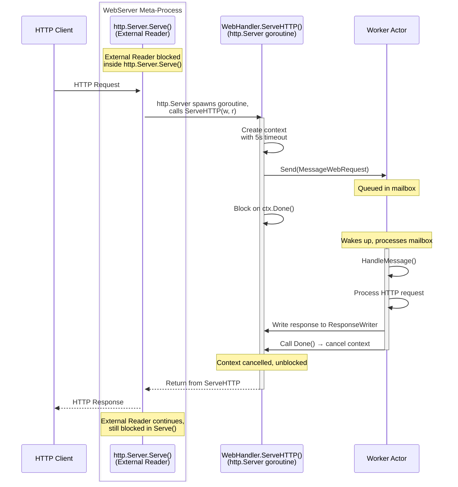

# Web

HTTP and actors speak different languages. HTTP is fundamentally synchronous - a request arrives, blocks waiting for processing, gets a response, connection closes. The actor model is fundamentally asynchronous - messages arrive in mailboxes, get processed sequentially one at a time, responses are separate messages sent whenever ready.

Integrating these two worlds is possible, but the integration strategy matters. Choose wrong and you lose the benefits of both models. Choose right and you get HTTP's ubiquity with actors' concurrency and distribution capabilities.

This chapter shows two integration approaches, ordered from simple to complex. The simple approach works for most cases and keeps the entire HTTP ecosystem available. The meta-process approach trades tooling for deeper actor integration, enabling patterns impossible with standard HTTP stacks.

Before reaching for meta-processes, understand what you're giving up and what you're gaining. The simple approach might be all you need.

## Simple Approach: Call from HTTP Handlers

The straightforward way: run a standard HTTP server, call actors from handlers using `node.Call()`, let network transparency distribute requests across the cluster.

This keeps HTTP and actors separate. HTTP handles protocol concerns - routing, middleware, headers, status codes. Actors handle business logic - state management, processing, coordination. Clean separation.

### Basic Pattern

```go
func main() {
    // Start node
    node, err := ergo.StartNode("gateway@localhost", gen.NodeOptions{})
    if err != nil {
        panic(err)
    }
    defer node.Stop()

    // Start HTTP server with node reference
    server := &APIServer{node: node}
    if err := server.Start(); err != nil {
        panic(err)
    }
}

type APIServer struct {
    node gen.Node
    mux  *http.ServeMux
}

func (a *APIServer) Start() error {
    a.mux = http.NewServeMux()
    a.mux.HandleFunc("/users/{id}", a.handleGetUser)
    a.mux.HandleFunc("/orders", a.handleCreateOrder)

    return http.ListenAndServe(":8080", a.mux)
}

func (a *APIServer) handleGetUser(w http.ResponseWriter, r *http.Request) {
    userID := r.PathValue("id")

    // Call actor anywhere in the cluster
    result, err := a.node.Call(
        gen.ProcessID{Name: "user-service", Node: "backend@node1"},
        GetUserRequest{ID: userID},
    )

    if err != nil {
        http.Error(w, "Service unavailable", http.StatusServiceUnavailable)
        return
    }

    if errResult, ok := result.(error); ok {
        http.Error(w, errResult.Error(), http.StatusNotFound)
        return
    }

    user := result.(User)
    json.NewEncoder(w).Encode(user)
}
```

The HTTP server runs outside the actor system in a separate goroutine. Handlers call actors synchronously using `node.Call()`. Actors can be anywhere - same node, remote node, doesn't matter. Network transparency routes the call.

### Why This Works

`Call()` blocks the HTTP handler goroutine, not an actor. Go's HTTP server creates one goroutine per connection. Blocking in a handler is normal - that goroutine waits, others continue serving requests.

The actor receiving the call processes it asynchronously in its own message loop. Multiple handlers can call the same actor concurrently. The actor processes one request at a time from its mailbox. This isolates the actor from HTTP concurrency.

Network transparency means the actor can be anywhere:

```go
// Same call works regardless of actor location
result, err := node.Call(
    gen.ProcessID{Name: "user-service", Node: "backend@node1"},
    request,
)
```

Change `Node` to move the actor. Code stays the same. Distribute load across nodes by routing different requests to different actors.

### Cluster Load Distribution

Network transparency means actors can run anywhere in the cluster. The HTTP gateway becomes a router that distributes requests across backend nodes.

Simple consistent hashing distributes load evenly while maintaining request affinity:

```go
func (a *APIServer) handleGetUser(w http.ResponseWriter, r *http.Request) {
    userID := r.PathValue("id")

    // Route requests for the same user to the same node
    // This improves cache locality - user data stays hot
    nodeID := consistentHash(userID, a.clusterSize)
    targetNode := fmt.Sprintf("backend@node%d", nodeID)

    result, err := a.node.Call(
        gen.ProcessID{Name: "user-service", Node: targetNode},
        GetUserRequest{ID: userID},
    )

    // handle result...
}
```

Requests for user "alice" always go to the same backend node. That node caches alice's data in memory. Subsequent requests hit warm cache. Change `clusterSize` to add nodes - hashing redistributes load automatically while preserving most affinity.

For dynamic topology where nodes join and leave unpredictably, use application discovery. Central registrars (etcd, Saturn) track which nodes are running which applications in real-time:

```go
func (a *APIServer) handleRequest(w http.ResponseWriter, r *http.Request) {
    // Application discovery requires central registrar (etcd or Saturn)
    // See: networking/service-discovering.md
    registrar, err := a.node.Network().Registrar()
    if err != nil {
        http.Error(w, "Service unavailable", http.StatusServiceUnavailable)
        return
    }

    resolver := registrar.Resolver()
    routes, err := resolver.ResolveApplication("user-service")
    if err != nil || len(routes) == 0 {
        http.Error(w, "Service unavailable", http.StatusServiceUnavailable)
        return
    }

    // Select node based on weight, load, health, proximity
    target := a.selectNode(routes)

    result, err := a.node.Call(
        gen.ProcessID{Name: "user-service", Node: target.Node},
        GetUserRequest{ID: r.PathValue("id")},
    )

    // handle result...
}

func (a *APIServer) selectNode(routes []gen.ApplicationRoute) gen.ApplicationRoute {
    // Weighted random selection
    totalWeight := 0
    for _, r := range routes {
        totalWeight += r.Weight
    }

    pick := rand.Intn(totalWeight)
    for _, r := range routes {
        pick -= r.Weight
        if pick < 0 {
            return r
        }
    }

    return routes[0]
}
```

Application discovery returns all nodes currently running the service. Each node reports its weight. Nodes with higher weights (more resources, better hardware, closer proximity) receive proportionally more traffic. Nodes that crash disappear from discovery immediately. New nodes appear as soon as they register. The HTTP gateway adapts to cluster topology changes without restarts.

For details on application discovery and central registrars, see [Service Discovery](../networking/service-discovering.md).

### Standard HTTP Tooling

This approach keeps the entire HTTP ecosystem available:

**OpenAPI generation**: Tools like swag/swaggo analyze HTTP handlers and generate OpenAPI specs. They see standard `net/http` handlers, so generation works normally.

**Middleware**: Standard HTTP middleware wraps handlers - authentication, logging, CORS, rate limiting. Actors are completely invisible to middleware.

**Routing**: Use any router - `http.ServeMux` (Go 1.22+), `gorilla/mux`, `chi`, `echo`. They all work with standard handlers.

**Testing**: Test HTTP handlers with `httptest`. Test actors separately with unit tests. Clean separation of concerns.

```go
// Standard middleware works
func authMiddleware(next http.Handler) http.Handler {
    return http.HandlerFunc(func(w http.ResponseWriter, r *http.Request) {
        if !isAuthorized(r) {
            http.Error(w, "Unauthorized", http.StatusUnauthorized)
            return
        }
        next.ServeHTTP(w, r)
    })
}

mux.Handle("/api/", authMiddleware(http.HandlerFunc(a.handleAPI)))
```

The actor system is an implementation detail. HTTP sees standard handlers. Clients see standard HTTP. Deployment tools see standard HTTP servers. Only the handler implementation uses actors internally.

### When This Approach Works

Use this when:
- You need standard HTTP tooling (OpenAPI, gRPC-gateway, middleware ecosystems)
- Load balancing happens at the nginx/kubernetes level, not actor level
- Backpressure from actors doesn't matter (actors process at their speed, HTTP clients wait)
- You want simple deployment (separate HTTP gateway, actor backend)

This covers most HTTP/actor integration cases. The HTTP layer is stateless. Actors hold state and logic. HTTP routes requests to actors. Clean architecture.

For details on synchronous request handling in actors, see [Handling Sync Requests](../advanced/handle-sync.md).

## Meta-Process Approach: Deep Integration

Meta-processes convert HTTP into asynchronous actor messages. Instead of calling actors synchronously from handlers, requests become messages flowing into the actor system.

This approach enables:
- Backpressure: actors control request rate through mailbox capacity
- **Addressable connections**: each WebSocket/SSE connection becomes an independent actor with `gen.Alias` identifier - any actor anywhere in the cluster can send messages directly to specific client connections through network transparency. This is the killer feature for real-time systems (chat, multiplayer games, live dashboards, collaborative editing) where backend logic must push updates to specific clients across cluster nodes. Impossible with the simple approach.
- Per-request routing: route to different actor pools based on request content
- Unified monitoring: HTTP requests visible as actor messages in system introspection

Standard HTTP routing and middleware still work - `meta.WebHandler` implements `http.Handler` and integrates with `http.ServeMux` or any router. You can wrap handlers in middleware for authentication, logging, CORS. What you lose is introspection-based tooling (OpenAPI generation, gRPC-gateway) because request processing happens inside actors, invisible to HTTP layer analysis tools.

### Architecture

Two meta-processes work together:

**meta.WebServer**: External Reader runs `http.Server.Serve(listener)`. Blocks there forever until listener fails. The `http.Server` creates its own goroutines for each HTTP connection - those goroutines call handlers, not the External Reader. Actor Handler never runs (no messages received).

**meta.WebHandler**: Implements `http.Handler` interface. External Reader blocks in `Start()` waiting for termination. When `http.Server` (running in WebServer) accepts a connection, it spawns a goroutine that calls `handler.ServeHTTP()`. Inside `ServeHTTP()`:
1. Create context with timeout
2. Send `meta.MessageWebRequest` to worker actor
3. Block on `<-ctx.Done()` waiting for worker to call `Done()`
4. Return (http.Server sends response to client)

Actor Handler never runs - `HandleMessage()` and `HandleCall()` are empty stubs.

Worker actors receive `meta.MessageWebRequest` containing:
- `http.ResponseWriter` - write response here
- `*http.Request` - the HTTP request
- `Done()` function - call this to unblock ServeHTTP

### Data Flow



Compare this with typical meta-processes like TCP or UDP:

**TCP/UDP meta-processes:**
- External Reader actively loops reading from socket, sends messages to actors
- Actor Handler receives messages from actors, writes to socket
- Both goroutines do real work - continuous bidirectional I/O

**Web meta-processes:**
- WebServer's External Reader passively blocks in `http.Server.Serve()` doing nothing - `http.Server` does all the work internally
- WebHandler's External Reader passively blocks on channel doing nothing - just waiting for termination
- Neither has an active Actor Handler - no messages arrive in their mailboxes
- All real work happens in `ServeHTTP()` executed by `http.Server` goroutines

Web meta-processes are unusual. They use the meta-process mechanism not for bidirectional I/O but for lifecycle management and integration with the actor system. The External Reader goroutines exist only to keep the meta-process alive while `http.Server` runs. The actual HTTP handling happens in goroutines spawned by `http.Server`, which are completely outside the meta-process architecture.

This works because `http.Server` already solves concurrency - it spawns goroutines per connection. The meta-process just wraps it for integration with actor lifecycle and messaging.

### Basic Setup

```go
type WebService struct {
    act.Actor
}

func (w *WebService) Init(args ...any) error {
    // Spawn worker that will handle HTTP requests
    _, err := w.SpawnRegister("web-worker",
        func() gen.ProcessBehavior { return &WebWorker{} },
        gen.ProcessOptions{},
    )
    if err != nil {
        return err
    }

    // Create HTTP multiplexer
    mux := http.NewServeMux()

    // Create handler meta-process pointing to worker
    handler := meta.CreateWebHandler(meta.WebHandlerOptions{
        Worker:         "web-worker",
        RequestTimeout: 5 * time.Second,
    })

    // Spawn handler meta-process
    handlerID, err := w.SpawnMeta(handler, gen.MetaOptions{})
    if err != nil {
        return err
    }

    // Register handler with mux (handler implements http.Handler)
    // Standard middleware works - handler is just http.Handler
    mux.Handle("/", authMiddleware(rateLimitMiddleware(handler)))

    // Create web server meta-process
    server, err := meta.CreateWebServer(meta.WebServerOptions{
        Host:    "localhost",
        Port:    8080,
        Handler: mux,
    })
    if err != nil {
        return err
    }

    // Spawn server meta-process
    serverID, err := w.SpawnMeta(server, gen.MetaOptions{})
    if err != nil {
        server.Terminate(err)
        return err
    }

    w.Log().Info("HTTP server listening on :8080 (server=%s, handler=%s)",
        serverID, handlerID)
    return nil
}
```

When a request arrives:
1. WebServer's External Reader is blocked in `http.Server.Serve()`
2. `http.Server` accepts connection, spawns its own goroutine for this connection
3. That goroutine calls `handler.ServeHTTP()` (handler is WebHandler)
4. `ServeHTTP()` sends `meta.MessageWebRequest` to worker actor using `Send()`
5. `ServeHTTP()` blocks on `<-ctx.Done()`
6. Worker actor receives message in its mailbox, processes it in `HandleMessage()`
7. Worker writes HTTP response to `ResponseWriter`, calls `Done()`
8. `Done()` cancels context, unblocking `ServeHTTP()`
9. `ServeHTTP()` returns, connection goroutine completes

Critical: `ServeHTTP()` executes in `http.Server` goroutines, not in meta-process goroutines. WebHandler's External Reader remains blocked in `Start()` waiting for termination. WebHandler's Actor Handler never spawns because no messages arrive in its mailbox.

### Worker Implementation

Workers receive `meta.MessageWebRequest` as regular messages in their mailbox:

```go
type WebWorker struct {
    act.Actor
}

func (w *WebWorker) HandleMessage(from gen.PID, message any) error {
    request, ok := message.(meta.MessageWebRequest)
    if !ok {
        return nil
    }

    defer request.Done()  // Always call Done to unblock ServeHTTP

    // Process HTTP request
    switch request.Request.Method {
    case "GET":
        user := w.getUserFromDB(request.Request.URL.Query().Get("id"))
        json.NewEncoder(request.Response).Encode(user)

    case "POST":
        var order Order
        json.NewDecoder(request.Request.Body).Decode(&order)
        w.createOrder(order)
        request.Response.WriteHeader(http.StatusCreated)

    default:
        http.Error(request.Response, "Method not supported", http.StatusMethodNotAllowed)
    }

    return nil
}
```

The pattern: receive `MessageWebRequest`, process it, write to `ResponseWriter`, call `Done()`. The `Done()` call unblocks the `ServeHTTP()` goroutine waiting in WebHandler.

**Using act.WebWorker**: Framework provides `act.WebWorker` that automatically extracts `MessageWebRequest`, routes to HTTP-method-specific callbacks (`HandleGet`, `HandlePost`, etc.), and calls `Done()` after processing. Use this instead of manual message handling - it eliminates boilerplate and ensures `Done()` is always called. See [WebWorker](../actors/webworker.md) for details.

### Concurrent Processing with act.Pool

Single worker processes requests sequentially. Use `act.Pool` to process multiple requests concurrently:

```go
type WebWorkerPool struct {
    act.Pool
}

func (p *WebWorkerPool) Init(args ...any) (act.PoolOptions, error) {
    return act.PoolOptions{
        PoolSize:          20,   // 20 concurrent workers
        WorkerMailboxSize: 10,   // Each worker queues up to 10 requests
        WorkerFactory:     func() gen.ProcessBehavior { return &WebWorker{} },
    }, nil
}

func (w *WebService) Init(args ...any) error {
    // Spawn pool with registered name
    _, err := w.SpawnRegister("web-worker",
        func() gen.ProcessBehavior { return &WebWorkerPool{} },
        gen.ProcessOptions{},
    )
    if err != nil {
        return err
    }

    handler := meta.CreateWebHandler(meta.WebHandlerOptions{
        Worker: "web-worker",
    })

    _, err = w.SpawnMeta(handler, gen.MetaOptions{})
    // rest of setup...
}
```

Pool distributes incoming requests across 20 workers. Each worker processes one request at a time. System handles 20 concurrent requests.

**Capacity control**: `PoolSize × WorkerMailboxSize` defines maximum requests the backend accepts. With 20 workers and 10 mailbox size, system capacity is 220 requests (20 processing + 200 queued). Beyond this, requests are shed - pool cannot forward to workers with full mailboxes.

This limits load on backend systems. Database handles 20 concurrent queries maximum. External API gets 20 parallel requests maximum. Worker mailboxes buffer bursts without overwhelming downstream services.

Worker failures are handled automatically. Pool spawns replacement workers when crashes are detected. Other workers continue processing during restart.

### Stateful Connections: WebSocket

HTTP request-response is stateless. WebSocket is the opposite - long-lived bidirectional connections remaining open for hours or days.

The framework provides WebSocket meta-process implementation in the extra library (`ergo.services/meta/websocket`). Each connection becomes an independent meta-process with `gen.Alias` identifier, addressable from anywhere in the cluster.

Each connection is an independent meta-process:
- External Reader continuously reads messages from client
- Actor Handler receives messages from backend actors, writes to client
- Both operate simultaneously - full-duplex bidirectional communication
- Connection has state (subscriptions, session data) managed by the actor

Killer feature: **cluster-wide addressability**. Any actor on any node can send messages directly to specific client connections:

```go
// Chat room broadcasts to all connected clients
for _, connAlias := range room.connections {
    room.Send(connAlias, ChatMessage{From: sender, Text: text})
}

// Game server on node1 pushes update to player connection on node2
gameServer.Send(playerConnAlias, StateUpdate{HP: hp, Position: pos})

// Backend actor pushes notification to user's browser
backend.Send(userConnAlias, Notification{Text: "Task completed"})
```

Network transparency makes every WebSocket connection addressable like any other actor. Backend logic scattered across cluster nodes can push updates to specific clients without routing through intermediaries.

This is impossible with the simple approach. `node.Call()` is request-response. WebSocket requires continuous streaming both directions. Meta-processes provide the architecture: one goroutine reading from client, another writing to client, both operating on the same connection.

For WebSocket implementation and usage examples, see [WebSocket](../extra-library/meta-processes/websocket.md).

## Choosing an Approach

Start with the simple approach. Use `node.Call()` from standard HTTP handlers. This works for most cases and keeps the entire HTTP ecosystem available - OpenAPI generation, middleware, familiar patterns.

Move to meta-processes when you specifically need:

**WebSocket or long-lived connections**: Each connection must be an addressable actor that backend logic can push updates to. The simple approach cannot do this - it's request-response only. Meta-processes make each connection an independent actor with cluster-wide addressability.

**Capacity control through mailbox limits**: Backend accepts exactly `PoolSize × WorkerMailboxSize` requests, no more. Beyond this, requests are rejected. This prevents memory exhaustion during overload. The simple approach queues unbounded requests in HTTP server.

The simple approach handles thousands of requests per second with proper actor distribution. Use meta-processes only when the simple approach cannot provide required capabilities.
