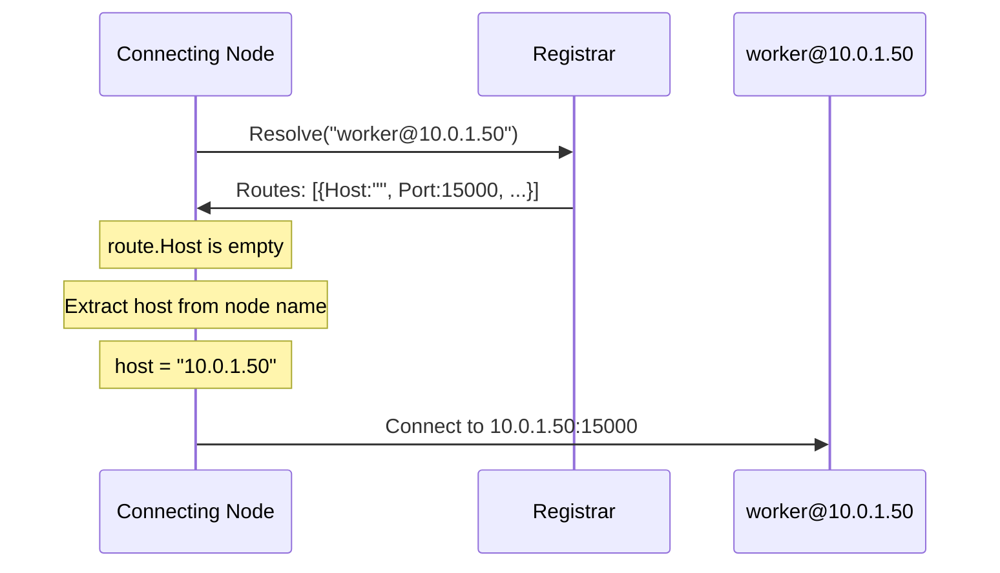
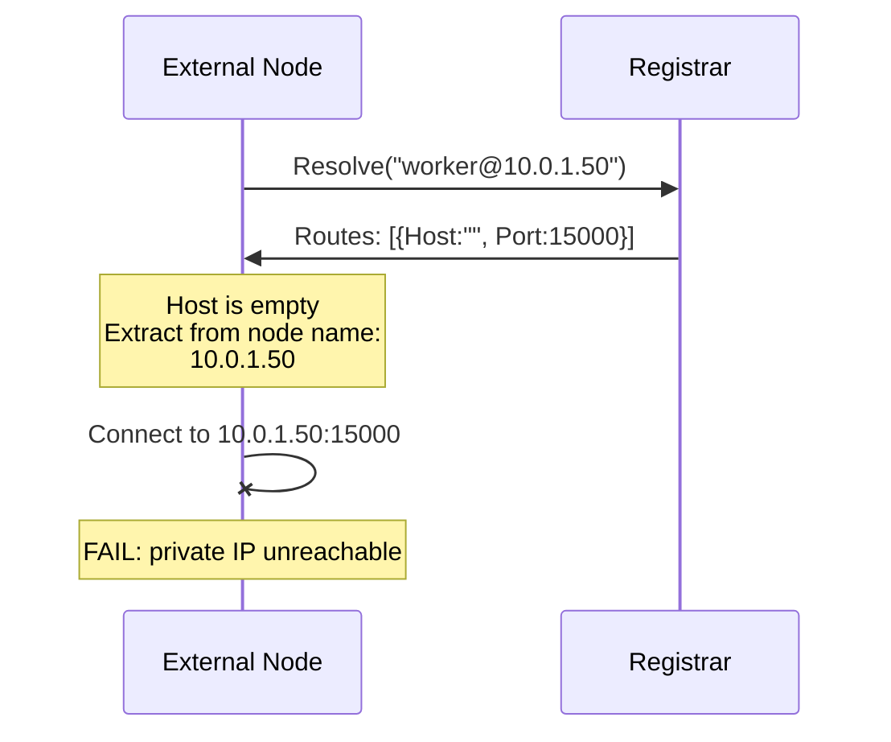
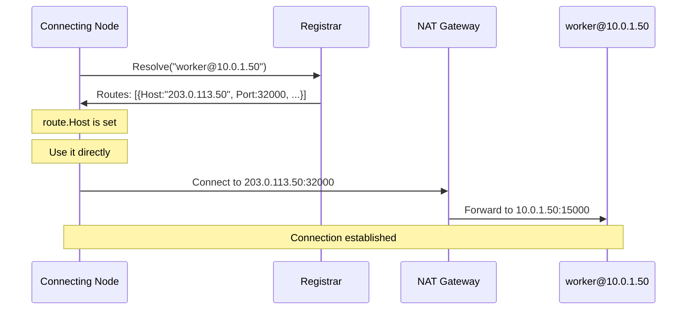
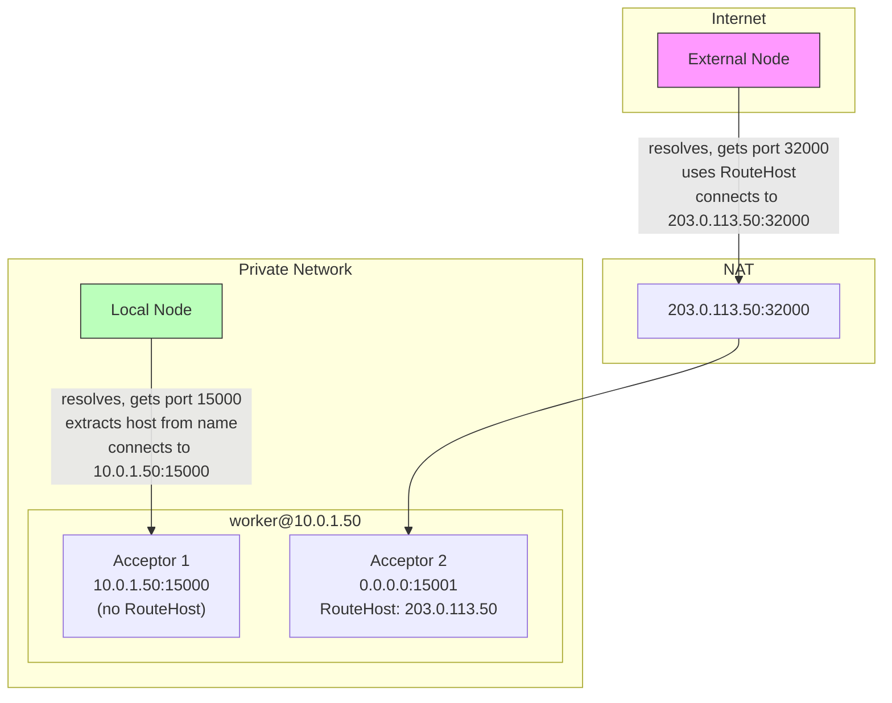
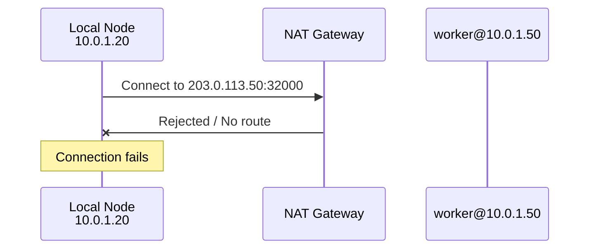
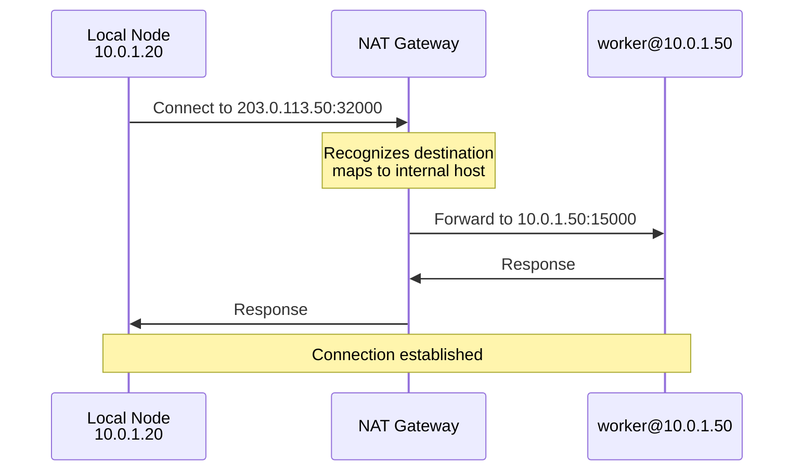

# Behind the NAT

When a node starts, it registers its routes with a registrar. A route contains connection parameters: port number, TLS flag, handshake version, protocol version, and optionally a host address. When another node needs to connect, it resolves the target node's routes from the registrar and uses these parameters to establish a connection.

The host address in the route is optional. When empty, the connecting node extracts the host from the target's node name. If you're connecting to `worker@10.0.1.50`, the framework extracts `10.0.1.50` and connects to that address on the resolved port.

This works when node names reflect reachable addresses. But when a node is behind NAT, its node name contains a private IP that external nodes can't reach. The solution is to include a public address in the route itself using `RouteHost` and `RoutePort`.

## How Route Resolution Works

Understanding the resolution flow clarifies why NAT causes problems and how `RouteHost` solves them.

When a node registers with any registrar (embedded, etcd, or Saturn), it sends its routes:

```go
// What gets registered (simplified)
MessageRegisterRoutes{
    Node:   "worker@10.0.1.50",
    Routes: []gen.Route{
        {
            Host:             "",      // empty by default
            Port:             15000,
            TLS:              false,
            HandshakeVersion: ...,
            ProtoVersion:     ...,
        },
    },
}
```

The registrar stores these routes exactly as received. When another node resolves `worker@10.0.1.50`:



The connecting node checks if `route.Host` is set. If empty, it extracts the host from the node name as a fallback.

## The NAT Problem

When a node is behind NAT, its node name contains a private IP. The external node resolves routes, gets an empty host, extracts `10.0.1.50` from the node name, and tries to connect to a private IP that's unreachable from the internet.



## The Solution: RouteHost and RoutePort

Tell the node what address to advertise by setting `RouteHost` and `RoutePort` in `AcceptorOptions`:

```go
node, err := ergo.StartNode("worker@10.0.1.50", gen.NodeOptions{
    Network: gen.NetworkOptions{
        Acceptors: []gen.AcceptorOptions{
            {
                Host:      "0.0.0.0",        // listen on all interfaces
                Port:      15000,            // listen on this port
                RouteHost: "203.0.113.50",   // advertise this host
                RoutePort: 32000,            // advertise this port
            },
        },
    },
})
```

Now the route registered with the registrar includes the public address:

```go
// What gets registered
Routes: []gen.Route{
    {
        Host:             "203.0.113.50",  // from RouteHost
        Port:             32000,           // from RoutePort
        TLS:              false,
        HandshakeVersion: ...,
        ProtoVersion:     ...,
    },
}
```

When another node resolves:



The connecting node sees a non-empty `Host` in the route and uses it directly. No fallback to node name extraction. The connection goes to the public address, NAT forwards it, and the connection succeeds.

## Field Reference

| AcceptorOptions Field | Purpose |
|----------------------|---------|
| `Host` | Network interface to bind the listener socket |
| `Port` | TCP port to listen on |
| `RouteHost` | Host address to advertise in route registration |
| `RoutePort` | Port to advertise in route registration (0 = use actual listening port) |

`Host` and `RouteHost` are independent:
- `Host: "0.0.0.0"` binds to all interfaces but is useless as a connectable address
- `RouteHost: "203.0.113.50"` is what other nodes use to connect

## Registrar Behavior

All registrars (embedded, etcd, Saturn) handle routes identically:

1. **Registration**: Store routes exactly as provided, including `Host` field
2. **Resolution**: Return routes exactly as stored
3. **Connection**: Connecting node uses `route.Host` if set, otherwise extracts from node name

The embedded registrar sends resolution queries via UDP to the host portion of the node name. For `worker@10.0.1.50`, it queries `10.0.1.50:4499`. This works because the registrar query goes to the private network (where the registrar runs), not to the NAT-ed node directly.

External registrars (etcd, Saturn) use their central server for all queries. The node name's host portion is irrelevant for resolution since queries go to etcd/Saturn, not to the target host.

## Common Scenarios

### Same Port Forwarding

NAT forwards the same port (15000 external = 15000 internal):

```go
Acceptors: []gen.AcceptorOptions{
    {
        Host:      "0.0.0.0",
        Port:      15000,
        RouteHost: "203.0.113.50",
        // RoutePort not set - uses actual port 15000
    },
}
```

### Different Port Forwarding

NAT maps different ports (32000 external -> 15000 internal):

```go
Acceptors: []gen.AcceptorOptions{
    {
        Host:      "0.0.0.0",
        Port:      15000,
        RouteHost: "203.0.113.50",
        RoutePort: 32000,
    },
}
```

### DNS Name Instead of IP

Advertise a DNS name for flexibility:

```go
Acceptors: []gen.AcceptorOptions{
    {
        Host:      "0.0.0.0",
        Port:      15000,
        RouteHost: "worker.prod.example.com",
    },
}
```

The DNS name is stored in the route. Connecting nodes resolve DNS at connection time, getting the current IP.

### Kubernetes NodePort

Pod behind NodePort service:

```go
Acceptors: []gen.AcceptorOptions{
    {
        Host:      "0.0.0.0",
        Port:      15000,              // container port
        RouteHost: os.Getenv("NODE_IP"), // Kubernetes node IP
        RoutePort: 32000,              // NodePort
    },
}
```

## Local Network Considerations

Setting `RouteHost` affects all nodes that resolve your address, including nodes on the same local network. If local nodes should use internal addresses while external nodes use public addresses, you have several options.

### Multiple Acceptors

Run acceptors on different ports for internal and external access:



```go
Acceptors: []gen.AcceptorOptions{
    {
        Host: "10.0.1.50",  // internal only, no RouteHost
        Port: 15000,
    },
    {
        Host:      "0.0.0.0",
        Port:      15001,
        RouteHost: "203.0.113.50",
        RoutePort: 32000,
    },
}
```

Both routes are registered. Local nodes can connect via either. External nodes can only use the one with `RouteHost` set.

### Static Routes on Local Nodes

Configure local nodes to bypass registrar resolution:

```go
// On local nodes
route := gen.NetworkRoute{
    Route: gen.Route{
        Host: "10.0.1.50",
        Port: 15000,
    },
}
network.AddRoute("worker@10.0.1.50", route, 100)
```

Static routes are checked before registrar resolution. Local nodes use the static route (internal IP), external nodes use registrar resolution (public IP from `RouteHost`).

### Hairpin NAT

Hairpin NAT (also called NAT loopback) allows internal nodes to connect using the public IP address.

When you set `RouteHost: "203.0.113.50"`, all nodes - including local ones - receive this public address from the registrar and try to connect to it.

**Without hairpin NAT support:**



**With hairpin NAT support:**



The traffic makes a "hairpin turn" at the NAT device - goes toward the external interface, turns around, comes back to the internal network.

This is a network infrastructure configuration on your router/firewall, not an application change. Check your NAT device documentation for "hairpin NAT", "NAT loopback", or "NAT reflection" settings.

## Relation to Static Routes

`RouteHost`/`RoutePort` and static routes solve opposite problems:

| Problem | Solution |
|---------|----------|
| You're behind NAT, others can't reach you | Set `RouteHost`/`RoutePort` to advertise your public address |
| Others are behind NAT, you can't reach them | Configure static routes with their public addresses |

In complex topologies, you might use both. Your node advertises its public address via `RouteHost`. It also configures static routes to reach other nodes through specific gateways.

## Troubleshooting

**External nodes can't connect**

1. Verify NAT/firewall forwards traffic to your node
2. Check `RouteHost` and `RoutePort` match your NAT configuration
3. Confirm the public address is reachable from outside

**Local nodes unnecessarily using public address**

Expected when `RouteHost` is set. Use multiple acceptors or static routes to give local nodes a direct path.

**Wrong port advertised**

If using `PortRange` and the first port is unavailable, the node binds to a different port. `RoutePort` (if set) still advertises your configured value. Ensure NAT forwards to the actual bound port, or ensure your configured port is available.

**Embedded registrar resolution fails for cross-network nodes**

The embedded registrar sends UDP queries to `hostname:4499` extracted from the target node name. If `worker@10.0.1.50` is behind NAT, external nodes send UDP to `10.0.1.50:4499`, which is unreachable. Use external registrars (etcd, Saturn) for cross-network deployments, or configure static routes.
