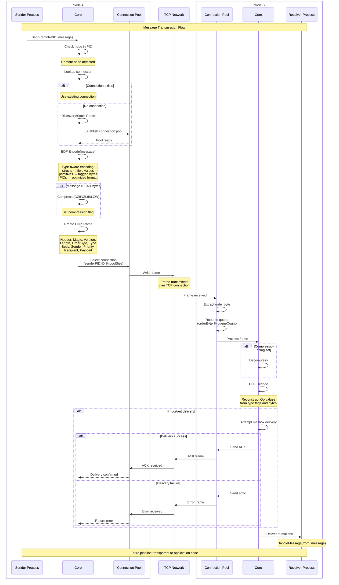

# Network Transparency

Network transparency means the location of a process - whether it's in the same goroutine, on the same node, or on a remote node halfway across the world - doesn't change how you interact with it. You send messages the same way. You make calls with the same API. You establish links and monitors with the same methods. The framework handles the complexity of discovering nodes, encoding messages, and routing them across the network.

This isn't just convenient. It's fundamental to building distributed systems in the actor model. If remote operations looked different from local operations, you'd be constantly checking location and branching your logic. That locality awareness would spread throughout your code, making it brittle and hard to reason about. Network transparency lets you design systems as collections of communicating actors, and deployment topology becomes an operational concern rather than a code concern.

But transparency has limits. Networks are slower than in-process communication. They fail in ways local operations don't. Messages can be lost. Connections drop. Remote nodes crash or become unreachable. The framework makes remote operations look local, but the network's physical reality still matters.

## What Transparency Means in Practice

Consider a simple example. You have a `gen.PID` and you want to send it a message:

```go
process.Send(pid, OrderRequest{OrderID: 12345, Items: []string{"item1", "item2"}})
```

This code is identical whether `pid` points to a local process or a remote one. You don't check. You don't call different methods. You just send.

Behind the scenes, the framework does different things:

**For a local process**: The message is placed directly in the recipient's mailbox queue. The framework checks the priority, selects the appropriate queue (Main, System, or Urgent), and pushes the message. If the process is sleeping, it wakes up. The entire operation happens in microseconds.

**For a remote process**: The node extracts the node name from the `gen.PID`, checks if a connection to that node exists, discovers the node's address if needed, establishes a connection pool if necessary, encodes your `OrderRequest` using EDF, wraps it in a protocol frame, sends it over TCP, and waits for the remote node to acknowledge delivery. The remote node receives the frame, decodes it, routes it to the recipient's mailbox, and sends an acknowledgment back. This takes milliseconds.

From your code's perspective, both operations look identical. The framework abstracts the complexity.

## The Transparency Illusion

Network transparency is an illusion carefully maintained by the framework. Several mechanisms work together to create this effect.

**Unified addressing** - Every process has a `gen.PID` that includes the node name. Local and remote processes have the same identifier structure. You don't need different types for "local process" and "remote process". A `gen.PID` is just a `gen.PID`, and it works everywhere.

**Automatic routing** - When you send to a process, the framework examines the node portion of the identifier. If it matches the local node, the message is delivered locally. If it doesn't match, the framework initiates discovery to find the remote node and routes the message over the network. You don't trigger this logic explicitly - it happens automatically.

**Location independence** - You can receive a `gen.PID` from anywhere - as a return value, in a message, from a registry lookup - and immediately use it for communication. You don't need to check where it's from or set up connections. The framework handles it.

**Failure semantics** - When you send to a local process that doesn't exist, you get an error immediately. When you send to a remote process that doesn't exist, you get... nothing, by default. The message is sent over the network, and if nobody's listening, it's silently dropped. This asymmetry breaks the transparency illusion. The Important delivery flag fixes this: with Important enabled, sending to a missing remote process gives you an immediate error, just like local delivery. The framework makes the network behave like local memory.

## How Messages Cross The Network

When you send a message to a remote process, what actually happens? The framework performs a complex series of operations to transform your Go value into bytes, transmit them over TCP, and reconstruct them on the receiving side. Understanding this flow helps you design efficient distributed systems and debug problems when they arise.

The sequence diagram below shows the complete message transmission pipeline, from the moment you call `Send` to the moment the recipient's `HandleMessage` is invoked:



When you send a message, the framework:

1. **Encodes** your value using EDF, transforming it into a byte sequence
2. **Compresses** it if the message exceeds the compression threshold (default 1024 bytes)
3. **Frames** it with protocol headers containing metadata (message type, sender, recipient, priority)
4. **Transmits** the frame over one of the TCP connections in the pool to the remote node
5. **Receives acknowledgment** if Important delivery is enabled

The remote node reverses this:

1. **Reads** the frame from the TCP connection
2. **Decompresses** if the compression flag is set
3. **Decodes** the bytes back into a Go value using EDF
4. **Routes** the message to the recipient's mailbox
5. **Sends acknowledgment** back if Important delivery was requested

This entire pipeline is invisible. You call `Send`, and the framework executes these steps. The receiving process calls `HandleMessage`, and it receives your value as if you'd passed it locally.

## EDF: Ergo Data Format

EDF (Ergo Data Format) is a binary serialization format designed for distributed actor systems. It solves a fundamental problem: how do you serialize Go values - structs, slices, maps, framework types like `gen.PID` - across the network with the performance of code-generated serializers like Protocol Buffers, but without requiring code generation?

The answer is dynamic specialization. When you register a type, EDF analyzes its structure and builds specialized encoding and decoding functions specifically for that type. For structs, it creates functions for each field and composes them into a single encoder. This happens once at registration time, not during encoding. When you send a message, EDF uses these pre-built functions - no reflection, no runtime type analysis.

```go
type Order struct {
    ID    int64
    Items []string
}

func init() {
    edf.RegisterTypeOf(Order{})  // Analyzed once, functions built
}

// Later, during message sending:
process.Send(to, Order{ID: 42, Items: []string{"item1"}})  // Uses pre-built encoder
```

This approach delivers Protocol Buffers-class performance without `.proto` files or `protoc` code generation.

Registration happens at runtime - no build step, no generated files. You call `edf.RegisterTypeOf()` in your `init()` function, and EDF builds the optimized encoders. Framework types like `gen.PID`, `gen.Ref`, and `gen.Event` have native support with specialized encodings. During node handshake, both sides exchange their registered type lists and negotiate short numeric IDs, turning a full type name into 3 bytes on the wire. Field names aren't encoded - only field values in declaration order.

Performance benchmarks (see `benchmarks/serial/`) show encoding is 50-100% faster than Protocol Buffers, while decoding is 20-60% slower. The encoding advantage comes from the specialized functions built during registration.

EDF enforces strict type contracts - both nodes must register identical type definitions. Type identity is the full package path plus type name, not just the type name. For example, `Order` in package `github.com/myapp/orders` becomes `#github.com/myapp/orders/Order`. Two packages with the same type name `Order` are different types in EDF - this is Go's type system enforced at the protocol level.

This strict typing is a deliberate design choice that pushes version management to the application level. When you need to evolve a message type, you version it explicitly in your code:

```go
package orders

type OrderV1 struct { ID int64 }                    // #github.com/myapp/orders/OrderV1
type OrderV2 struct { ID int64; Priority int }      // #github.com/myapp/orders/OrderV2
```

Your actors handle both versions, routing logic based on the type received. This approach is essential for canary deployments where old and new versions coexist - each node declares what it understands, and the application code manages compatibility. Protocol-level backward compatibility would hide versioning from your code, making canary rollouts harder to control.

### Type Constraints

EDF imposes size limits on certain types. These limits balance memory safety with practical message sizes.

**Atoms** (`gen.Atom`) - Maximum 255 bytes. Atoms are used for names - node names, process names, event names. Names longer than 255 bytes are uncommon and likely indicate a design issue. The 255-byte limit keeps name handling efficient.

**Strings** - Maximum 65,535 bytes (2^16-1). This covers most string use cases. For larger text (documents, logs, large payloads), use binary encoding (`[]byte`) instead, which supports up to 4GB.

**Errors** - Maximum 32,767 bytes (2^15-1). Error messages longer than 32KB are unusual. If you need to send detailed diagnostic information, use a separate field in your message struct.

**Binary** (`[]byte`) - Maximum 4,294,967,295 bytes (2^32-1, ~4GB). This is the largest single value EDF can encode. Messages containing multi-gigabyte binaries work but are inefficient. Consider chunking large data into multiple messages or using meta processes for streaming.

**Collections** (map, array, slice) - Maximum 2^32 elements. A map can have up to 4 billion entries. A slice can have 4 billion elements. These limits are unlikely to be hit in practice - a slice of 4 billion int64 values would consume 32GB of memory.

These limits are enforced during encoding. If you attempt to encode a 70,000 byte string, the encoder returns an error. The message isn't sent. On the receiving side, if a malicious sender tries to send an oversized value, the decoder rejects it and closes the connection.

## Type Registration Requirements

For custom types to cross the network, both sending and receiving nodes must register them. Registration tells EDF how to encode and decode the type, and creates a numeric ID that's shared during handshake for efficient encoding.

Register types during initialization:

```go
type Order struct {
    ID    int64
    Items []string
}

func init() {
    edf.RegisterTypeOf(Order{})
}
```

### Registration Requirements

**Only exported fields** - Structs must have all fields exported (starting with uppercase). This is by design: exported fields define your actor's contract. When actors communicate - locally or across the network - they exchange messages according to explicit contracts. Unexported fields are implementation details, internal state that shouldn't cross actor boundaries. If registration encounters unexported fields, it fails with `"struct Order has unexported field(s)"`.

```go
type Order struct {
    ID    int64   // Exported - part of the contract
    items []Item  // Unexported - internal state, registration fails
}
```

**No pointer types** - EDF rejects pointer types and structs containing pointer fields. This is by design: pointers are a local memory optimization and shouldn't be part of network contracts. A `*Database` field is meaningless to a remote actor - it can't dereference your memory address. Pointers express local sharing semantics that don't translate across address spaces.

```go
type Order struct {
    ID    int64
    Cache *OrderCache  // Registration fails - pointer is local optimization
}
```

For distributed references, use framework types designed for remote access: `gen.PID` (process reference), `gen.Alias` (named reference), `gen.Ref` (call reference). These work across nodes and provide location-independent semantics.

**Nested types must be registered first** - If your type contains other custom types, register the inner types before the outer type:

```go
type Address struct {
    City   string
    Street string
}

type Person struct {
    Name    string
    Address Address
}

func init() {
    edf.RegisterTypeOf(Address{})  // register child first
    edf.RegisterTypeOf(Person{})   // then parent
}
```

The order matters because registration builds the encoding schema by examining fields. When registering `Person`, EDF sees the `Address` field. If `Address` isn't registered yet, registration fails with `"type Address must be registered first"`. If `Address` is already registered, EDF references its schema, creating an efficient nested encoding.

### Custom Marshaling for Special Cases

If your type has unexported fields or needs special encoding, implement custom marshaling:

```go
type Config struct {
    public  string
    private int
}

// Option 1: edf.Marshaler/Unmarshaler (recommended for performance)
func (c Config) MarshalEDF(w io.Writer) error {
    buf := make([]byte, 0, 256)
    buf = append(buf, c.public...)
    buf = binary.BigEndian.AppendUint64(buf, uint64(c.private))
    _, err := w.Write(buf)
    return err
}

func (c *Config) UnmarshalEDF(b []byte) error {
    c.public = string(b[:len(b)-8])
    c.private = int(binary.BigEndian.Uint64(b[len(b)-8:]))
    return nil
}

// Option 2: encoding.BinaryMarshaler/Unmarshaler (standard interface)
func (c Config) MarshalBinary() ([]byte, error) {
    buf := make([]byte, 0, 256)
    buf = append(buf, c.public...)
    buf = binary.BigEndian.AppendUint64(buf, uint64(c.private))
    return buf, nil
}

func (c *Config) UnmarshalBinary(b []byte) error {
    c.public = string(b[:len(b)-8])
    c.private = int(binary.BigEndian.Uint64(b[len(b)-8:]))
    return nil
}
```

EDF supports both `edf.Marshaler`/`Unmarshaler` and Go's standard `encoding.BinaryMarshaler`/`Unmarshaler` interfaces. The key difference is performance: `edf.Marshaler` writes directly to EDF's internal buffer (`io.Writer`), avoiding intermediate allocations. When you call `MarshalEDF(w)`, the `io.Writer` is EDF's reusable buffer - your bytes go straight to the wire. With `encoding.BinaryMarshaler`, you must allocate and return a `[]byte`, which EDF then copies into its buffer.

For high-throughput message types, prefer `edf.Marshaler`. For types that implement standard interfaces or rarely-sent messages, `encoding.BinaryMarshaler` works fine.

### Encoding Errors

Go's `error` type is an interface. Encoding an error requires special handling because interfaces don't have a fixed structure.

Framework errors (`gen.ErrProcessUnknown`, `gen.TerminateReasonNormal`, etc.) are pre-registered when the node starts. They have numeric IDs and encode compactly as 3 bytes: type tag `0x9c` + 2-byte ID.

Custom errors need registration:

```go
var (
    ErrInvalidOrder = errors.New("invalid order")
    ErrOutOfStock   = errors.New("out of stock")
)

func init() {
    edf.RegisterError(ErrInvalidOrder)
    edf.RegisterError(ErrOutOfStock)
}
```

Registered errors encode as 3 bytes total (type tag + 2-byte ID where ID > 32767). Unregistered errors encode as type tag + 2-byte length + error string bytes. On decoding, the framework checks if it has a local error with that string. If it does, it returns the local error instance. If not, it creates a new error with `fmt.Errorf(string)`.

This means error identity can be preserved across nodes if both sides register the error. If only one side registers it, you get an error with the correct message but not the same instance. Code comparing errors with `errors.Is` needs both sides to register for correct behavior.

## Type Registration Timing

Type registration must happen before connection establishment. During handshake, nodes exchange their registered type lists and error lists. These lists become the encoding dictionaries for that connection.

If you register a type after a connection is established, that type isn't in the dictionary. Attempting to send a value of that type fails - the encoder can't find it in the shared schema. The only way to use the newly registered type is to disconnect and reconnect, forcing a new handshake that includes the type.

This is why registration typically happens in `init()` functions. The registration runs before `main()`, which runs before node startup, which runs before any connections are established. By the time connections form, all types are registered.

For dynamic type registration (registering types based on runtime configuration or plugin loading), you have limited options:

**Register before node start** - Load your configuration, determine which types you need, register them all, then start the node. This works but requires knowing all types upfront.

**Coordinate reconnection** - Register the new type, disconnect existing connections to nodes that need the type, wait for reconnection with new handshake. This is complex and causes temporary communication loss.

**Use custom marshaling** - Implement `edf.Marshaler`/`Unmarshaler` or `encoding.BinaryMarshaler`/`Unmarshaler`. These don't require pre-registration - they work immediately. The tradeoff is you write the encoding logic yourself.

Most applications register types statically in `init()` and avoid these complications.

## Compression

Large messages are automatically compressed to reduce network bandwidth. Compression is transparent - you configure it on the process or node, and the framework applies it automatically when appropriate.

When compression is enabled, the framework checks the encoded message size before transmission. If it exceeds the compression threshold (default 1024 bytes), the message is compressed using the configured algorithm. The protocol frame's message type (byte 7) is set to `0xc8` (200, protoMessageZ) and byte 8 contains the compression type ID (100=LZW, 101=ZLIB, 102=GZIP), so the receiving node knows to decompress before decoding.

Configure compression in process options:

```go
pid, err := node.Spawn(createWorker, gen.ProcessOptions{
    Compression: gen.Compression{
        Enable:    true,
        Type:      gen.CompressionTypeGZIP,
        Level:     gen.CompressionLevelDefault,
        Threshold: 1024,
    },
})
```

Or adjust it dynamically:

```go
process.SetCompression(true)
process.SetCompressionType(gen.CompressionTypeGZIP)
process.SetCompressionLevel(gen.CompressionLevelBestSpeed)
process.SetCompressionThreshold(2048)
```

**Type** determines the compression algorithm. GZIP (ID=102) provides good compression ratios with reasonable speed. ZLIB (ID=101) is similar but with slightly different format. LZW (ID=100) is faster but produces lower compression. Choose based on your CPU/bandwidth tradeoff.

**Level** trades compression time for compression ratio. `CompressionLevelBestSize` produces smaller messages but takes longer. `CompressionLevelBestSpeed` compresses quickly but produces larger output. `CompressionLevelDefault` balances both.

**Threshold** sets the minimum size for compression. Messages smaller than the threshold aren't compressed, even if compression is enabled. Compressing tiny messages adds overhead without reducing size meaningfully. The default 1024 bytes is reasonable - messages below 1KB go uncompressed, larger messages get compressed.

Compression happens per-message. Each message is independently compressed or not, based on its size. This keeps compression stateless and allows the receiver to decode messages in any order.

## Caching and Optimization

During handshake, nodes exchange caching dictionaries for frequently used values. This caching reduces message sizes significantly.

**Atom caching** - Node names, process names, event names - these atoms appear repeatedly in messages. Every `gen.PID` contains the node name. Every message frame contains sender and recipient identifiers. Instead of encoding `"mynode@localhost"` repeatedly (2-byte length + 17 bytes = 19 bytes), the handshake assigns it a numeric ID. Cached atoms encode as 2 bytes (uint16 ID, where ID > 255). All subsequent uses of that atom encode as the 2-byte ID.

**Type caching** - Registered types get numeric IDs. A `User` struct registered on both sides gets an agreed-upon ID. Messages containing `User` values encode the ID instead of the full type name and structure. A typical struct name like `"#mypackage/User"` might be 20-30 bytes - cached, it's 3 bytes (`0x83` + 2-byte cache ID where ID > 4095).

**Error caching** - Registered errors get IDs. Framework errors are pre-registered with well-known IDs. Custom errors get IDs during handshake. Error responses that might encode as 50+ bytes (error string message) encode as 3 bytes with caching (type tag + 2-byte ID where ID > 32767).

The caches are bidirectional - both nodes maintain the same mappings. During encoding, the sender looks up the cache and uses IDs. During decoding, the receiver looks up IDs and reconstructs values. The cache persists for the connection lifetime. If the connection drops and reconnects, a new handshake creates a new cache.

This caching is automatic. You don't manage the cache or invalidate entries. The framework handles it. You just benefit from smaller messages.

## Important Delivery

Network transparency breaks down when dealing with failures. Sending to a local process that doesn't exist returns an error immediately - the framework checks the process table and sees the PID isn't registered. Sending to a remote process that doesn't exist returns... nothing. The message is encoded, sent to the remote node, and the remote node silently drops it because there's no recipient. Your code doesn't know the process was missing.

This asymmetry makes debugging difficult. Is the remote process slow to respond, or does it not exist? Did the message get lost in the network, or was it never received? The fire-and-forget nature of normal `Send` provides no feedback.

The Important delivery flag fixes this:

```go
err := process.SendImportant(remotePID, message)
if err != nil {
    // Definitely failed - remote process doesn't exist,
    // or mailbox is full, or connection dropped
}
```

With Important delivery:

1. The message is sent to the remote node with an Important flag in the frame (bit 7 of priority byte set)
2. The remote node attempts delivery to the recipient's mailbox
3. If delivery succeeds, the remote node sends an acknowledgment back
4. If delivery fails (no such process, mailbox full), the remote node sends an error response back
5. The sender waits for the response (either acknowledgment or error) with a timeout

If the acknowledgment arrives, `SendImportant` returns nil. If an error response arrives, it returns the error. If the timeout expires, it returns `gen.ErrTimeout`.

This gives you the same semantics as local delivery: immediate error feedback when something goes wrong. The network becomes transparent for failures too, not just successes.

The cost is latency. Normal `Send` returns immediately - it queues the message and continues. `SendImportant` blocks until the remote node responds, adding a network round-trip. For messages that must be delivered, this cost is worth it. For best-effort messages where occasional loss is acceptable, stick with normal `Send`.

For detailed exploration of Important Delivery patterns, reliability guarantees, and protocols like RR-2PC and FR-2PC, see [Important Delivery](../advanced/important-delivery.md).

## Protocol Frame Structure

EDF-encoded messages are wrapped in ENP (Ergo Network Protocol) frames for transmission over TCP.

Each frame has an 8-byte header:
- Byte 0: Magic byte (78 for ENP)
- Byte 1: Protocol version (1 for current version)
- Bytes 2-5: Frame length (uint32, total size in bytes)
- Byte 6: Order byte (derived from sender PID for message ordering)
- Byte 7: Message type (101 for PID message, 121 for call request, 129 for response, 200 for compressed, etc.)

For PID messages, the frame contains:
- Sender PID (8 bytes - just the ID, node is known from connection)
- Priority byte (bits 0-6 = priority 0-2, bit 7 = Important delivery flag)
- Optional reference (8 bytes - first uint64 of Ref.ID, only if Important)
- Recipient PID (8 bytes)
- EDF-encoded message payload

The **order byte** (byte 6) preserves message ordering per sender. It's calculated as `senderPID.ID % 255`, ensuring messages from the same sender have the same order value. This guarantees sequential processing on the receiving side even if messages arrive on different TCP connections in the pool. Messages from different senders have different order values, enabling parallel processing.

When the receiving node reads a frame from TCP, it extracts the order byte and routes the frame to the appropriate receive queue. The connection creates **4 receive queues per TCP connection** in the pool. So a 3-connection pool has 12 receive queues total. Frames are distributed to queues based on `order_byte % queue_count`. Each queue is processed by a dedicated goroutine that decodes frames and delivers messages to recipients. This parallel processing improves throughput while preserving per-sender ordering.

## Limits of Transparency

Network transparency is powerful but not magical. The network has physical properties that can't be abstracted away.

**Latency** - Remote operations are slower. A local `Send` takes microseconds. A remote `Send` takes milliseconds. That's three orders of magnitude. For a single message, it's negligible. For thousands of messages, the difference is dramatic. Design systems to minimize remote calls, batch operations, and use asynchronous patterns.

**Bandwidth** - Network links have finite capacity. Sending millions of small messages can saturate a network connection. Encoding and decoding adds CPU overhead. Compression helps but costs CPU time. Be mindful of message volume and size. Local operations have effectively infinite bandwidth - remote operations don't.

**Failures** - Networks fail in ways local memory doesn't. Packets get lost. Connections drop. Nodes become unreachable. DNS fails. Firewalls block traffic. Local operations either succeed instantly or fail with a clear error. Remote operations can timeout, leaving you uncertain whether they succeeded. Design for these failure modes with timeouts, retries, and idempotent operations.

**Partial failures** - In a distributed system, some nodes can fail while others continue working. A local system either works entirely or crashes entirely. A distributed system can be partially operational - some nodes reachable, others not. This partial failure is the hardest aspect of distributed systems. The framework can't hide it entirely.

**Ordering** - Message ordering is preserved per-sender within a connection. Messages from process A to process B arrive in the order sent. But messages from different senders can interleave arbitrarily. And if a connection drops and reconnects, messages sent during disconnection are lost or delayed. Don't assume global ordering across the cluster.

Network transparency makes distributed programming feel local. But distributed programming has fundamental differences from local programming. The transparency is a tool that simplifies common cases - it doesn't eliminate the need to think about distributed system challenges.

## Practical Implications

Understanding network transparency helps you design better distributed systems.

**Use local clustering** - Group processes that communicate frequently on the same node. If processes exchange hundreds of messages per second, put them locally. Their communication is microseconds instead of milliseconds, and you avoid network overhead.

**Prefer async over sync** - Use `Send` (asynchronous) instead of `Call` (synchronous) for remote communication when possible. Async messaging doesn't block the sender, improving throughput. Sync calls over the network tie up your process waiting for responses.

**Design for message batching** - Send one message with 100 items instead of 100 messages with 1 item each. Network overhead is per-message. Batching amortizes that overhead.

**Handle failures explicitly** - Use timeouts on sync calls. Use Important delivery for critical messages. Monitor connection health. Don't assume remote operations succeed - check errors and have fallback logic.

**Keep messages small** - Encoding and network transmission costs scale with message size. Large messages cause memory allocation, encoding overhead, network congestion. If you're sending megabytes of data, consider whether it belongs in messages or should use a different mechanism (file transfer, streaming, database).

**Leverage compression** - Enable compression for processes that send large messages. The CPU cost of compression is usually worth the network bandwidth savings. But don't compress tiny messages - the overhead exceeds the benefit.

**Register types early** - Do all type registration in `init()` functions before the node starts. Avoid dynamic type registration that requires connection cycling. Static registration is simpler and more reliable.

For details on how the network stack implements transparency, see [Network Stack](network-stack.md). For understanding how nodes discover each other, see [Service Discovery](service-discovering.md).
