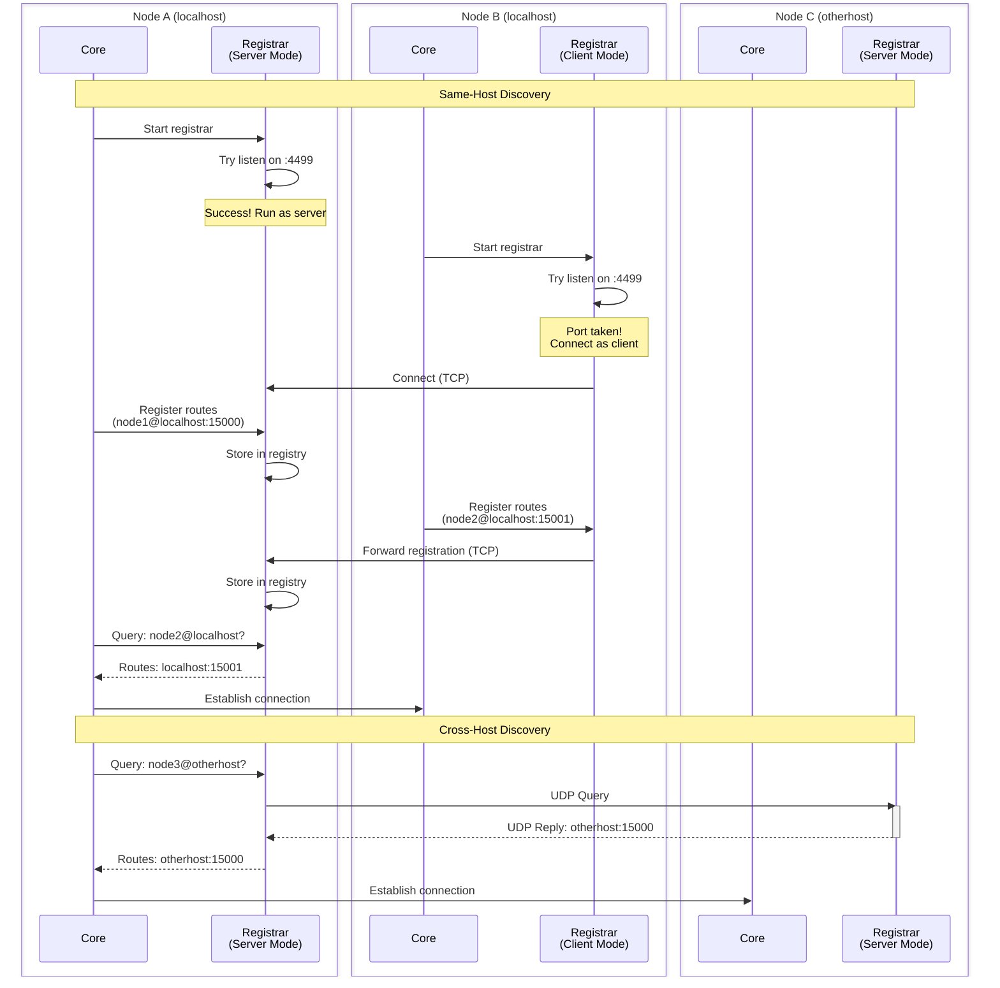

# Service Discovery

Service discovery solves a fundamental problem in distributed systems: how does one node find another node when all it has is a name?

When you send a message to a remote process, the target identifier contains the node name - a `gen.PID` includes the node where that process runs, a `gen.ProcessID` specifies both process name and node, and a `gen.Alias` includes the node. But what does that node name mean in network terms? What IP address? What port? Is TLS required? What protocol versions are supported? Service discovery answers these questions, translating logical node names into concrete connection parameters.

## The Discovery Problem

Consider a simple scenario. Node A wants to send to a process on node B. The process has a `gen.PID` that includes the node name "worker-node@server-cluster.local". That's the logical address, but it's not enough to open a TCP connection. The node needs to translate that into connection parameters:

- The IP address or hostname to connect to
- The port number where node B is listening
- Whether TLS is required for this connection
- Which handshake and protocol versions node B supports
- Which acceptor to use if node B has multiple listeners

This information changes dynamically. Nodes start and stop. Ports change. TLS gets enabled or disabled. You don't want to hardcode these details into your application. You want discovery to happen automatically, and you want it to stay current.

## The Embedded Registrar

Every node includes a registrar component that handles discovery. When a node starts, its registrar attempts to become a server by binding to port 4499 - TCP on localhost:4499 for registration and UDP on 0.0.0.0:4499 for resolution. If the TCP bind succeeds, the registrar runs in server mode. If the port is already taken (another node is using it), the registrar switches to client mode and connects to the existing server.

This design means one node per host acts as the discovery server for all other nodes on that host. Whichever node started first becomes the server. The rest are clients.

When a node's registrar runs in server mode, it:
- Listens on TCP localhost:4499 for registration from same-host nodes
- Listens on UDP 0.0.0.0:4499 (all interfaces) for resolution queries from any host
- Maintains a registry of which nodes are running and how to reach them
- Responds to queries with current connection information

When a node's registrar runs in client mode, it:
- Connects via TCP to the local registrar server at localhost:4499
- Forwards its own registration to the server over TCP
- Performs discovery queries via UDP (to localhost for same-host, to remote hosts for cross-host)
- Maintains the TCP connection until termination (for registration keepalive)

This dual-mode design provides automatic failover. If the server node terminates, its TCP connections close. The remaining nodes detect the disconnection, and they race to bind port 4499. The winner becomes the new server. The others reconnect as clients. Discovery continues without manual intervention.

## Registration

When a node starts, it registers with the registrar. This registration happens over the TCP connection (for same-host nodes) or through initial discovery queries (for the server itself).



What gets registered:
- Node name (must be unique on the host)
- List of acceptors this node is running
- For each acceptor: port number, handshake version, protocol version, TLS flag

The TCP connection from client to server stays open. It serves two purposes: maintaining registration (if the connection drops, the node is considered dead) and enabling the server to push updates (though the current implementation doesn't use this capability).

If a node tries to register a name that's already taken, the registrar returns `gen.ErrTaken`. Node names must be unique within a host. Across hosts, the same name is fine - node names include the hostname for disambiguation.

## Resolution

When a node needs to connect to a remote node, it queries the registrar for connection information.

The resolution mechanism depends on whether the querying node is running the registrar in server mode:

**If the node runs the registrar server** and the target is on the same host, resolution is a direct function call - no network involved. The server looks up the target in its local registry and returns the acceptor information immediately.

**If the node is a registrar client**, resolution uses UDP regardless of whether the target is same-host or cross-host. The node extracts the hostname from the target node name (worker@otherhost becomes otherhost), sends a UDP packet to that host on port 4499, and waits for a response. For same-host queries, this means UDP to localhost:4499. For cross-host queries, it's UDP to the remote host. The registrar server (wherever it is) looks up the node and sends back the acceptor list via UDP reply.

This UDP-based resolution is stateless. No connection is maintained. Each query is independent. This keeps it lightweight but means there's no push notification when remote nodes change - you only discover changes when you query again. The TCP connection between client and server is used only for registration and keepalive, not for resolution queries.

The resolution response includes everything needed to establish a connection:
- Acceptor port number
- Handshake protocol version
- Network protocol version
- TLS flag (whether encryption is required)

Multiple acceptors are supported. If a node has three acceptors listening on different ports with different configurations, all three appear in the resolution response. The connecting node tries them in order until one succeeds.

## Application Discovery

Central registrars (etcd and Saturn) provide application discovery - finding which nodes in your cluster are running specific applications. The embedded registrar doesn't support this feature.

When an application starts on a node, it registers an application route with the registrar:

```go
route := gen.ApplicationRoute{
    Node:   node.Name(),
    Name:   "workers",
    Weight: 100,
    Mode:   gen.ApplicationModePermanent,
    State:  gen.ApplicationStateRunning,
}
registrar.RegisterApplicationRoute(route)
```

The registrar stores this deployment information. Other nodes can then discover where the application is running:

```go
registrar, _ := node.Network().Registrar()
resolver := registrar.Resolver()
routes, err := resolver.ResolveApplication("workers")
// routes contains all nodes running "workers" application
```

The response includes the node name, application state, running mode, and a weight value. Multiple nodes can run the same application - the resolver returns all of them.

### Load Balancing with Weights

Weights enable intelligent load distribution across application instances.

When multiple nodes run the same application, each registration includes a weight. Higher weights indicate preference - nodes with more resources, better performance, or strategic positioning get higher weights. When you resolve an application, you get all instances with their weights:

```go
routes, _ := resolver.ResolveApplication("workers")
// routes = []gen.ApplicationRoute{
//   {Name: "workers", Node: "worker1@host1", Weight: 100, Mode: Permanent, State: Running},
//   {Name: "workers", Node: "worker2@host2", Weight: 50,  Mode: Permanent, State: Running},
//   {Name: "workers", Node: "worker3@host3", Weight: 200, Mode: Permanent, State: Running},
// }
```

You choose which instance to use based on your load balancing strategy:

**Weighted random** - Randomly select, but favor higher weights. Worker3 gets picked 2x more often than worker1, 4x more than worker2.

**Round-robin with weights** - Cycle through instances, but send proportionally more requests to higher-weighted nodes. Send 4 requests to worker3, 2 to worker1, 1 to worker2, then repeat.

**Least-loaded** - Track active requests per instance, prefer higher-weight nodes when load is equal.

**Geographic routing** - Set weights based on proximity. Same datacenter gets weight 100, same region gets 50, cross-region gets 10.

The weight is metadata - the registrar doesn't enforce any particular strategy. Your application decides how to interpret weights.

### Use Cases for Application Discovery

**Service mesh** - Applications discover service endpoints dynamically. Your "api" application needs to send requests to the "workers" application. Instead of hardcoding which nodes run workers, you resolve it at runtime. When workers scale up or down, discovery reflects the current topology.

**Job distribution** - A scheduler needs to distribute jobs across worker nodes. Resolve the "workers" application, get the list of available instances with their weights, and distribute jobs proportionally. If a worker node goes down, the next resolution returns fewer instances automatically.

**Application migration** - You're moving an application from old nodes to new nodes. Start the application on new nodes with low weights. Verify it works correctly. Gradually increase weights on new nodes while decreasing weights on old nodes. Traffic shifts smoothly. Once migration completes, stop the application on old nodes.

**Feature flags** - Run experimental versions of an application on a subset of nodes with specific weights. Route a percentage of traffic to the experimental version. If it performs well, increase its weight. If it fails, remove its registration entirely.

**Multi-region deployment** - Deploy applications across regions. Use weights to prefer local regions. A node in us-east resolves the application and gets instances from all regions, but us-east instances have weight 100, us-west has weight 20, eu has weight 10. Most traffic stays local, but you can still route to other regions if needed.

## Configuration Management

Central registrars provide cluster-wide configuration storage. The embedded registrar doesn't support this - each node maintains its own configuration independently.

Configuration lives in the registrar's key-value store. For etcd, this is etcd's native key-value storage. For Saturn, it's stored in the Raft-replicated state. Any node can read configuration, creating a single source of truth for cluster settings:

```go
registrar, _ := node.Network().Registrar()

// Get single config item
dbURL, err := registrar.ConfigItem("database_url")

// Get multiple items
config, err := registrar.Config("database_url", "cache_size", "log_level")
// config = map[string]any{
//     "database_url": "postgres://...",
//     "cache_size": 1024,
//     "log_level": "info",
// }
```

Configuration values can be any type - strings, numbers, booleans, nested structures. The registrar encodes them using EDF, so complex configuration is supported.

### Configuration Patterns

**Global configuration** - Settings that apply cluster-wide. Database connection strings, external service URLs, feature flags. Store them in the registrar, and all nodes read the same values. When you update a configuration item in the registrar, new nodes get the updated value automatically.

**Per-node configuration** - Node-specific settings stored with the node name as a key prefix. Store `node:worker1:cpu_limit`, `node:worker2:cpu_limit` separately. Each node reads its own configuration using its name. This enables heterogeneous clusters where nodes have different capabilities.

**Per-application configuration** - Settings specific to an application. Store under an application key prefix: `app:workers:batch_size`, `app:workers:concurrency`. When the application starts on any node, it reads this configuration from the registrar.

**Environment-based configuration** - Different values for dev/staging/production. Use key prefixes: `prod:database_url`, `staging:database_url`, `dev:database_url`. Nodes set an environment variable indicating their environment and read the appropriate keys.

**Configuration hierarchy** - Combine multiple patterns with fallbacks. Read `app:workers:batch_size`, fall back to `default:batch_size`, fall back to hardcoded default. This provides specificity where needed and defaults everywhere else.

### Dynamic Configuration Updates

Configuration in the registrar is static from the framework's perspective - it doesn't push updates to running nodes. When you change a configuration item in etcd or Saturn, running nodes don't see the change automatically. They have the value they read during startup or their last query.

To implement dynamic configuration updates, use the registrar event system:

```go
// For etcd registrar
import "ergo.services/registrar/etcd"

// For Saturn registrar
import "ergo.services/registrar/saturn"

registrar, _ := node.Network().Registrar()
event, err := registrar.Event()
if err != nil {
    // registrar doesn't support events (embedded registrar only)
}

// Link to the event to receive notifications
process.LinkEvent(event)

// In your HandleEvent callback (etcd example):
func (w *Worker) HandleEvent(message gen.MessageEvent) error {
    switch ev := message.Message.(type) {
    
    case etcd.EventConfigUpdate:
        // Configuration item changed
        w.Log().Info("config updated: %s = %v", ev.Item, ev.Value)
        w.loadConfig()
        
    case etcd.EventNodeJoined:
        // New node joined the cluster
        w.Log().Info("node joined: %s", ev.Name)
        w.checkNewNode(ev.Name)
        
    case etcd.EventNodeLeft:
        // Node left the cluster
        w.Log().Info("node left: %s", ev.Name)
        w.handleNodeDown(ev.Name)
        
    case etcd.EventApplicationLoaded:
        // Application loaded on a node
        w.Log().Info("application %s loaded on %s (weight: %d)", 
            ev.Name, ev.Node, ev.Weight)
            
    case etcd.EventApplicationStarted:
        // Application started running
        w.Log().Info("application %s started on %s (mode: %s, weight: %d)", 
            ev.Name, ev.Node, ev.Mode, ev.Weight)
        w.refreshServices()
        
    case etcd.EventApplicationStopping:
        // Application is stopping
        w.Log().Info("application %s stopping on %s", ev.Name, ev.Node)
        
    case etcd.EventApplicationStopped:
        // Application stopped completely
        w.Log().Info("application %s stopped on %s", ev.Name, ev.Node)
        w.refreshServices()
        
    case etcd.EventApplicationUnloaded:
        // Application unloaded from node
        w.Log().Info("application %s unloaded from %s", ev.Name, ev.Node)
    }
    return nil
}

// For Saturn registrar, use saturn.EventConfigUpdate, saturn.EventNodeJoined, etc.
// The event types are identical in structure but defined in separate packages.
```

**Both etcd and Saturn registrars support events** and push notifications immediately when:
- **Configuration changes** - `EventConfigUpdate` with item name and new value
- **Nodes join/leave** - `EventNodeJoined` / `EventNodeLeft` with node name
- **Applications lifecycle** - `EventApplicationLoaded`, `EventApplicationStarted`, `EventApplicationStopping`, `EventApplicationStopped`, `EventApplicationUnloaded` with application name, node, weight, and mode

Each registrar defines its own event types in its package (`ergo.services/registrar/etcd` or `ergo.services/registrar/saturn`). The event structures are identical, but you must use the correct package import for your registrar. This lets you react to cluster changes in real-time.

**Embedded registrar** doesn't support events.

With event notifications from etcd or Saturn registrars, nodes learn about configuration changes within milliseconds.

### Use Cases for Configuration Management

**Database connection strings** - Instead of deploying configuration files to every node, store the connection string in the registrar. Nodes read it on startup. When you rotate credentials or migrate to a new database, update the registrar. Restart nodes gradually, and they pick up the new connection string automatically. No configuration file deployment needed.

**Feature flags** - Enable or disable features dynamically across the cluster. Store `feature:new_algorithm:enabled` in the registrar. Applications check this flag when deciding which code path to use. Change the flag in the registrar, restart applications (or use events for live updates), and the feature rolls out cluster-wide.

**Capacity planning** - Store node capacity information: CPU limits, memory limits, concurrent job limits. Applications read these limits and respect them when distributing work. When you upgrade hardware, update the capacity values in the registrar. Applications discover the new capacity automatically.

**Service discovery integration** - Combine application discovery with configuration. Store connection parameters for each application deployment. When you resolve the "workers" application, you get not just the node names but also their specific configurations - which worker pool size, which queue they're processing, which priority level they handle.

**Staged rollouts** - Store configuration with version tags. Set `config:version` to "v2". Nodes read their configuration version on startup. Half your cluster uses v1 configuration, half uses v2. Monitor behavior. If v2 performs better, update all nodes to v2. If it causes problems, roll back to v1. Configuration versioning enables controlled changes.

**Cluster-wide coordination** - Store cluster-wide state that multiple nodes need to coordinate on. Leader election metadata, distributed lock information, shared counters. This isn't what the registrar is designed for (use dedicated coordination services for complex coordination), but simple coordination needs can be met with registrar configuration storage.

## Failover and Reliability

The embedded registrar has built-in automatic failover.

When a registrar server node terminates:
1. Its TCP connections to client nodes (on the same host) close
2. Client nodes detect the disconnection
3. Each client attempts to bind localhost:4499
4. The first to succeed becomes the new server
5. The rest connect to the new server as clients
6. Everyone re-registers their routes with the new server

This failover is automatic and takes a few milliseconds. Discovery continues without interruption.

For cross-host discovery, the same failover mechanism applies to each host independently. If a remote host's registrar server node goes down, another node on that host immediately takes over the server role. From the perspective of nodes on other hosts, discovery to that host continues working - they send UDP queries to the host, and whichever node is currently the registrar server responds. The failover is invisible to external hosts because the UDP queries are addressed to the host (port 4499), not to a specific node.

## Limitations of the Embedded Registrar

The embedded registrar is minimal by design. It provides route resolution only. What it doesn't provide:

**No application discovery** - You can discover where nodes are, but not where specific applications are running. Want to find which nodes are running the "workers" application? You have to query every node individually or maintain that mapping yourself.

**No load balancing metadata** - There's no weight system for distributing load across multiple instances of the same application. You can't express that some nodes have more capacity or should receive more traffic.

**No centralized configuration** - Configuration lives with each node. There's no cluster-wide config store. If you want to change a setting across the cluster, you modify each node individually through node environment variables or configuration files.

**No event notifications** - Discovery is pull-based. You query when you need information. The registrar doesn't push updates when things change. If a node joins or leaves, or an application starts or stops, you only discover the change when you query again.

**No topology awareness** - The registrar doesn't understand your cluster structure. It treats all nodes equally. If you have nodes in different datacenters or regions, the registrar provides no metadata to help you route efficiently based on proximity or cost.

**Limited scalability** - The UDP query model works for small to medium clusters but doesn't scale to hundreds of nodes efficiently. Cross-host discovery has no caching - every query hits the network. For large clusters, this generates significant network traffic.

These limitations don't matter for development or small deployments. Two nodes on your laptop? Three nodes in a single datacenter? The embedded registrar works fine. But for production clusters, especially large ones or those requiring dynamic topology, you want the richer feature set of etcd or Saturn registrars.

## External Registrars

External registrars replace the embedded implementation with centralized discovery services.

**etcd registrar** (`ergo.services/registrar/etcd`) uses etcd as the discovery backend. All nodes register their routes in etcd on startup. All discovery queries go to etcd. This centralizes cluster state: any node can discover any other node, applications can advertise their deployment locations, configuration can be stored in etcd's key-value store.

The etcd registrar implementation maintains registration through HTTP polling - each node makes a registration request every second to keep its entry alive. This works well for small to medium clusters (50-70 nodes) but creates overhead at larger scales. The polling approach reflects etcd's design for web services rather than continuous cluster communication. Despite this limitation, etcd provides proven reliability, extensive tooling, and operational familiarity for teams already using etcd in their infrastructure.

**Saturn registrar** (`ergo.services/registrar/saturn`) is purpose-built for Ergo clusters. It's an external Raft-based registry designed specifically for the framework's communication patterns. Instead of polling, Saturn maintains persistent connections and pushes updates immediately when cluster state changes. This makes it more efficient at scale - Saturn can handle clusters with thousands of nodes without the overhead of constant HTTP polling. The immediate event propagation means nodes learn about topology changes instantly rather than waiting for the next poll interval.

Which registrar you choose depends on your deployment:
- Small clusters (< 10 nodes), same host or trusted network: embedded registrar
- Medium clusters (10-70 nodes), existing etcd infrastructure: etcd registrar
- Large clusters (70+ nodes) or real-time requirements: Saturn registrar

The choice is transparent to application code. You specify the registrar in `gen.NodeOptions.Network.Registrar` at startup. Everything else - registration, resolution, failover - works the same way regardless of which registrar you use.

## Registrar Configuration

For the embedded registrar, configuration is minimal:

```go
import "ergo.services/ergo/net/registrar"

node, err := ergo.StartNode("myapp@localhost", gen.NodeOptions{
    Network: gen.NetworkOptions{
        Registrar: registrar.Create(registrar.Options{
            Port: 4499, // default
            DisableServer: false, // allow server mode
        }),
    },
})
```

Setting `DisableServer: true` prevents the node from becoming a registrar server. It will always run in client mode. This is useful if you have a dedicated node that should handle discovery and you don't want application nodes competing for the server role.

For external registrars, configuration includes the service endpoint:

```go
import "ergo.services/registrar/etcd"

node, err := ergo.StartNode("myapp@prod.example.com", gen.NodeOptions{
    Network: gen.NetworkOptions{
        Registrar: etcd.Create(etcd.Options{
            Endpoints: []string{"etcd1:2379", "etcd2:2379", "etcd3:2379"},
            // ... authentication, TLS, etc
        }),
    },
})
```

The node connects to the registrar during startup. If the connection fails, startup fails. Discovery is considered essential - if you can't register and discover, the node can't participate in the cluster, so there's no point in starting.

## Discovery in Practice

Service discovery is invisible during normal operation. You send messages, make calls, establish links - discovery happens automatically behind the scenes.

Where discovery becomes visible is during debugging and operations. When connections fail, understanding discovery helps diagnose why. Is the registrar unreachable? Is the target node not registered? Are the acceptor configurations incompatible?

The registrar provides an `Info()` method that shows its status:

```go
network := node.Network()
registrar, err := network.Registrar()
if err != nil {
    // node has no registrar configured
}

info := registrar.Info()
// info.Server - registrar endpoint
// info.EmbeddedServer - true if running as server
// info.SupportConfig - whether config storage is available
// info.SupportRegisterApplication - whether app routing is available
```

This information helps you understand what discovery features are available and whether the registrar is functioning correctly.

For deeper understanding of how discovery integrates with connection establishment and message routing, see the [Network Stack](network-stack.md) chapter. For configuring explicit routes that bypass discovery, see [Static Routes](static-routes.md).
